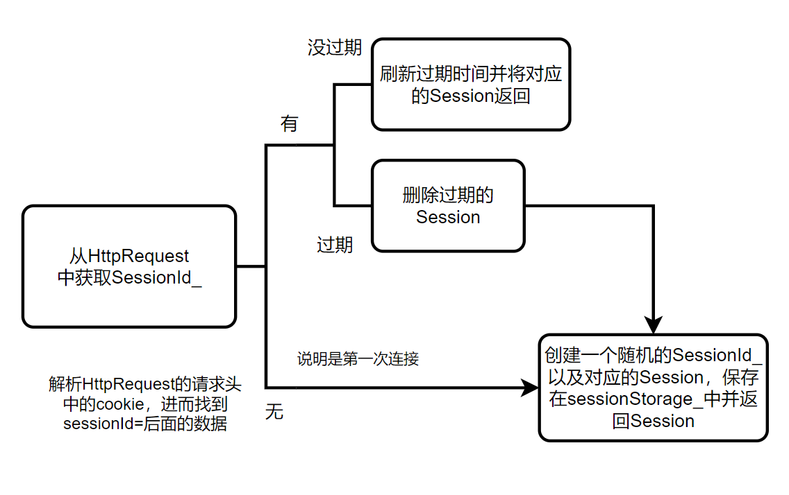

# 会话管理

## 为什么需要会话管理？
- HTTP基于请求/响应模式：所有请求都是相互独立的，无连续性的
- HTTP是无连接的协议（短连接）：限制每次连接只处理一个请求
- HTTP是无状态协议：协议对于事务处理没有记忆能力

对于需要客户端和服务端`多次交互`的网络应用，则必须`记住客户端的状态`，比如购物车，用户登录等。会话就是一个`客户端连续不断地和服务端进行请求/响应的一系列交互`，多次请求间建立关联的方式，称之为会话管理，或者会话跟踪。

## 会话的建立

由于HTTP没有提供任何记住客户端的途径，那么服务器如何建立维护与客户端的会话？

当服务端接收到客户端的首次请求时，服务器初始化一个会话并分配给给会话一个`唯一的标识符`(sessionId)。在以后得请求中，客户端必须将唯一的标识符包含在请求中（请求头），服务器根据次表示符将请求与对应的会话联系起来。
```css
Host: example.com                                         # 必须
User-Agent: Mozilla/5.0 (Windows NT 10.0; Win64; x64)     # 客户端信息
Accept: text/html, application/json                       # 可接受的响应类型
Content-Type: application/json                            # 请求字体的MIME类型
Authorization: Bearer abc123xyz                           # 认证信息
Cookie: sessionId=abc123; username=john                   # **Cookie**
Content-Length: 56                                        
Connection: keep-alive                                    # 连接管理
```


## Session

会话管理类，用于在HTTP服务器中管理用户会话状态

用户第一次访问 → 创建Session → 分配sessionId； 后续请求携带sessionId → 恢复用户状态； 实现"有状态"的HTTP通信（HTTP本身是无状态的）

```cpp
std::string sessionId_;  // 会话Id_（唯一的标识符）
std::unordered_map<std::string, std::string> data_;
std::chrono::system_clock::time_point expiryTime_;
int maxAge_;  // 过期时间(秒)
SessionManager* sessionManager_;
```
这里的数据一般是用户的状态信息，临时数据等，比如：
```
session.setValue("user_id", "10001");          // 用户ID
session.setValue("username", "zhangsan");      // 用户名
session.setValue("user_role", "admin");        // 用户角色
session.setValue("permissions", "read,write"); // 权限列表
session.setValue("department", "engineering"); // 部门信息
session.setValue("avatar_url", "/avatars/1.jpg"); // 头像链接
```


## SessionStorage

存储会话`Session`的类：
```cpp
std::unordered_map<std::string, std::shared_ptr<Session>> sessions_;
```
封装了几个成员方法包括：创建并保存会话，删除会话，删除过期的会话，获取会话


## SessionManager

获取`Session`：



从`HttpRequest`中解析出`SessionId`:
```cpp
// Cookie: sessionId=abc123; username=john   
std::string cookie = req.getHeader("Cookie");
size_t pos = cookie.find("sessionId="); 
...
```

为`HttpResponse`添加`Cookie`
```cpp
std::string cookie = "sessionId=" + sessionId + "; Path=/; HttpOnly";
resp->addHeader("Set-Cookie", cookie);
```


`Session`部分的实现相对简单，因为 `Session` 并不维持 TCP/SSL 连接，它维持的是逻辑上的用户会话状态，每次连接都根据`Session`记录的数据恢复用户的状态，就相当于：
```cpp
时间线：
┌──────第一次请求───┐    ┌─────第二次请求─────┐    ┌─────第三次请求─────┐
│ 无sessionId     │    │ Cookie带sessionId │    │ Cookie带sessionId │
│ 服务器：创建新会话 │    │ 服务器：查找现有会话 │    │ 服务器：查找现有会话 │
│ 响应：Set-Cookie │    │ 恢复用户状态        │    │ 恢复用户状态       │
└─────────────────┘    └───────────────────┘    └──────────────────┘
```
第一次用户登录请求时，服务器验证账号密码后，会在服务器端创建一个 `Session` 对象，其中存储用户的登录状态标识（如 user_id、is_authenticated=true 等），然后给客户端返回 `sessionId_`。下次请求时，客户端会携带这个 `sessionId_`，服务器根据它找到对应的 `Session`，从中读取登录状态信息来确认用户身份，从而维持用户的登录状态。