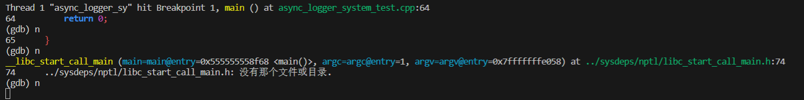

# AsynLogSystem-CloudStorage
基于libevent的带异步日志功能的云存储系统

## 更新日志
1. 2025.9.13
    
    实现了异步日志系统的主要功能:
    

    include(with libevent)提供了基于libevent的部分功能测试，可以在终端`nc 127.0.0.1 8000`向服务器发送消息作为日志信息发送到控制台和日志中。

2. 2025.9.17

    - 发现没有libevent测试的异步日志管理系统并没有将日志信息写入缓冲区，而是直接发送了
        ```cpp
        mylog::LoggerManager::GetInstance().GetLogger("asynclogger")->Info("pdchelloworld");
        ```
        其中`.GetLogger()`是从`LoggerMap`中返回对应的`async_logger(class AbstractAsyncLoggerPtr)`, 
        
        `AbstractAsyncLoggerPtr`包含一个成员变量`logger_(class Logger)`， 并把他返回， 

        `logger_`中就有`INFO`等方法，可以把消息发送到控制台，文件或者滚动文件中，因此这个过程并没有经过buffer

        通过调整各个类的调用逻辑解决。

    <br>

    - 没有消息发来时，生产者消费者都在不断地判断条件，通过gdb调试发现，处理完所有消息后，控制生产者
        线程的两个标志`label_consumer_ready_`和`label_data_ready_`都是`true`，这就意味着生产者进入wait语句判断一次后就会出来，发现没有数据
        就开启下一次循环，重复同样的操作，因此表现出来生产者不断地在判断wait中的
        谓词。

        当生产者被“意外唤醒”时，此时`label_consumer_ready_`和`label_data_ready_`都是`true`，但再经判断发现自己的缓冲区内没有东西，就把`label_data_ready_`置为`false`，重新开启循环时就会等待。同时，由于初始化是误把两个标签初始化为`true`导致启动时就无限循环。

    <br>

    - 完善了日志信息的筛选部分，即等于最低等级的日志消息不会被`flush`

    <br>

    - 消息处理完毕后主线程异常阻塞，即便是`main`函数执行`return 0`后：
    
    两个异步日志器，对应两对生产者-消费者线程即一共四个，即使设计为分离线程，主线程依然会阻塞住。

        在调用`~AsyncWorker()`的时候，通过标记让生产者和消费者线程终止循环。
    


    


