# AsynLogSystem-CloudStorage
基于libevent的带异步日志功能的云存储系统

## 更新日志
1. 2025.9.13
    
    实现了异步日志系统的主要功能:
    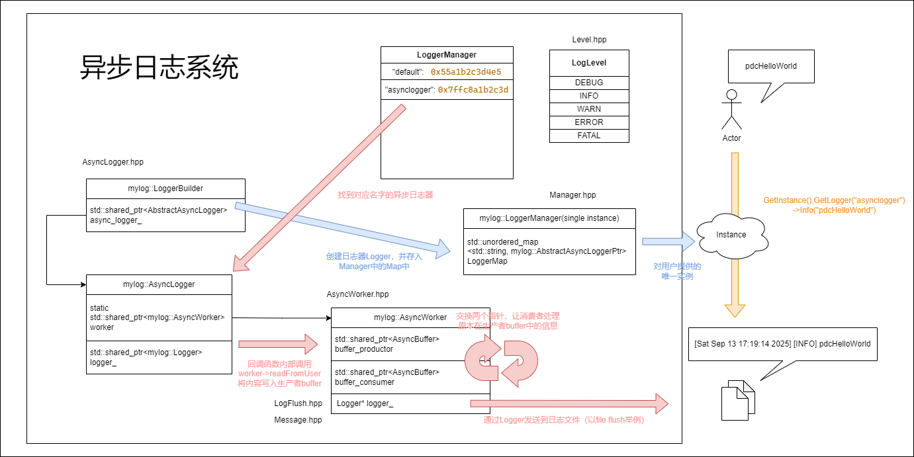

    include(with libevent)提供了基于libevent的部分功能测试，可以在终端`nc 127.0.0.1 8000`向服务器发送消息作为日志信息发送到控制台和日志中。

<br>

2. 2025.9.17

    - 完善了日志信息的筛选部分，即等于最低等级的日志消息不会被`flush`

- 问题1

    发现没有libevent测试的异步日志管理系统并没有将日志信息写入缓冲区，而是直接发送了
    ```cpp
    mylog::LoggerManager::GetInstance().GetLogger("asynclogger")->Info("pdchelloworld");
    ```
    其中`.GetLogger()`是从`LoggerMap`中返回对应的`async_logger(class AbstractAsyncLoggerPtr)`, 
    
    `AbstractAsyncLoggerPtr`包含一个成员变量`logger_(class Logger)`， 并把他返回， 

    `logger_`中就有`INFO`等方法，可以把消息发送到控制台，文件或者滚动文件中，因此这个过程并没有经过buffer

    通过调整各个类的调用逻辑解决。

    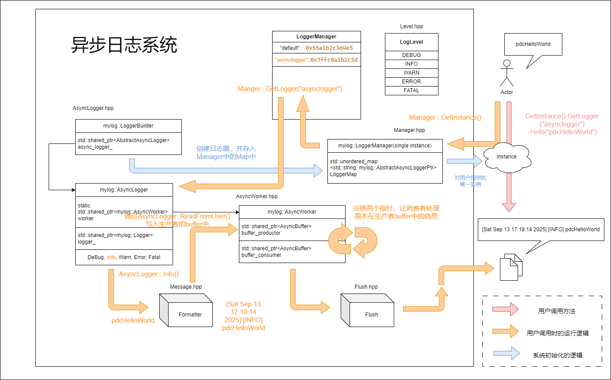

- 问题2

    一个发生在buffer交换的非致命问题：

    一开始生产者在等待数据，消费者在等待生产者给数据（交换buffer）（label_consumer_ready_ = true），之后生产者的buffer有了数据（label_data_ready_ = true），它被唤醒，交换buffer并通知消费者（label_data_ready_），而后释放互斥锁，此时生产者和消费将抢夺同一个锁：**如果生产者抢到了这把锁**，在生产者进入`wait`之前，又有数据到了（label_data_ready_ = true），这时候再`wait`就不会进入等待，而是交换buffer，但是，消费者中的buffer还没有被处理掉......
    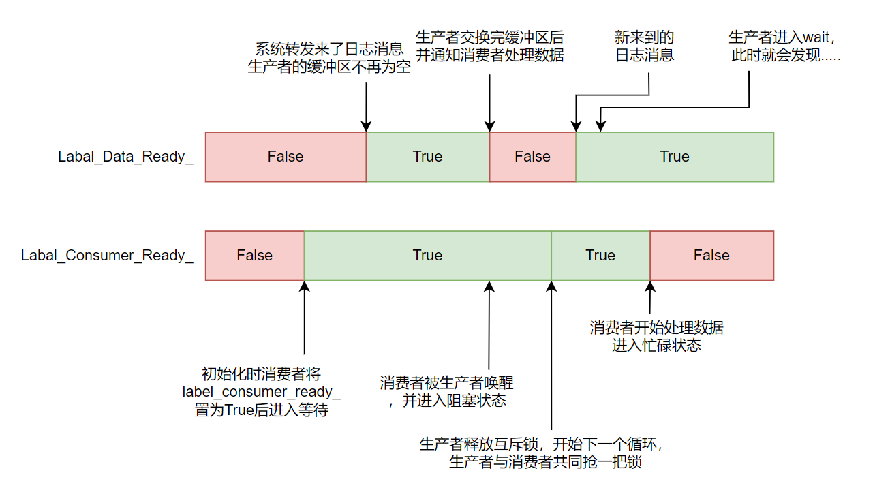

    因此让生产者交换完缓冲区后，把`label_consumer_ready_`置为`false`，表示消费者的buffer中已经有数据了。这样生产者抢到锁后，即使有数据发来，也会把锁释放掉让消费者先处理buffer中的数据。

    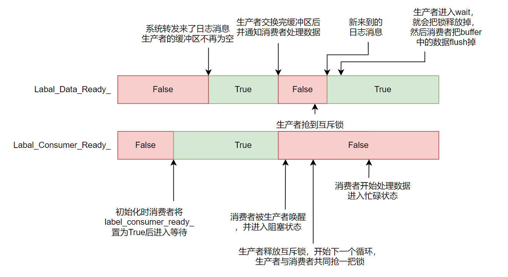


- 问题3

    一个发生在AsyncWorker析构中的死锁问题：

    一开始，生产者在等待数据，消费者在等待生产者给数据（交换buffer）
    之后生产者的buffer有了数据，它被唤醒，因为没有线程占着锁，它启动，交换buffer什么的，
    然后通知消费者起来，消费者发现条件都满足了，进入阻塞状态，生产者结束当前循环后会释放锁，
    于是生产者和消费者同时抢锁：
    如果生产者抢到了锁，他会进入wait，然后发现buffer没有数据进而等待，消费者从而拿到锁，于是这种情况下，**消费者在处理数据时生产者在wait处等待**。
    如果消费者抢到了锁，那么它直接处理数据，于是在这种情况下，**消费者在处理数据时生产者在互斥锁的外面阻塞**，
    如果此时此刻AsyncWorker开始析构，在消费者处理完数据后抢到了锁，那么生产者和消费者都在互斥锁外面阻塞，析构函数中的通知就没有用。
    不过生产者进入wait,发现Exitlabel_已经为true，依然能正常退出，通知析构函数，当然此时析构函数只检测到了生产者退出的标志是true，因此继续等待。
    消费者进入wait，因为消费者唯二被唤醒的情况是生产者通知或者AsyncWorker析构时通知，因为生产者线程已经结束了，所以消费者在wait中永远出不来，进而AsyncWorker的析构也卡住了。
    
    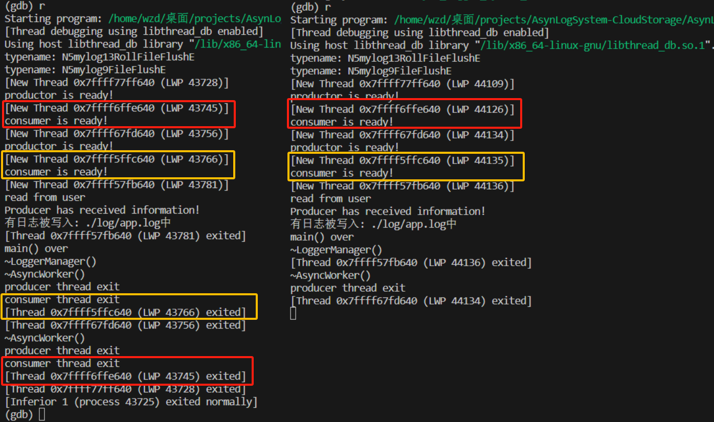

    最初的消费者的唤醒条件比较单一：
    ```cpp
    cond_consumer_.wait(lock);
    ```
    由于上一个问题我们在生产者交换完buffer就把`label_consumer_ready_`置为`false`，因此我们可以以`label_consumer_ready_`作为标志，同时初始化的时候置为`true`，因为在异步日志器构建完成之前不会有数据输入，因此不存在生产者初始化进入`wait`之前因为有消息而直接跳过。
    ```cpp
    cond_consumer_.wait(lock, [&]()->bool { return !label_consumer_ready_ || ExitLabel_;});
    ```
    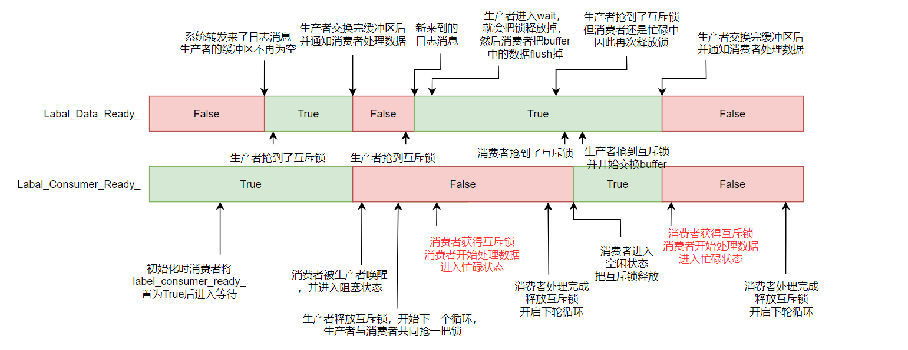

<br>

3. 2025.9.22

    - 实现了`backlog`服务器和客户端的部分，以及`ThreadPool`与异步日志系统的连接：线程函数`threadfunc`调用时，会先创建一个`Client`指针，`Client`会执行一系列连接服务器相关的操作等。当异步日志系统发现日志时[Error]和[Fatal]时，就会通过线程池的`submitLog()`进行提交。
    线程函数中会检测是否日志队列中有日志，如果有，抢到锁后就将其发送到服务器。

    - 异步日志系统向服务器发送消息的功能基本完善，存在瑕疵但是对整体的功能没有影响。

- 问题4
    
    一个连接服务器后事件循环无法正常启动的问题

    通过gdb调试发现，有时候有些进程无法正常启动事件循环，刚启动后就发现`event_base_dispatch(base);`下面的断点被触发了。
    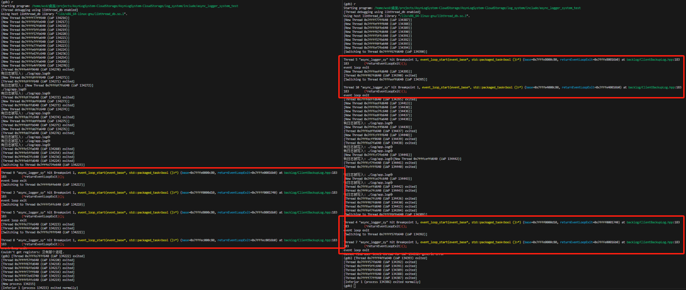

    通过gdb打印`event_base_dispatch(base);`的返回值发现，异常退出事件循环的，它们返回值为1，而正常退出的几个返回值都是0，通过查阅`libevent`的源码，找到退出循环的语句，从判断语句的其中两个条件来看，`!event_haveevents(base) && !N_ACTIVE_CALLBACKS(base)`应该分别表示：是否有事件，以及激活状态的事件的数量。
    ```cpp
    /* If we have no events, we just exit */
    if (0==(flags&EVLOOP_NO_EXIT_ON_EMPTY) &&
        !event_haveevents(base) && !N_ACTIVE_CALLBACKS(base)) {
        event_debug(("%s: no events registered.", __func__));
        retval = 1;
        goto done;
    }
    ```
    ```cpp
    static int event_haveevents(struct event_base *base)
    {
        return (base->virtual_event_count > 0 || base->event_count > 0);
    }
    ```
    ```cpp
    #define N_ACTIVE_CALLBACKS(base) ((base)->event_count_active)        
    ```
    
    通过gdb进入`event_base_dispatch(base)`函数内部，事件循环正常启动的情况下，应该是如下情况：蓝色划线的分别代表事件循环直接退出的三个需要成立条件：其中`flags`默认为0，`EVLOOP_NO_EXIT_ON_EMPTY`为0x04，&后的结果为0，因此第一个条件满足；第二个条件获取注册的事件情况，返回1表示有注册的事件，正常情况下返回1，故第二个条件为0，到此已经可以判断条件不会成立；第三个条件式激活状态的事件情况，结果是0，故第三个条件为满足。
    
    
    我们用gdb将断点打在事件循环直接退出的条件满足后执行的语句上，结果发现，此时的事件循环中没有任何事件！因此事件循环退出的三个条件都满足了，于是`event_base_dispatch(base)`直接就出来了。
    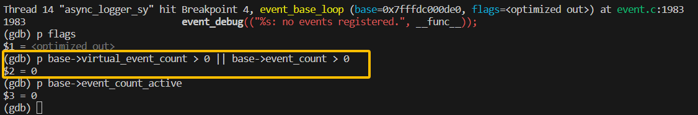
    
    进一步调试，我们打印刚进入`event_base_dispatch(base)`时事件循环有无事件，发现是有的`event_haveevents(base) = 1`(`event_callback`和`read_callback`两个事件，只打印`base->event_count`是2)，但等到事件循环退出的条件判断时，却显示没有任何事件。
    

    另外我们发现，在进入事件循环即执行`event_base_dispatch(base)`之前使线程休眠0.1s，便可解决上述问题。
    ```cpp
    std::this_thread::sleep_for(std::chrono::milliseconds(100));
    ```
    
<br>

4. 2025.9.23
    - 异步日志器判断线程池是否创建成功来决定是否向服务器提交日志，但是线程池创建成功不代表器它的线程连接服务器成功，因此
    线程池向外包装一个函数，用于判断成功连接的数量，如果一个都没有，那就不提交。

    - 实现了把服务器接受到的日志消息写入到日志文件中，之前仅仅是输出在控制台中

- 问题5

    新的问题（可能和22号的问题有联系），当启动的线程较多比如8个时，发生以下问题的概率就更高：
    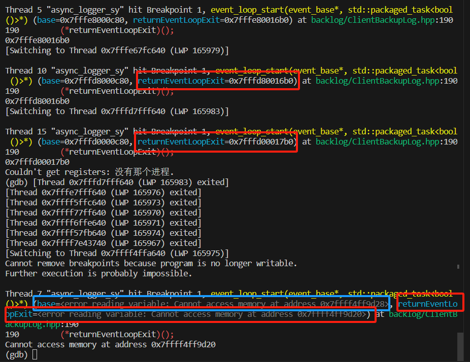
    图中我们可以看到，参数`base`和`returnEventLoopExit()`已不可访问。说明`Client`对象此时已经析构了，
    它的这两个成员变量无法再访问。

    在`Client`的启动函数`start()`中，我们将事件循环放到了另一个线程并将其设置为分离线程。在`Client::stop()`中关闭事件循环，等待事件循环关闭后再接着把`bev`和`base`清理掉。
    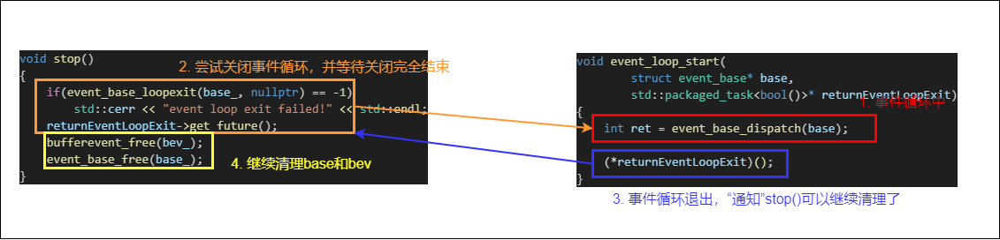
    `Client()`发生在线程池的线程函数退出后，那么就可能发生以下的情况：

    `client_->stop()`执行，
    ```cpp
    void threadFunc(tp_uint threadid)
    {
        std::unique_ptr<Client> client_ =
            std::make_unique<Client>(serverAddr_, serverPort_, threadid);
        // 启动客户端并连接服务器, 其中包含了event_base_dispatch(base);
        if(client_->start())
        .
        .
        .

        client_->stop();  // 清理base, bv，关闭事件循环
        Exit_.notify_all();  // 通知析构函数那里，我这个线程已经清理完成了
    }
    ```

    当我们在`~ThreadPool()`最后休眠5s，该问题便解决，因此我们可以认为：线程池析构后还有一些`Client`没有析构完成，导致出错。另外，当`Client`连接服务器成功后，`curThreadSize_`就会加一，但是有时候，这个值可能
    会小于`INIT_THREADSIZE`，或许可以说明某些`Client`连接失败，并且连接失败`Client`，服务器控制台显示的客户端下线发生在5s休眠之后，而正常连接都发生在5s休眠之前，并且它们不会执行到`client_->stop();`和`Exit_.notify_all();`，而5s之后是线程池析构了，因此还可以认为，有些`Client`在`while`循环中无法退出。

<br>

5. 2025.9.25

    - 在启动事件循环之前让线程休眠100ms，就解决了上面两个大问题...
        ```cpp
        std::this_thread::sleep_for(std::chrono::milliseconds(100));
        int ret = event_base_dispatch(base);
        ```
        后续会接着分析该问题。

<br>

6. 2025.9.26

    - 实现了云存储服务的配置文件的加载以及服务器的建立，并且与异步日志系统对接。
    - 使用CMake对项目构建系统的架构设计。
        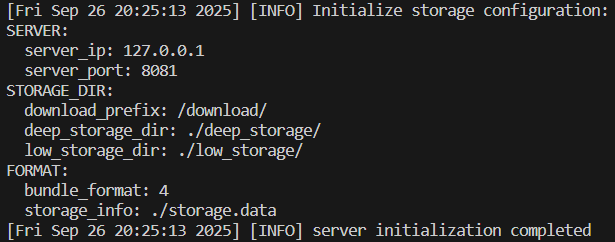

<br>

7. 2025.9.27

    - 实现了云存储服务中服务器的启动，以及客户端连接服务器，并且服务器有对应的日志消息产生(显示有客户端连接)

<br>

8. 2025.10.1

    - 完成了`Util.hpp`和`DataManager.hpp`的编写

<br>

9. 2025.10.12

    - 完成了云存储的基本功能

<br>

10. 2025.10.13

    - 尝试实现三台服务器的文件存储和传输，其中：
        
        1. 172.30.173.233 (ubuntu server) 【某主机通过vscode连接的远程服务器】
        2. 172.30.173.20  (ubuntu server) 【某主机通过vscode连接的远程服务器】
        3. 172.30.173.224 (ubuntu 有可视化界面)  【某主机通过VMware启动的服务器】

        主要的文件传递发生在前两台服务器之间，包括实验代码，实验数据集，训练模型等等。但由于二者无可视化界面，无法通过网页进行可视化操作，因此我们需要专门实现一个新的`Service.hpp`，提供终端上的上传文件，下载文件，查看文件列表的功能。

        由于三个服务器在同一网段`172.30.173`，因此实现起来相对方便

    - 实现了两台服务器(ubuntu server)在终端下载文件，同时，通过访问浏览器，window端也可以在可视化界面上上传和下载文件
    - 修复了服务器启动时无法显示先前上传的文件列表

        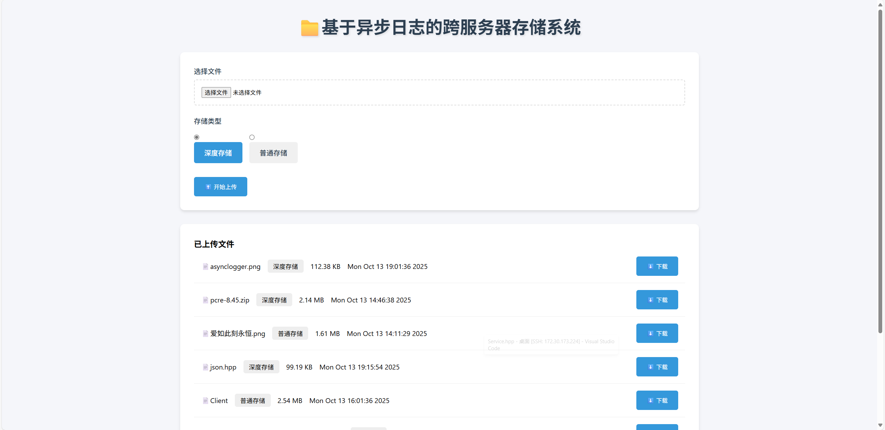

    - 添加了删除文件功能，同时从`table_`和`storage.data`中删除对应的`StorageInfo`


<br>

11. 2025.10.16

- 问题6

    使用gdb调试，发现系统启动时会创建17个线程，然后立刻结束16个线程的问题，如图所示，这其中的16个线程来自线程池。

    调试发现，系统启动会创建17个线程，然后立刻结束16个线程的问题，如图所示，这其中的16个线程来自线程池。对于异步日志系统的Client(检测到ERROR或者FATAL日志就向远程服务器发送日志信息)，它通过`libevent`来实现其功能，期间会启动一个事件循环，会阻塞住当前线程，因此事件循环被放在了一个分离线程中，导致线程池启动的时候创建了两倍于初始线程数量的线程。初始线程数量为8，因此会一口气创建16个线程。
    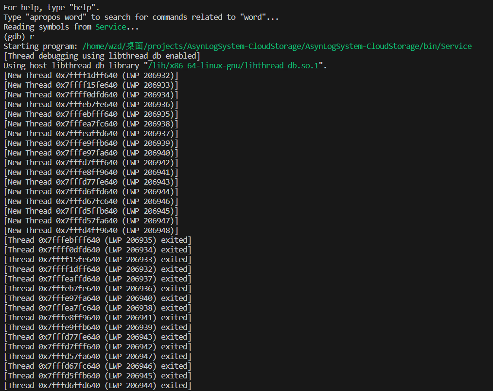

    查阅代码发现，客户端的启动函数中，先启动了事件循环，再连接服务器，这里顺序有误，导致启动事件循环时没有激活的事件而直接结束，事件循环的结束又导致了`Client->start()`的失败将顺序掉转后，即先连接服务器，再启动事件循环，问题便得以解决，没有线程意外结束。
    

    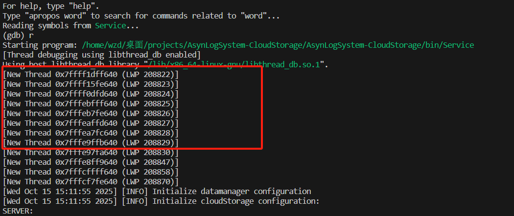
    正确的逻辑，先连接服务器后再启动事件循环，调试结果如下：红色方框是线程池创建的8个线程，并且没有异常的线程结束问题。

- 问题7
    
    设定上，日志系统会把`ERROR`级别及以上的日志发送的远程服务器，目前既不是远程(只是127.0.0.1)，也接收不到日志消息(之前单独测试日志系统时可以)，其中，接收不到消息的原因是之前通过`future`确保服务器连接的操作完成后再启动事件循环，即尝试连接服务器的动作会触发事件的回调函数，在事件的回调函数中判断服务器连接完成后，再返回值来结束主线程的阻塞(等待返回值)。
    ```cpp
    void event_callback(struct bufferevent* bev, short events, void* ctx) 
    {
        auto returnConnectLabel = static_cast<std::packaged_task<bool(bool)>*>(ctx);
        bool label = false;
        
        if (events & BEV_EVENT_CONNECTED) {
            // std::cout << "成功连接到服务器 " << std::endl;
            label = true;
        } 
        else if (events & BEV_EVENT_ERROR) {
            // std::cerr << "连接错误: " << evutil_socket_error_to_string(EVUTIL_SOCKET_ERROR()) << std::endl;
        } 
        else if (events & BEV_EVENT_EOF) {
            // std::cout << "服务器断开连接" << std::endl;
        }
        // 把连接服务器是否成功的标志返回
        (*returnConnectLabel)(label);
    }
    ```
    但是逻辑顺序改正以后，经过调试发现，因为事件循环在连接服务器后才启动，因此连接服务器的这个动作并不会触发事件循环，从而不会调用到`event_callback()`，`(*returnConnectLabel)(label);`执行不到，因此主线程一直被阻塞着，`client->start()`无法结束，从而不能进入线程函数中的循环。删除这个多此一举的操作便可。
    如图所示，用户端尝试下载一个云端不存在的文件，存储系统就向日志系统提交一条`ERROR`级别的日志，日志系统就将该日志发送到“远程”服务器上。
    
    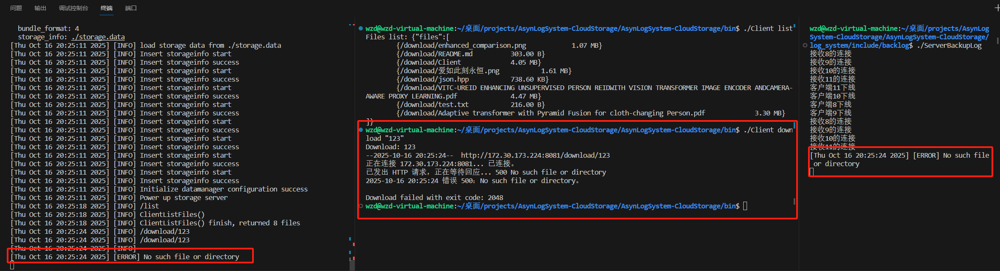


<br>

12. 2025.10.16

- 问题8

    启动系统的时候【偶尔】会出现"空间不足"的提示，它来自于异步日志系统的缓冲区，但启动阶段不应该有写入缓冲区的操作

    ```cpp
    void write(const char* message_unformatted, unsigned int length)
    {
        std::unique_lock<std::mutex> lock(BufferWriteMutex_);

        if(UNIT_SPACE - buffer_pos_  < length)
        {
            std::cerr << "空间不足" << std::endl;
            return; 
        }
        std::memcpy(buffer_.data() + buffer_pos_, message_unformatted, length);
        buffer_pos_ += (length + 1);  // 加1空一个0作为结束符
    }
    ```
    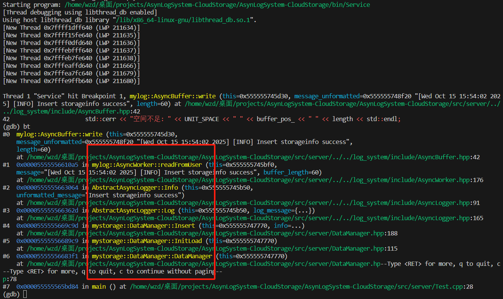

    通过gdb调试发现是存储系统中的数据管理器`DataManager`初始化时的日志。实验中，云存储中的`low_storage`和`deep_storage`中一共有7个文件，但是从日志消息中我们可以看到，被完整记录的日志数量只有4个。
    ```cpp
    [Wed Oct 15 15:47:38 2025] [INFO] load storage data from ./storage.data
    [Wed Oct 15 15:47:38 2025] [INFO] Insert storageinfo start
    [Wed Oct 15 15:47:38 2025] [INFO] Insert storageinfo success   // 1
    [Wed Oct 15 15:47:38 2025] [INFO] Insert storageinfo start
    [Wed Oct 15 15:47:38 2025] [INFO] Insert storageinfo success   // 2
    [Wed Oct 15 15:47:38 2025] [INFO] Insert storageinfo start
    [Wed Oct 15 15:47:38 2025] [INFO] Insert storageinfo success   // 3
    [Wed Oct 15 15:47:38 2025] [INFO] Insert storageinfo start
    [Wed Oct 15 15:47:38 2025] [INFO] Insert storageinfo success   // 4
    [Wed Oct 15 15:47:38 2025] [INFO] Insert storageinfo start
    [Wed Oct 15 15:47:38 2025] [INFO] Power up storage server
    ```
    由于没有实现空前不足时的等待操作，故这些日志信息会直接被舍弃掉。一个简单粗暴的方法：把`buffer`的上限从`1024`拉到`4096`

    解决方法：通过线程的同步通信，在对外提供的写入接口中，写入之前先进行判断，如果空间不足就释放互斥锁，当生产者完成与消费者缓冲区之间的交换时，此时肯定是空的，就发通知可以写入了。这里我们将缓冲区的大小降到400，以更加频繁的触发写入时空间不足的情况，结果表明，即使出现了暂时空间不足的情况，但日志系统依然能够记录存储中10个文件的全部插入日志。
    ```cpp
    // 对外提供一个写入的接口
    void readFromUser(std::string message, unsigned int buffer_length)
    {
        const char* buffer = message.c_str();
        std::unique_lock<std::mutex> lock(Mutex_);
        {
            // 如果生产者的空间不足以写入，就释放锁等待，生产者的缓冲区有空间会通知
            cond_writable_.wait(lock, [&]()->bool{ 
                return buffer_productor_->getAvailable() < buffer_length;
            });

            buffer_productor_->write(buffer, buffer_length);

            label_data_ready_ = true;
            cond_productor_.notify_all();
        } 
    }
    ```
    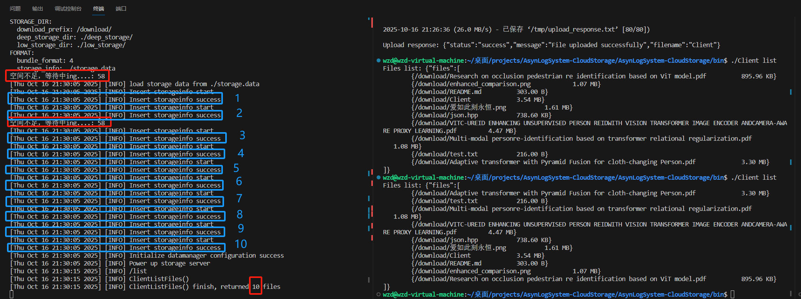

<br>

13. 2025.10.17

    - 修复了浏览器可视化页面能下载却不能上传的问题。

- 问题9

    假设线程池只启动一个线程，启动后线程的情况如下：
    ```cpp
    [New Thread 0x7ffff1dff640 (LWP 244934)]
    [New Thread 0x7ffff15fe640 (LWP 244935)]
    [New Thread 0x7ffff0dfd640 (LWP 244936)]
    [Thread 0x7ffff15fe640 (LWP 244935) exited]
    [New Thread 0x7ffff15fe640 (LWP 244937)]
    [New Thread 0x7fffebfff640 (LWP 244938)]
    [New Thread 0x7fffeb7fe640 (LWP 244939)]
    [Fri Oct 17 14:58:45 2025] [INFO] Initialize datamanager configuration
    [Fri Oct 17 14:58:45 2025] [INFO] Initialize cloudStorage configuration:
    ```
    其中一个是线程池的线程和它`Client`事件循环的两个，另外4个是因为创建了两个日志器(一个是默认的)，每个日志器处理缓冲区有生产者线程和消费者线程，故两个日志器就是4个线程。从启动后线程的情况我可以看到，在不启动远程服务器的情况下，有一个线程`exited`了，可以确认是线程池的线程或者它启动的`Client`对应的事件循环的线程。

    因为`ret = bufferevent_socket_connect(bev_, (struct sockaddr*)&server_addr_, sizeof(server_addr_));`返回`0`只是代表启动连接的操作成功了，而不是连接成功了。因此即使远程服务器没启动，`Client`连接不到服务器，也会继续往下执行，启动事件循环，然后返回`true`表示连接成功。但是，连接失败了会导致启动事件循环时没有事件或者处于活跃状态下的事件，从而直接退出事件循环。因此显而易见，退出的线程就是事件循环的这个线程，但这个线程还在(在线程函数的循环当中)，下一次日志系统接受到级别为`ERROR`或者`FATAL`的日志时依然会发送给线程池，线程池通过`bufferevent_write()`执行发送操作。
    ```cpp
    std::thread loop([&]()->int{
        int ret = event_base_dispatch(base_);
        return ret;  // gdb将断点达到此处，执行调试后程序停在了这里，说明已经退出事件循环并且返回值时1确实是异常退出。
    });
    ```
    如果连接不到服务器，运行到`event_base_dispatch(base_);`时不会阻塞，而是直接返回1。利用这个返回值我们可以这样设计：让事件循环的线程函数去捕获`ret`，此时`ret`是0，如果连接到了服务器那么事件循环就会阻塞，`ret`保持不变；如果连不上，就会把`ret`置为1，通过判断`ret`的值来确定是否连接成功，如果是1就是失败，是0就成功。代码中需要让主线程先沉睡一会，给事件循环函数异常退出后修改`ret`的时间。这样，如果线程的`Client`连接不到服务器，线程也会结束。
    ```cpp
    std::thread loop([&]()->void{ ret = event_base_dispatch(base_); });

    loop.detach(); 
    std::this_thread::sleep_for(std::chrono::milliseconds(10));

    if(ret == 0)
    {
        Connecting_ = true;
        return true;
    }

    return false;
    ```

- 问题10

    直接`./Service`时有时候会异常阻塞，只记录了一条从`storage.data`的日志如下图所示，通过`gdb`调试发现阻塞在因为生产者缓冲区空间不足时而释放互斥锁等待的位置（但是用gdb启动就不会有这种问题？）
    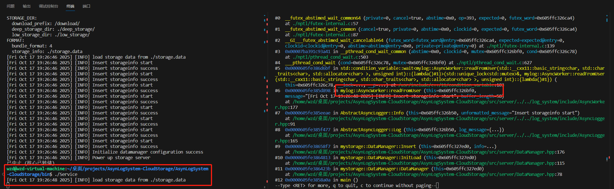
    这种情况说明线程一直处于等待状态，但没有通知来唤醒它。

    原因在于控制缓冲区的生产者和消费者初始化有严格的先后顺序，之前是通过启动生产者线程后休眠100ms再接着启动消费者线程。但后面这段休眠的代码被删除了，导致了如果消费者速度比较快，率先声明自己已经准备好了，会导致生产者和消费者的协同工作出现问题。
    ```cpp
    cond_productor_.wait(lock, [&]()->bool{ return label_consumer_ready_ && label_data_ready_ || ExitLabel_;});
    ```
    ```cpp
    cond_consumer_.wait(lock, [&]()->bool { return ExitLabel_ || !label_consumer_ready_;});
    ```

    经过打印测试，复现出程序阻塞时的情况如下图所示：

    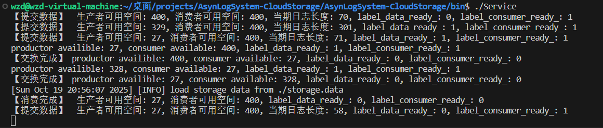
    明确一点，`label_consumer_ready_`初始化的时候就是`true`。按照此图的分析，<u>消费者应该处于临界区之外而非等待中</u>。第一个用户提交用户之前的输出，因为还没有提交过，所以`label_data_ready_`为`false`，随后的两个用户提交就都是`true`，但第三个用户提交时生产者缓冲区空间不足了，因此等待。生产者拿到了互斥锁，`label_consumer_ready_`和`label_data_ready_`都满足条件，从而往下执行交换缓冲区。交换后这俩标志都会被置为`false`。由于生产者通知了用户和消费者，但是消费者就存在一种可能：<u>消费者在生产者交换缓冲区后抢到了锁，进入临界区并把`label_consumer`置为`true`，判断该标签不为`false`就等待</u>。接下来消费者有抢到了锁(之前提交失败的)就提交日志，并把`label_data_ready_`置为`true`，因此下一个正常提交的用户提交之前的打印的情况就又是`label_data_ready_`和`label_consumer_ready_`都为`true`的景象，消费者表示准备就绪状态，但是自己还有数据没有处理。
    
    于是当时生产者抢到锁后，就会因为两个`true`而往下进行缓冲区的交换，但此时两个缓冲区都是有数据的。<u>生产者把原来交给消费者，但消费者还没处理的缓冲区又换回来了</u>，并把两个标签全部置为`false`。这便是出现连续两次交换缓冲区的情况。这时消费者获得锁，因为`label_consumer_ready_`为`false`就把缓冲区的数据处理掉。无论接下来消费者有没有抢到锁，`label_consuemr_ready_`是`true`还是`false`，此时`label_data_ready_`为`false`，但是生产者缓冲区有大量数据，已经无法放下下一条信息了。<u>因此下一个用户提交时，它会进入等待状态(把`label_data_ready_`置为`true`发生在成功提交之后)，生产者因为`label_data_ready_`为`false`而继续等待，消费者最终也会因为进入临界区自己把`label_consumer_ready_`置为`true`而等待</u>。故程序阻塞。
    
    解决方法：

    由于`label_consumer_ready_`初始化时就是`true`，问题出在生产者已经把`label_consumer_ready_`置为`false`，表示消费者你的缓冲区有数据了，赶紧处理。但是拿到锁的消费者刚进入临界区，把`label_consumer_ready_`又置成了`true`。因此，把`label_consumer_ready_ = true;`移动到消费者处理完数据之后，不仅解决了上面的问题，而且处理完后立即置为`true`应该是更合理的做法，因为保不齐消费者释放锁后抢不到接下来的锁，用户或生产者抢到了锁，但此时消费者缓冲区没有数据准备就绪但是`label_consumer_ready_`为`false`的意义上的错误。

    <!-- 于是，在创建并启动生产者线程之后休眠10ms，再创建和启动消费者线程，便能解决问题? -->

<br>

14. 2025.10.19

    - 解决了一个偶然会出现的报错：
        ```cpp
        [err] evthread.c:400: Assertion lock_ == NULL failed in evthread_setup_global_lock_
        ```
        原因是`evthread_use_pthreads(); `多次调用，它最初被放在`Client`的初始化中，因为线程池的每个线程都对应一个`Client`，故创建多个`Client`会调用多次`evthread_use_pthreads(); `。于是把它单独放在线程池的创建中。

<br>

15. 2025.10.20
    - 实现了缓冲区的软扩容，如果日志大小大于整个缓冲区的大小，就会动态扩容，并在一定时间内检测到缓冲区的扩容部分没有使用时将其释放掉。

    - 实现了缓冲区的硬扩容，只要日志大小大于剩余缓冲区的大小，就会动态扩容，其他同上。

    - 为异步日志系统完善了配置文件及其加载。

        需要加载的配置包括：
        THREADPOOL:
            INIT_THREADSIZE 4
            THREAD_SIZE_THRESHHOLD 4
            LOGQUE_MAX_THRESHHOLD 4

        ASYNCBUFFER:
            INIT_BUFFER_SIZE 512

        ASYNCWORKER:
            EFFECTIVE_EXPANSION_TIMES 4

        
- 问题11

    由于设计的时候，用户提交信息的时候如果生产者的缓冲区剩余空间不足，就会等待，等生产者与消费者交换后再尝试提交。但是如果日志信息大小本身就超过了整个缓冲区的大小，那么线程会直接卡死。

  解决方法：

    设置动态增长的缓冲区空间，如果用户提交日志信息的时候发现生产者缓冲区的大小还没自己日志信息的长，就扩容，扩容的增量为当前日志信息大小的2倍/~~初始容量的2倍~~。每次生产者进行交换的时候会有一个计数，如果此时缓冲区使用的大小小于`INIT_BUFFER_SIZE`时就会减一，当计算为0时，交换后生产者就会认为大日志信息的高峰已经过去了，就把缓冲区设置回`INIT_BUFFER_SIZE`

    可以设置两种不同的动态扩容模式：第一种<u>(软扩容)</u>就是上面的这种，如果不是因为日志长度大于整个缓冲区大小的放不下，这种需要等待，只有当日志信息大到整个缓冲区都放不下才会扩容；第二种<u>(硬扩容)</u>是只要空间不足，就扩容，扩容的增量为当前日志大小的两倍。

    由于用户，生产者和消费者谁能抢到互斥锁是随机的，因此可能出现连续扩容的情况。


<br>

16. 2025.10.21

- 问题12

    对异步日志系统进行性能测试，1s内向系统连续写日志，发现日志中有大量的残缺。
    ```cpp
    while (std::chrono::steady_clock::now() - start < std::chrono::seconds(1))
    {
        mylog::GetLogger("asynclogger")->Info("pdcHelloWorld");
    }
    ```
    原因：测试代码位于`log_system/include/`中，而正常运行系统的脚本在`bin/`，于是找不到配置文件。

    
<br>

17. 2025.10.22

    我们测试了异步日志系统的性能，连续向日志系统发送2s的日志，并记录第一个1s内发送了多少日志，另外，异步日志系统中，从生产者开始处理开始计时。到某个时刻消费者处理完日志检测到时间超过1s，这段时间作为异步日志系统的1s内处理的日志总量。实验结果如下:
    |      | 1s内发送的日志数量 | 1s内处理的日志数量 | 1s处理的日志大小(MB) |
    |------|-------------------|-------------------|---------------------|
    | 0    | 130654            | 130660            | 21.34               |
    | 1    | 150802            | 150802            | 24.63               |
    | 2    | 166344            | 166466            | 27.17               |
    | 3    | 160507            | 160529            | 26.22               |
    | 4    | 130590            | 130590            | 21.33               |
    | 5    | 141340            | 141341            | 23.09               |
    | 6    | 96626             | 96745             | 15.78               |
    | 7    | 163877            | 163883            | 26.77               |
    | 8    | 160825            | 160829            | 26.27               |
    | 9    | 154221            | 154221            | 25.19               |

    从表格中的数据可以看到，客户端1s内发送的日志数量的波动很大，这是由于日志的提交逻辑如下。在函数`readFromUser()`中如果生产者的缓冲区空间不足会等待，比如一直是用户抢到锁，导致生产者无法及时的处理数据。上述这种如果上传的日志比剩余空间大就等待的模式是软扩容，因为只有日志本身大于整个生产者整个缓冲区大小时才会触发扩容。
    ```cpp
    mylog::GetLogger("asynclogger")->Info("pdcHelloWorld")
    --> void Info(const std::string& unformatted_message)
    ----> void readFromUser(std::string message, unsigned int buffer_length)
    ```

- 问题13

    同样的测试条件，把扩容方式从软扩容变为硬扩容后就出现了问题。从gdb调试的结果来看问题出在了用户向生产者缓冲区写入数据时，但是打断点在这行语句，或者到达断点位置不停下继续执行，就能够正常的运行整个程序？
    ```cpp
    std::memcpy(buffer_.data() + buffer_pos_, message_unformatted, length);
    ```
    通过调试发现，执行到这一行即将写入的时候依然出现了剩余空间不足的情况，即```buffer_pos_ + length > buffer_.size()```的情况。

    问题所在：

    硬扩容模式下判断是否需要扩容的条件是```if(buffer_productor_->getAvailable() < buffer_length)```，如果内存刚好够用，就会把日志信息写入剩余的空间，但是为了分隔多条日志，需要添加一个`\0`(严谨来说不是添加，因为缓冲区里面没有数据就都是`\0`，只是`buffer_pos_`需要额外+1)，因此`buffer_pos_`就超过了缓冲区的索引范围。修改为`=`便可以解决问题。

    下面是硬扩容的情况，同样的，即使没有等待过程，除了互斥锁的持有情况，扩容的次数也会影响1秒内发送的日志数量,因为扩容时用户端调用的。

    |      | 1s内发送的日志数量 | 1s内处理的日志数量 | 1s处理的日志大小(MB) |
    |------|-------------------|-------------------|---------------------|
    | 0    | 89265             | 89265             | 14.58               |
    | 1    | 88918             | 88918             | 14.53               |
    | 2    | 167795            | 167857            | 27.41               |
    | 3    | 173487            | 173591            | 28.34               |
    | 4    | 109395            | 109396            | 17.87               |
    | 5    | 92407             | 92410             | 15.10               |
    | 6    | 91091             | 91158             | 14.88               |
    | 7    | 110331            | 110331            | 18.02               |
    | 8    | 96247             | 96557             | 15.72               |
    | 9    | 83665             | 83771             | 13.67               |
