# AsynLogSystem-CloudStorage
基于libevent的带异步日志功能的云存储系统

## 更新日志
1. 2025.9.13
    
    实现了异步日志系统的主要功能:
    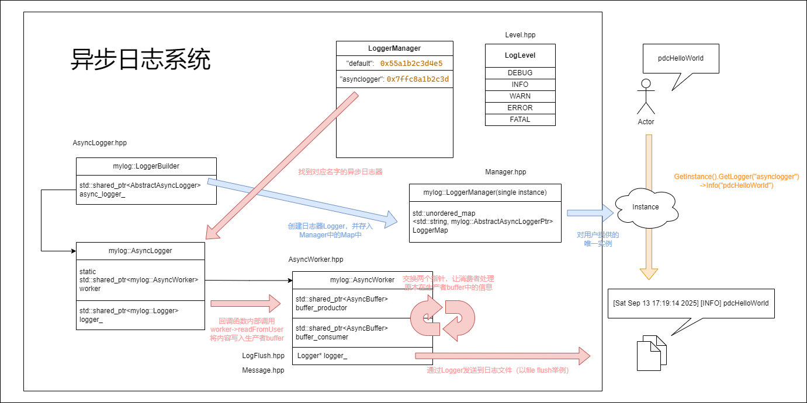

    include(with libevent)提供了基于libevent的部分功能测试，可以在终端`nc 127.0.0.1 8000`向服务器发送消息作为日志信息发送到控制台和日志中。

<br>

2. 2025.9.17

    - 完善了日志信息的筛选部分，即等于最低等级的日志消息不会被`flush`

- 问题1

    发现没有libevent测试的异步日志管理系统并没有将日志信息写入缓冲区，而是直接发送了
    ```cpp
    mylog::LoggerManager::GetInstance().GetLogger("asynclogger")->Info("pdchelloworld");
    ```
    其中`.GetLogger()`是从`LoggerMap`中返回对应的`async_logger(class AbstractAsyncLoggerPtr)`, 
    
    `AbstractAsyncLoggerPtr`包含一个成员变量`logger_(class Logger)`， 并把他返回， 

    `logger_`中就有`INFO`等方法，可以把消息发送到控制台，文件或者滚动文件中，因此这个过程并没有经过buffer

    通过调整各个类的调用逻辑解决。

    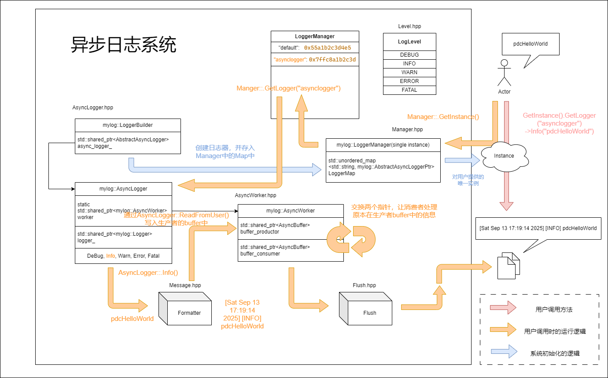

- 问题2

    一个发生在buffer交换的非致命问题：

    一开始生产者在等待数据，消费者在等待生产者给数据（交换buffer）（label_consumer_ready_ = true），之后生产者的buffer有了数据（label_data_ready_ = true），它被唤醒，交换buffer并通知消费者（label_data_ready_），而后释放互斥锁，此时生产者和消费将抢夺同一个锁：**如果生产者抢到了这把锁**，在生产者进入`wait`之前，又有数据到了（label_data_ready_ = true），这时候再`wait`就不会进入等待，而是交换buffer，但是，消费者中的buffer还没有被处理掉......
    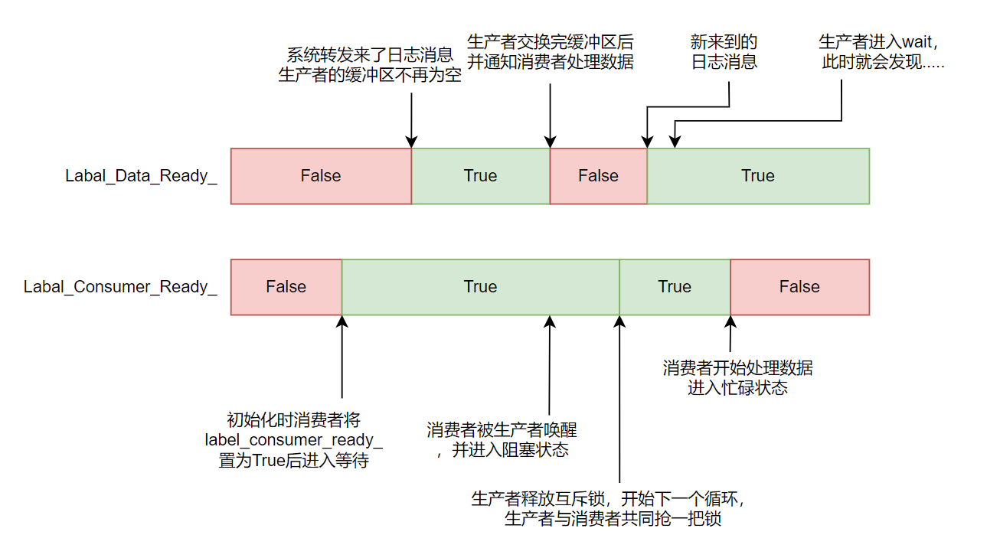

    因此让生产者交换完缓冲区后，把`label_consumer_ready_`置为`false`，表示消费者的buffer中已经有数据了。这样生产者抢到锁后，即使有数据发来，也会把锁释放掉让消费者先处理buffer中的数据。

    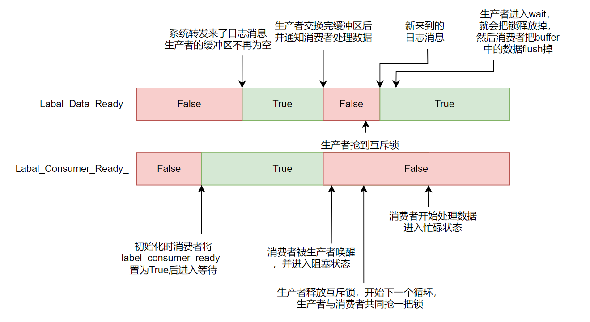


- 问题3

    一个发生在AsyncWorker析构中的死锁问题：

    一开始，生产者在等待数据，消费者在等待生产者给数据（交换buffer）
    之后生产者的buffer有了数据，它被唤醒，因为没有线程占着锁，它启动，交换buffer什么的，
    然后通知消费者起来，消费者发现条件都满足了，进入阻塞状态，生产者结束当前循环后会释放锁，
    于是生产者和消费者同时抢锁：
    如果生产者抢到了锁，他会进入wait，然后发现buffer没有数据进而等待，消费者从而拿到锁，于是这种情况下，**消费者在处理数据时生产者在wait处等待**。
    如果消费者抢到了锁，那么它直接处理数据，于是在这种情况下，**消费者在处理数据时生产者在互斥锁的外面阻塞**，
    如果此时此刻AsyncWorker开始析构，在消费者处理完数据后抢到了锁，那么生产者和消费者都在互斥锁外面阻塞，析构函数中的通知就没有用。
    不过生产者进入wait,发现Exitlabel_已经为true，依然能正常退出，通知析构函数，当然此时析构函数只检测到了生产者退出的标志是true，因此继续等待。
    消费者进入wait，因为消费者唯二被唤醒的情况是生产者通知或者AsyncWorker析构时通知，因为生产者线程已经结束了，所以消费者在wait中永远出不来，进而AsyncWorker的析构也卡住了。
    
    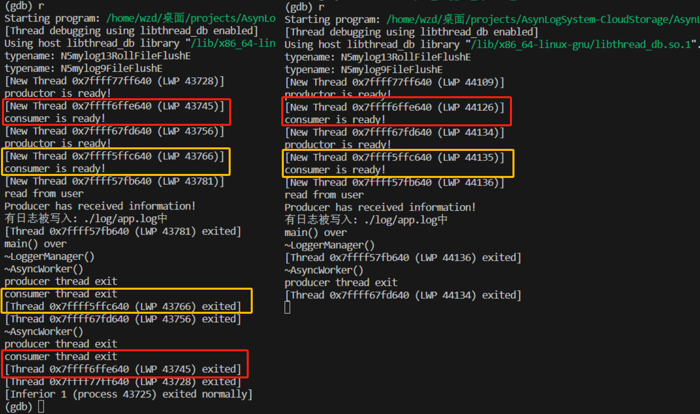

    最初的消费者的唤醒条件比较单一：
    ```cpp
    cond_consumer_.wait(lock);
    ```
    由于上一个问题我们在生产者交换完buffer就把`label_consumer_ready_`置为`false`，因此我们可以以`label_consumer_ready_`作为标志，同时初始化的时候置为`true`，因为在异步日志器构建完成之前不会有数据输入，因此不存在生产者初始化进入`wait`之前因为有消息而直接跳过。
    ```cpp
    cond_consumer_.wait(lock, [&]()->bool { return !label_consumer_ready_ || ExitLabel_;});
    ```
    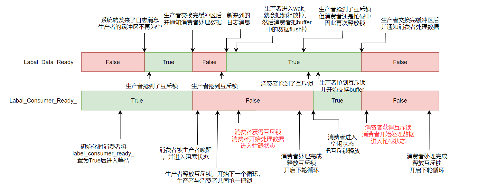

<br>

3. 2025.9.22

    - 实现了`backlog`服务器和客户端的部分，以及`ThreadPool`与异步日志系统的连接：线程函数`threadfunc`调用时，会先创建一个`Client`指针，`Client`会执行一系列连接服务器相关的操作等。当异步日志系统发现日志时[Error]和[Fatal]时，就会通过线程池的`submitLog()`进行提交。
    线程函数中会检测是否日志队列中有日志，如果有，抢到锁后就将其发送到服务器。

    - 异步日志系统向服务器发送消息的功能基本完善，存在瑕疵但是对整体的功能没有影响。

- 问题4
    
    一个连接服务器后事件循环无法正常启动的问题

    通过gdb调试发现，有时候有些进程无法正常启动事件循环，刚启动后就发现`event_base_dispatch(base);`下面的断点被触发了。
    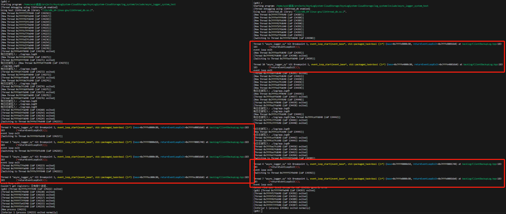

    通过gdb打印`event_base_dispatch(base);`的返回值发现，异常退出事件循环的，它们返回值为1，而正常退出的几个返回值都是0，通过查阅`libevent`的源码，找到退出循环的语句，从判断语句的其中两个条件来看，`!event_haveevents(base) && !N_ACTIVE_CALLBACKS(base)`应该分别表示：是否有事件，以及激活状态的事件的数量。
    ```cpp
    /* If we have no events, we just exit */
    if (0==(flags&EVLOOP_NO_EXIT_ON_EMPTY) &&
        !event_haveevents(base) && !N_ACTIVE_CALLBACKS(base)) {
        event_debug(("%s: no events registered.", __func__));
        retval = 1;
        goto done;
    }
    ```
    ```cpp
    static int event_haveevents(struct event_base *base)
    {
        return (base->virtual_event_count > 0 || base->event_count > 0);
    }
    ```
    ```cpp
    #define N_ACTIVE_CALLBACKS(base) ((base)->event_count_active)        
    ```
    
    通过gdb进入`event_base_dispatch(base)`函数内部，事件循环正常启动的情况下，应该是如下情况：蓝色划线的分别代表事件循环直接退出的三个需要成立条件：其中`flags`默认为0，`EVLOOP_NO_EXIT_ON_EMPTY`为0x04，&后的结果为0，因此第一个条件满足；第二个条件获取注册的事件情况，返回1表示有注册的事件，正常情况下返回1，故第二个条件为0，到此已经可以判断条件不会成立；第三个条件式激活状态的事件情况，结果是0，故第三个条件为满足。
    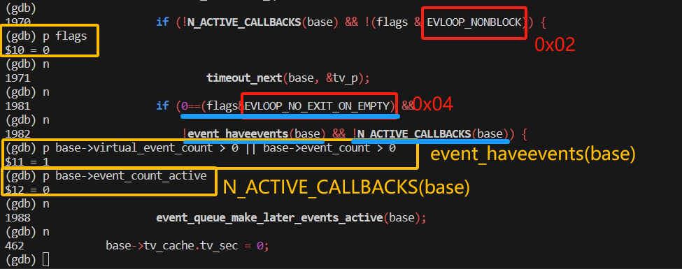
    
    我们用gdb将断点打在事件循环直接退出的条件满足后执行的语句上，结果发现，此时的事件循环中没有任何事件！因此事件循环退出的三个条件都满足了，于是`event_base_dispatch(base)`直接就出来了。
    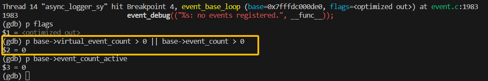
    
    进一步调试，我们打印刚进入`event_base_dispatch(base)`时事件循环有无事件，发现是有的`event_haveevents(base) = 1`(`event_callback`和`read_callback`两个事件，只打印`base->event_count`是2)，但等到事件循环退出的条件判断时，却显示没有任何事件。
    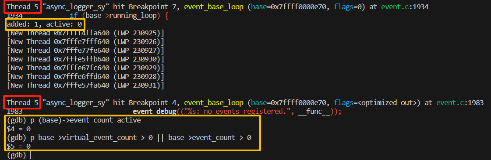

    另外我们发现，在进入事件循环即执行`event_base_dispatch(base)`之前使线程休眠0.1s，便可解决上述问题。
    ```cpp
    std::this_thread::sleep_for(std::chrono::milliseconds(100));
    ```
    
<br>

4. 2025.9.23
    - 异步日志器判断线程池是否创建成功来决定是否向服务器提交日志，但是线程池创建成功不代表器它的线程连接服务器成功，因此
    线程池向外包装一个函数，用于判断成功连接的数量，如果一个都没有，那就不提交。

    - 实现了把服务器接受到的日志消息写入到日志文件中，之前仅仅是输出在控制台中

- 问题5

    新的问题（可能和22号的问题有联系），当启动的线程较多比如8个时，发生以下问题的概率就更高：
    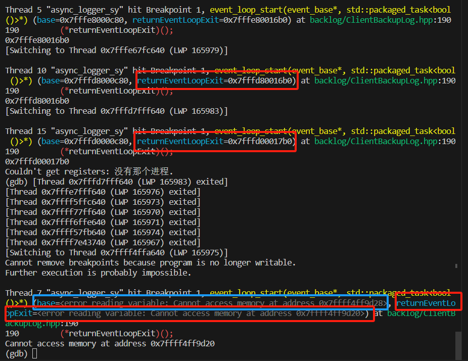
    图中我们可以看到，参数`base`和`returnEventLoopExit()`已不可访问。说明`Client`对象此时已经析构了，
    它的这两个成员变量无法再访问。

    在`Client`的启动函数`start()`中，我们将事件循环放到了另一个线程并将其设置为分离线程。在`Client::stop()`中关闭事件循环，等待事件循环关闭后再接着把`bev`和`base`清理掉。
    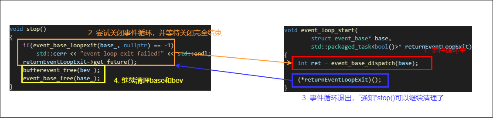
    `Client()`发生在线程池的线程函数退出后，那么就可能发生以下的情况：

    `client_->stop()`执行，
    ```cpp
    void threadFunc(tp_uint threadid)
    {
        std::unique_ptr<Client> client_ =
            std::make_unique<Client>(serverAddr_, serverPort_, threadid);
        // 启动客户端并连接服务器, 其中包含了event_base_dispatch(base);
        if(client_->start())
        .
        .
        .

        client_->stop();  // 清理base, bv，关闭事件循环
        Exit_.notify_all();  // 通知析构函数那里，我这个线程已经清理完成了
    }
    ```

    当我们在`~ThreadPool()`最后休眠5s，该问题便解决，因此我们可以认为：线程池析构后还有一些`Client`没有析构完成，导致出错。另外，当`Client`连接服务器成功后，`curThreadSize_`就会加一，但是有时候，这个值可能
    会小于`INIT_THREADSIZE`，或许可以说明某些`Client`连接失败，并且连接失败`Client`，服务器控制台显示的客户端下线发生在5s休眠之后，而正常连接都发生在5s休眠之前，并且它们不会执行到`client_->stop();`和`Exit_.notify_all();`，而5s之后是线程池析构了，因此还可以认为，有些`Client`在`while`循环中无法退出。

<br>

5. 2025.9.25

    - 在启动事件循环之前让线程休眠100ms，就解决了上面两个大问题...
        ```cpp
        std::this_thread::sleep_for(std::chrono::milliseconds(100));
        int ret = event_base_dispatch(base);
        ```
        后续会接着分析该问题。

<br>

6. 2025.9.26

    - 实现了云存储服务的配置文件的加载以及服务器的建立，并且与异步日志系统对接。
    - 使用CMake对项目构建系统的架构设计。
        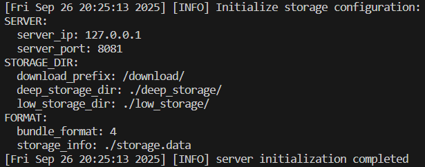

<br>

7. 2025.9.27

    - 实现了云存储服务中服务器的启动，以及客户端连接服务器，并且服务器有对应的日志消息产生(显示有客户端连接)

<br>

8. 2025.10.1

    - 完成了`Util.hpp`和`DataManager.hpp`的编写

<br>

9. 2025.10.12

    - 完成了云存储的基本功能

<br>

10. 2025.10.13

    - 尝试实现三台服务器的文件存储和传输，其中：
        
        1. 172.30.173.233 (ubuntu server) 【某主机通过vscode连接的远程服务器】
        2. 172.30.173.20  (ubuntu server) 【某主机通过vscode连接的远程服务器】
        3. 172.30.173.224 (ubuntu 有可视化界面)  【某主机通过VMware启动的服务器】

        主要的文件传递发生在前两台服务器之间，包括实验代码，实验数据集，训练模型等等。但由于二者无可视化界面，无法通过网页进行可视化操作，因此我们需要专门实现一个新的`Service.hpp`，提供终端上的上传文件，下载文件，查看文件列表的功能。

        由于三个服务器在同一网段`172.30.173`，因此实现起来相对方便

    - 实现了两台服务器(ubuntu server)在终端下载文件，同时，通过访问浏览器，window端也可以在可视化界面上上传和下载文件
    - 修复了服务器启动时无法显示先前上传的文件列表

        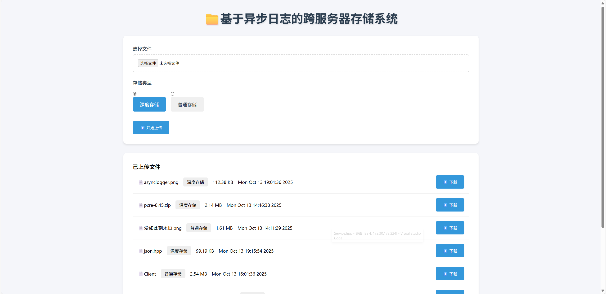

    - 添加了删除文件功能，同时从`table_`和`storage.data`中删除对应的`StorageInfo`


<br>

11. 2025.10.16

- 问题6

    使用gdb调试，发现系统启动时会创建17个线程，然后立刻结束16个线程的问题，如图所示，这其中的16个线程来自线程池。

    调试发现，系统启动会创建17个线程，然后立刻结束16个线程的问题，如图所示，这其中的16个线程来自线程池。对于异步日志系统的Client(检测到ERROR或者FATAL日志就向远程服务器发送日志信息)，它通过`libevent`来实现其功能，期间会启动一个事件循环，会阻塞住当前线程，因此事件循环被放在了一个分离线程中，导致线程池启动的时候创建了两倍于初始线程数量的线程。初始线程数量为8，因此会一口气创建16个线程。
    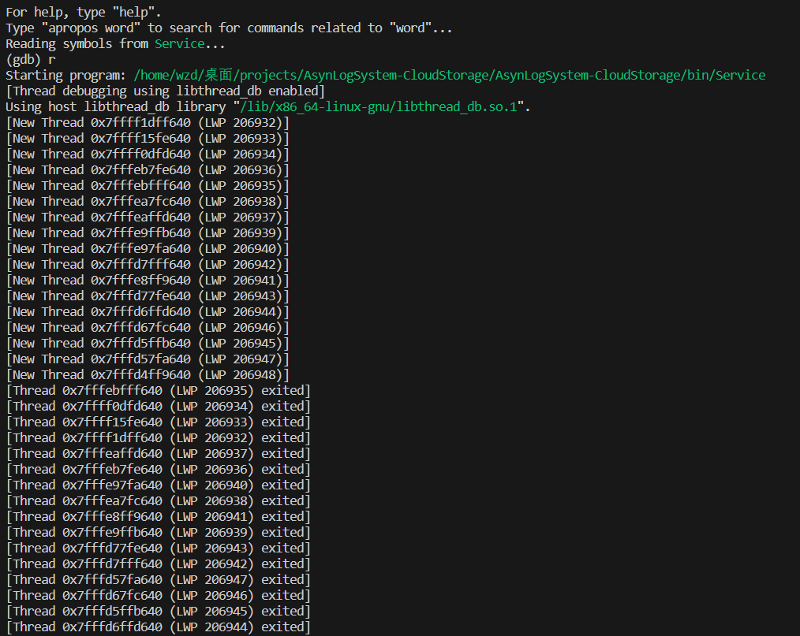

    查阅代码发现，客户端的启动函数中，先启动了事件循环，再连接服务器，这里顺序有误，导致启动事件循环时没有激活的事件而直接结束，事件循环的结束又导致了`Client->start()`的失败将顺序掉转后，即先连接服务器，再启动事件循环，问题便得以解决，没有线程意外结束。
    

    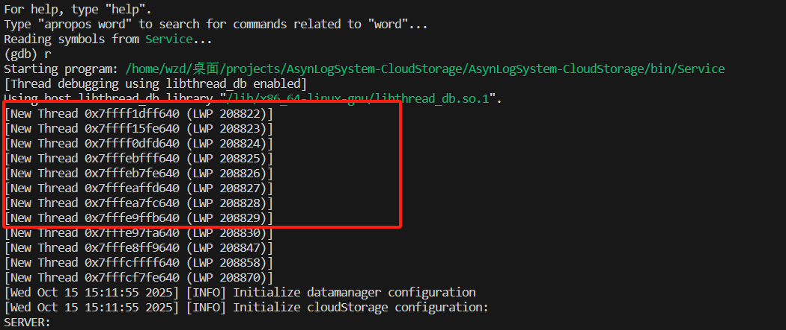
    正确的逻辑，先连接服务器后再启动事件循环，调试结果如下：红色方框是线程池创建的8个线程，并且没有异常的线程结束问题。

- 问题7
    
    设定上，日志系统会把`ERROR`级别及以上的日志发送的远程服务器，目前既不是远程(只是127.0.0.1)，也接收不到日志消息(之前单独测试日志系统时可以)，其中，接收不到消息的原因是之前通过`future`确保服务器连接的操作完成后再启动事件循环，即尝试连接服务器的动作会触发事件的回调函数，在事件的回调函数中判断服务器连接完成后，再返回值来结束主线程的阻塞(等待返回值)。
    ```cpp
    void event_callback(struct bufferevent* bev, short events, void* ctx) 
    {
        auto returnConnectLabel = static_cast<std::packaged_task<bool(bool)>*>(ctx);
        bool label = false;
        
        if (events & BEV_EVENT_CONNECTED) {
            // std::cout << "成功连接到服务器 " << std::endl;
            label = true;
        } 
        else if (events & BEV_EVENT_ERROR) {
            // std::cerr << "连接错误: " << evutil_socket_error_to_string(EVUTIL_SOCKET_ERROR()) << std::endl;
        } 
        else if (events & BEV_EVENT_EOF) {
            // std::cout << "服务器断开连接" << std::endl;
        }
        // 把连接服务器是否成功的标志返回
        (*returnConnectLabel)(label);
    }
    ```
    但是逻辑顺序改正以后，经过调试发现，因为事件循环在连接服务器后才启动，因此连接服务器的这个动作并不会触发事件循环，从而不会调用到`event_callback()`，`(*returnConnectLabel)(label);`执行不到，因此主线程一直被阻塞着，`client->start()`无法结束，从而不能进入线程函数中的循环。删除这个多此一举的操作便可。
    如图所示，用户端尝试下载一个云端不存在的文件，存储系统就向日志系统提交一条`ERROR`级别的日志，日志系统就将该日志发送到“远程”服务器上。
    
    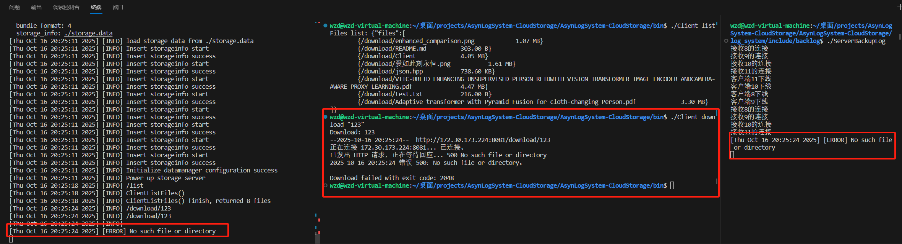


<br>

12. 2025.10.16

- 问题8

    启动系统的时候【偶尔】会出现"空间不足"的提示，它来自于异步日志系统的缓冲区，但启动阶段不应该有写入缓冲区的操作

    ```cpp
    void write(const char* message_unformatted, unsigned int length)
    {
        std::unique_lock<std::mutex> lock(BufferWriteMutex_);

        if(UNIT_SPACE - buffer_pos_  < length)
        {
            std::cerr << "空间不足" << std::endl;
            return; 
        }
        std::memcpy(buffer_.data() + buffer_pos_, message_unformatted, length);
        buffer_pos_ += (length + 1);  // 加1空一个0作为结束符
    }
    ```
    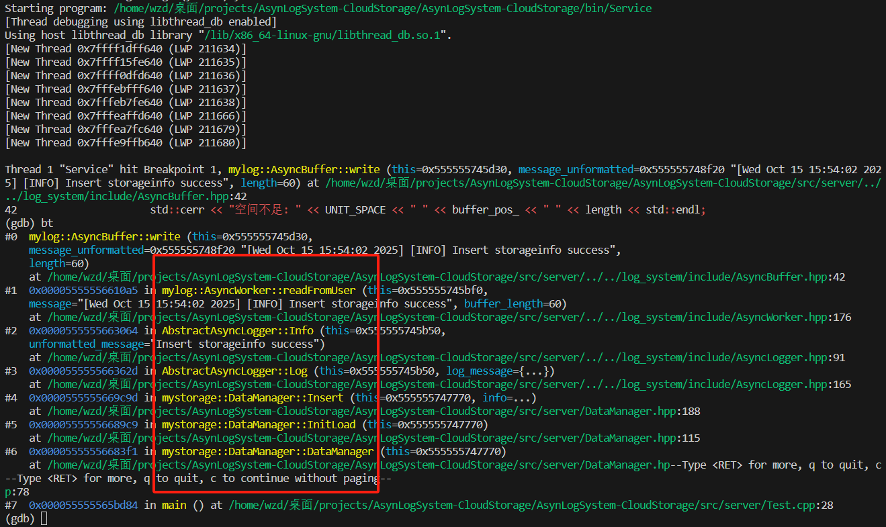

    通过gdb调试发现是存储系统中的数据管理器`DataManager`初始化时的日志。实验中，云存储中的`low_storage`和`deep_storage`中一共有7个文件，但是从日志消息中我们可以看到，被完整记录的日志数量只有4个。
    ```cpp
    [Wed Oct 15 15:47:38 2025] [INFO] load storage data from ./storage.data
    [Wed Oct 15 15:47:38 2025] [INFO] Insert storageinfo start
    [Wed Oct 15 15:47:38 2025] [INFO] Insert storageinfo success   // 1
    [Wed Oct 15 15:47:38 2025] [INFO] Insert storageinfo start
    [Wed Oct 15 15:47:38 2025] [INFO] Insert storageinfo success   // 2
    [Wed Oct 15 15:47:38 2025] [INFO] Insert storageinfo start
    [Wed Oct 15 15:47:38 2025] [INFO] Insert storageinfo success   // 3
    [Wed Oct 15 15:47:38 2025] [INFO] Insert storageinfo start
    [Wed Oct 15 15:47:38 2025] [INFO] Insert storageinfo success   // 4
    [Wed Oct 15 15:47:38 2025] [INFO] Insert storageinfo start
    [Wed Oct 15 15:47:38 2025] [INFO] Power up storage server
    ```
    由于没有实现空前不足时的等待操作，故这些日志信息会直接被舍弃掉。一个简单粗暴的方法：把`buffer`的上限从`1024`拉到`4096`

    解决方法：通过线程的同步通信，在对外提供的写入接口中，写入之前先进行判断，如果空间不足就释放互斥锁，当生产者完成与消费者缓冲区之间的交换时，此时肯定是空的，就发通知可以写入了。这里我们将缓冲区的大小降到400，以更加频繁的触发写入时空间不足的情况，结果表明，即使出现了暂时空间不足的情况，但日志系统依然能够记录存储中10个文件的全部插入日志。
    ```cpp
    // 对外提供一个写入的接口
    void readFromUser(std::string message, unsigned int buffer_length)
    {
        const char* buffer = message.c_str();
        std::unique_lock<std::mutex> lock(Mutex_);
        {
            // 如果生产者的空间不足以写入，就释放锁等待，生产者的缓冲区有空间会通知
            cond_writable_.wait(lock, [&]()->bool{ 
                return buffer_productor_->getAvailable() < buffer_length;
            });

            buffer_productor_->write(buffer, buffer_length);

            label_data_ready_ = true;
            cond_productor_.notify_all();
        } 
    }
    ```
    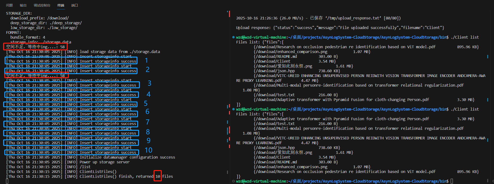

<br>

13. 2025.10.17

    - 修复了浏览器可视化页面能下载却不能上传的问题。

- 问题9

    假设线程池只启动一个线程，启动后线程的情况如下：
    ```cpp
    [New Thread 0x7ffff1dff640 (LWP 244934)]
    [New Thread 0x7ffff15fe640 (LWP 244935)]
    [New Thread 0x7ffff0dfd640 (LWP 244936)]
    [Thread 0x7ffff15fe640 (LWP 244935) exited]
    [New Thread 0x7ffff15fe640 (LWP 244937)]
    [New Thread 0x7fffebfff640 (LWP 244938)]
    [New Thread 0x7fffeb7fe640 (LWP 244939)]
    [Fri Oct 17 14:58:45 2025] [INFO] Initialize datamanager configuration
    [Fri Oct 17 14:58:45 2025] [INFO] Initialize cloudStorage configuration:
    ```
    其中一个是线程池的线程和它`Client`事件循环的两个，另外4个是因为创建了两个日志器(一个是默认的)，每个日志器处理缓冲区有生产者线程和消费者线程，故两个日志器就是4个线程。从启动后线程的情况我可以看到，在不启动远程服务器的情况下，有一个线程`exited`了，可以确认是线程池的线程或者它启动的`Client`对应的事件循环的线程。

    因为`ret = bufferevent_socket_connect(bev_, (struct sockaddr*)&server_addr_, sizeof(server_addr_));`返回`0`只是代表启动连接的操作成功了，而不是连接成功了。因此即使远程服务器没启动，`Client`连接不到服务器，也会继续往下执行，启动事件循环，然后返回`true`表示连接成功。但是，连接失败了会导致启动事件循环时没有事件或者处于活跃状态下的事件，从而直接退出事件循环。因此显而易见，退出的线程就是事件循环的这个线程，但这个线程还在(在线程函数的循环当中)，下一次日志系统接受到级别为`ERROR`或者`FATAL`的日志时依然会发送给线程池，线程池通过`bufferevent_write()`执行发送操作。
    ```cpp
    std::thread loop([&]()->int{
        int ret = event_base_dispatch(base_);
        return ret;  // gdb将断点达到此处，执行调试后程序停在了这里，说明已经退出事件循环并且返回值时1确实是异常退出。
    });
    ```
    如果连接不到服务器，运行到`event_base_dispatch(base_);`时不会阻塞，而是直接返回1。利用这个返回值我们可以这样设计：让事件循环的线程函数去捕获`ret`，此时`ret`是0，如果连接到了服务器那么事件循环就会阻塞，`ret`保持不变；如果连不上，就会把`ret`置为1，通过判断`ret`的值来确定是否连接成功，如果是1就是失败，是0就成功。代码中需要让主线程先沉睡一会，给事件循环函数异常退出后修改`ret`的时间。这样，如果线程的`Client`连接不到服务器，线程也会结束。
    ```cpp
    std::thread loop([&]()->void{ ret = event_base_dispatch(base_); });

    loop.detach(); 
    std::this_thread::sleep_for(std::chrono::milliseconds(10));

    if(ret == 0)
    {
        Connecting_ = true;
        return true;
    }

    return false;
    ```

- 问题10

    直接`./Service`时有时候会异常阻塞，只记录了一条从`storage.data`的日志如下图所示，通过`gdb`调试发现阻塞在因为生产者缓冲区空间不足时而释放互斥锁等待的位置（但是用gdb启动就不会有这种问题？）
    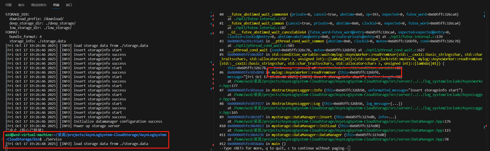
    这种情况说明线程一直处于等待状态，但没有通知来唤醒它。

    原因在于控制缓冲区的生产者和消费者初始化有严格的先后顺序，之前是通过启动生产者线程后休眠100ms再接着启动消费者线程。但后面这段休眠的代码被删除了，导致了如果消费者速度比较快，率先声明自己已经准备好了，会导致生产者和消费者的协同工作出现问题。
    ```cpp
    cond_productor_.wait(lock, [&]()->bool{ return label_consumer_ready_ && label_data_ready_ || ExitLabel_;});
    ```
    ```cpp
    cond_consumer_.wait(lock, [&]()->bool { return ExitLabel_ || !label_consumer_ready_;});
    ```

    经过打印测试，复现出程序阻塞时的情况如下图所示：

    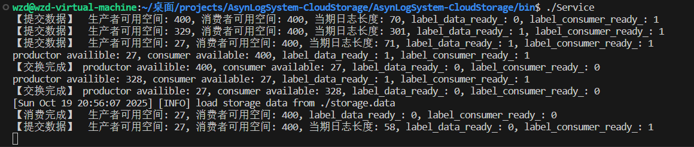

    明确一点，`label_consumer_ready_`初始化的时候就是`true`。按照此图的分析，<u>消费者应该处于临界区之外而非等待中</u>。第一个用户提交用户之前的输出，因为还没有提交过，所以`label_data_ready_`为`false`，随后的两个用户提交就都是`true`，但第三个用户提交时生产者缓冲区空间不足了，因此等待。生产者拿到了互斥锁，`label_consumer_ready_`和`label_data_ready_`都满足条件，从而往下执行交换缓冲区。交换后这俩标志都会被置为`false`。由于生产者通知了用户和消费者，但是消费者就存在一种可能：<u>消费者在生产者交换缓冲区后抢到了锁，进入临界区并把`label_consumer`置为`true`，判断该标签不为`false`就等待</u>。接下来消费者有抢到了锁(之前提交失败的)就提交日志，并把`label_data_ready_`置为`true`，因此下一个正常提交的用户提交之前的打印的情况就又是`label_data_ready_`和`label_consumer_ready_`都为`true`的景象，消费者表示准备就绪状态，但是自己还有数据没有处理。
    
    于是当时生产者抢到锁后，就会因为两个`true`而往下进行缓冲区的交换，但此时两个缓冲区都是有数据的。<u>生产者把原来交给消费者，但消费者还没处理的缓冲区又换回来了</u>，并把两个标签全部置为`false`。这便是出现连续两次交换缓冲区的情况。这时消费者获得锁，因为`label_consumer_ready_`为`false`就把缓冲区的数据处理掉。无论接下来消费者有没有抢到锁，`label_consuemr_ready_`是`true`还是`false`，此时`label_data_ready_`为`false`，但是生产者缓冲区有大量数据，已经无法放下下一条信息了。<u>因此下一个用户提交时，它会进入等待状态(把`label_data_ready_`置为`true`发生在成功提交之后)，生产者因为`label_data_ready_`为`false`而继续等待，消费者最终也会因为进入临界区自己把`label_consumer_ready_`置为`true`而等待</u>。故程序阻塞。
    
    解决方法：

    由于`label_consumer_ready_`初始化时就是`true`，问题出在生产者已经把`label_consumer_ready_`置为`false`，表示消费者你的缓冲区有数据了，赶紧处理。但是拿到锁的消费者刚进入临界区，把`label_consumer_ready_`又置成了`true`。因此，把`label_consumer_ready_ = true;`移动到消费者处理完数据之后，不仅解决了上面的问题，而且处理完后立即置为`true`应该是更合理的做法，因为保不齐消费者释放锁后抢不到接下来的锁，用户或生产者抢到了锁，但此时消费者缓冲区没有数据准备就绪但是`label_consumer_ready_`为`false`的意义上的错误。

    <!-- 于是，在创建并启动生产者线程之后休眠10ms，再创建和启动消费者线程，便能解决问题? -->

<br>

14. 2025.10.19

    - 解决了一个偶然会出现的报错：
        ```cpp
        [err] evthread.c:400: Assertion lock_ == NULL failed in evthread_setup_global_lock_
        ```
        原因是`evthread_use_pthreads(); `多次调用，它最初被放在`Client`的初始化中，因为线程池的每个线程都对应一个`Client`，故创建多个`Client`会调用多次`evthread_use_pthreads(); `。于是把它单独放在线程池的创建中。

<br>

15. 2025.10.20
    - 实现了缓冲区的软扩容，如果日志大小大于整个缓冲区的大小，就会动态扩容，并在一定时间内检测到缓冲区的扩容部分没有使用时将其释放掉。

    - 实现了缓冲区的硬扩容，只要日志大小大于剩余缓冲区的大小，就会动态扩容，其他同上。

    - 为异步日志系统完善了配置文件及其加载。

        需要加载的配置包括：
        THREADPOOL:
            INIT_THREADSIZE 4
            THREAD_SIZE_THRESHHOLD 4
            LOGQUE_MAX_THRESHHOLD 4

        ASYNCBUFFER:
            INIT_BUFFER_SIZE 512

        ASYNCWORKER:
            EFFECTIVE_EXPANSION_TIMES 4

        
- 问题11

    由于设计的时候，用户提交信息的时候如果生产者的缓冲区剩余空间不足，就会等待，等生产者与消费者交换后再尝试提交。但是如果日志信息大小本身就超过了整个缓冲区的大小，那么线程会直接卡死。

  解决方法：

    设置动态增长的缓冲区空间，如果用户提交日志信息的时候发现生产者缓冲区的大小还没自己日志信息的长，就扩容，扩容的增量为当前日志信息大小的2倍/~~初始容量的2倍~~。每次生产者进行交换的时候会有一个计数，如果此时缓冲区使用的大小小于`INIT_BUFFER_SIZE`时就会减一，当计算为0时，交换后生产者就会认为大日志信息的高峰已经过去了，就把缓冲区设置回`INIT_BUFFER_SIZE`

    可以设置两种不同的动态扩容模式：第一种<u>(软扩容)</u>就是上面的这种，如果不是因为日志长度大于整个缓冲区大小的放不下，这种需要等待，只有当日志信息大到整个缓冲区都放不下才会扩容；第二种<u>(硬扩容)</u>是只要空间不足，就扩容，扩容的增量为当前日志大小的两倍。

    由于用户，生产者和消费者谁能抢到互斥锁是随机的，因此可能出现连续扩容的情况。


<br>

16. 2025.10.21

- 问题12

    对异步日志系统进行性能测试，1s内向系统连续写日志，发现日志中有大量的残缺。
    ```cpp
    while (std::chrono::steady_clock::now() - start < std::chrono::seconds(1))
    {
        mylog::GetLogger("asynclogger")->Info("pdcHelloWorld");
    }
    ```
    原因：测试代码位于`log_system/include/`中，而正常运行系统的脚本在`bin/`，于是找不到配置文件。

    
<br>

17. 2025.10.22

    我们测试了异步日志系统的性能，连续向日志系统发送2s的日志，并记录第一个1s内发送了多少日志，另外，异步日志系统中，从生产者开始处理开始计时。到某个时刻消费者处理完日志检测到时间超过1s，这段时间作为异步日志系统的1s内处理的日志总量。实验结果如下:
    |      | 1s内发送的日志数量 | 1s内处理的日志数量 | 1s处理的日志大小(MB) |
    |------|-------------------|-------------------|---------------------|
    | 0    | 130654            | 130660            | 21.34               |
    | 1    | 150802            | 150802            | 24.63               |
    | 2    | 166344            | 166466            | 27.17               |
    | 3    | 160507            | 160529            | 26.22               |
    | 4    | 130590            | 130590            | 21.33               |
    | 5    | 141340            | 141341            | 23.09               |
    | 6    | 96626             | 96745             | 15.78               |
    | 7    | 163877            | 163883            | 26.77               |
    | 8    | 160825            | 160829            | 26.27               |
    | 9    | 154221            | 154221            | 25.19               |

    从表格中的数据可以看到，客户端1s内发送的日志数量的波动很大，这是由于日志的提交逻辑如下。在函数`readFromUser()`中如果生产者的缓冲区空间不足会等待，比如一直是用户抢到锁，导致生产者无法及时的处理数据。上述这种如果上传的日志比剩余空间大就等待的模式是软扩容，因为只有日志本身大于整个生产者整个缓冲区大小时才会触发扩容。
    ```cpp
    mylog::GetLogger("asynclogger")->Info("pdcHelloWorld")
    --> void Info(const std::string& unformatted_message)
    ----> void readFromUser(std::string message, unsigned int buffer_length)
    ```

- 问题13

    同样的测试条件，把扩容方式从软扩容变为硬扩容后就出现了问题。从gdb调试的结果来看问题出在了用户向生产者缓冲区写入数据时，但是打断点在这行语句，或者到达断点位置不停下继续执行，就能够正常的运行整个程序？
    ```cpp
    std::memcpy(buffer_.data() + buffer_pos_, message_unformatted, length);
    ```
    通过调试发现，执行到这一行即将写入的时候依然出现了剩余空间不足的情况，即```buffer_pos_ + length > buffer_.size()```的情况。

    问题所在：

    硬扩容模式下判断是否需要扩容的条件是```if(buffer_productor_->getAvailable() < buffer_length)```，如果内存刚好够用，就会把日志信息写入剩余的空间，但是为了分隔多条日志，需要添加一个`\0`(严谨来说不是添加，因为缓冲区里面没有数据就都是`\0`，只是`buffer_pos_`需要额外+1)，因此`buffer_pos_`就超过了缓冲区的索引范围。修改为`=`便可以解决问题。

    下面是硬扩容的情况，同样的，即使没有等待过程，除了互斥锁的持有情况，扩容的次数也会影响1秒内发送的日志数量,因为扩容时用户端调用的。

    |      | 1s内发送的日志数量 | 1s内处理的日志数量 | 1s处理的日志大小(MB) |
    |------|-------------------|-------------------|---------------------|
    | 0    | 89265             | 89265             | 14.58               |
    | 1    | 88918             | 88918             | 14.53               |
    | 2    | 167795            | 167857            | 27.41               |
    | 3    | 173487            | 173591            | 28.34               |
    | 4    | 109395            | 109396            | 17.87               |
    | 5    | 92407             | 92410             | 15.10               |
    | 6    | 91091             | 91158             | 14.88               |
    | 7    | 110331            | 110331            | 18.02               |
    | 8    | 96247             | 96557             | 15.72               |
    | 9    | 83665             | 83771             | 13.67               |


<br>

18. 2025.10.23

    将`backup`的远程服务器(实际为本地服务器)替换为真正的本地服务器，并成功连接：

    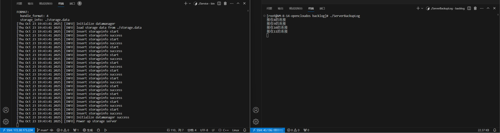


<br>

19. 2025.10.25

    - 修复了`FileFlush`模式下如果没有创建好的日志文件下不会自动创建的问题。

    - 修复了客户端下载时日志中有重复信息的问题。

    - 增加了线程池连接不到远程服务器时提交`WARN`级别的日志。


20. 2025.10.28
- 问题14

    整个系统的服务端启动后，线程池会尝试连接远程服务器，如果远程服务器没有开启，那么就判定为连接失败，并且线程池的所有线程都会退出线程函数，线程关闭。之后远程服务器启动后，服务端已经无法再发起连接了，唯一的方法就是关闭整个服务端，在远程服务器启动的情况下再启动。
    如果成功连接之后远程服务器意外关闭，线程池中的线程依然处在线程函数的循环当中，接受到日志，依然后通过`buffer_write()`尝试将`ERROR`或者`FATAL`级别的日志发送给远程服务器，但显然这个操作不可能成功。

    连接中的远程服务器突然关机时，线程池每个线程中`Client`的事件循环就会因为没有激活的事件而退出，因而响应的事件循环线程也会结束。

    方案：

    1. ~~每次接受到`ERROR`或者`FATAL`级别的日志，如果没有发现没有连上远程服务器，就尝试连接。~~，每次重连`Client`都会为事件循环创建一个独立的线程，如果还是连接不上，该线程就会自己退出。当`ERROR`或者`FATAL`级别的日志非常多时，就会频繁的创建和销毁线程。更何况提交日志后的`notEmpty_.notify_all();`会唤醒线程池内所有的线程，故一条`ERROR`或者`FATAL`的日志就会有`initThreadSize_ * 2`次的线程创建和销毁。

    2. 设计一个管理员~~(类似于`ThreadPool`中的`Client`)~~，启动后它可以重新让服务端尝试连接远程服务器。 

        可以管理员先尝试连接远程服务器，如果连接成功，再让线程池里的线程去连接远程服务器；如果连接失败，就不让线程去尝试连接，这样可以避免大量的线程创建和销毁。

        首先，如果中途远程服务器异常关闭，每个线程都应该退出。一开始没有线程察觉到异常。当用户发送了一条日志等级为`ERROR`或者`FATAL`的日志时，某个线程准备处理这条日志，却发现自己的`Client`已经断开了，于是需要通知所有其他线程，并退出自己的线程函数，从而每个线程都退出。

        其次，如果管理员连接到了远程服务器，他该如何向线程池表示远程服务器已重新准备就绪？
        应该类似日志文件系统的客户端(查看，上传，下载，删除)，因为客户端直接连接到服务端，服务端中有线程池的指针，可以进行后续操作。在日志系统的客户端添加响应的功能。

        管理员`SuperClient`调用后发现远程服务器启动中，这是连接的时候服务端线程池可能的状态:
        1. 处于正常连接远程服务器的状态，此时不应该有任何操作。
        2. 处于与远程服务器完全断开连接的状态，此时应该重新启动线程池。
        3. 处在正常连接而后远程服务器突然掉线的状态(线程的`Client`都已断开，但是线程本身还在线程函数中没有结束)，此时`curThreadSize_`依然是`4`，因此不能作为判断依据。

            此时应当先通知所有线程，让他们陆续退出。等待所有线程退出完成后，再重启。

            如果线程刚好不在`notEmpty_.wait()`中，比如临界区外或者正在执行处理日志，那么这个`notEmpty_.notify_all()`对他们没有效果，但是不存在长期占有锁的操作，因此无论怎么样，它们总会抢到锁，进入`notEmpty_.wait()`后判断条件发现`Client`断开了，于是退出线程函数。

            但`Client`是创建在线程函数内部的，不属于`Thread`的成员变量，因此无法直接访问`Client`是否断开。因此，我们可以把`Thread`的普通指针作为Client的成员变量~~(交叉引用？)~~，因为`Client`的生命周期更短，因此不需要担心用着用着`Thread`类的成员变量执行的内存被释放了。

            线程`Thread`类设置一个成员变量`clientactive_`来指示`Client`的连接情况(默认为`true`)，同时提供一个对外(对`Client`)的接口，可以把该标志置为`false`。`Client`创建的时候接受了线程`Thread`的普通指针作为成员变量，当`client`的事件循环因为远程服务器的断开而退出后，就会立即通过`Thread`指针调用函数把`clientactive_`设置为false。因此，在当前场景(`Client`的事件循环退出但是`Thread`的线程函数还在执行)下，管理员检测到远程服务器正常启动，就通知线程池重连。

    
<br>

21. 2025.10.29

- 问题15

    在线程池和远程服务器处于连接状态下，突然关闭远程服务器，正常情况4个线程的`Client`都会断开连接，在`gdb`中应该能看到有4个线程`exited`的消息，但是有时候只有2个`exited`的消息。

    
<br>

22. 2025.11.5

- 问题16

    异步日志系统析构的时候可能会卡住，有时候还会丢失日志。这个问题发生在 `AsyncWorker` 的析构时。如果 `~AsyncWorker()` 调用时还有很多用户在互斥锁外等待，那么析构函数中，把`ExitLabel_` 置为 `true` 并且通知消费者和生产者，如果生产者和消费者相继抢到锁，就会依次退出，从而完成 `AsyncWorker()` 的析构，于是就有很多的消息没有处理。

    通过一个标志 `ProhibitSummbitLabel_` 和一个计数 `user_current_count_`,  `~AsyncWorker()`调用时第一个阶段，先把 `ProhibitSummbitLabel_` 设置为 `true`，用户调用 `ReadFromUser()` 想要提交日志时就会直接退出，而那些在 `ProhibitSummbitLabel_` 设置为 `true` 之前就进来的不受印象。每进来一个用户就把 `user_current_count_` 加一，提交完退出就减一。之后等待，等待 `user_current_count_` 变为0，之后第二阶段在分别关闭生产者和消费者。


<br>

23. 2025.11.12

    新增效果，`Debug`时能够打印对应的文件名和执行所在行

<br>

24. 2026.3.27

    进行了相关的优化处理，单个线程每秒能够处理的日志量可达到46MB/s.

    包括，修改了原有的错误逻辑(看似异步，实则同步)，18MB/s -> 29MB/s

    优化了消费者处理日志的逻辑，将日志读取到局部的容器中就释放互斥锁，让消费者在处理日志的时候也可以提前交换缓冲区。将日志的输出从逐条输出变为一口气输出，减少了磁盘IO的次数。

    设计了缓冲区扩容的阈值，不允许缓冲区无限扩容，初始的缓冲区大小为8MB，最大为128MB

    如果在用于云存储服务上，那么这些日志信息都是云存储生成的，因此最多就是有非常多条日志，总计大小很大，但是不会出现有一条非常大(4G)的日志。

25. 2026.3.28

    异步日志系统在多线程场景下的测试：
    
    ### 多线程并发性能测试（150B 日志）

    | 线程数 | QPS (logs/s) | 相对单线程 | P50延迟 | P95延迟 | P99延迟 | 丢包率 |
    |--------|--------------|------------|---------|---------|---------|--------|
    | 1 线程 | 194,464 | 基准 | 3,558 ns | 6,899 ns | 58,608 ns | 0% |
    | 4 线程 | 214,789 | +10.5% | 3,586 ns | 15,824 ns | 442,224 ns | 0% |
    | 8 线程 | 194,445 | 0% | - | - | - | 0% |

    ### 不同日志大小对性能的影响（2线程）

    | 日志大小 | QPS (logs/s) | 相对性能 | 测试时长 | 总日志数 |
    |----------|--------------|----------|----------|----------|
    | 100 B | 177,093 | 100% | 10,013 ms | 1,773,231 |
    | 500 B | 153,044 | 86.4% | 10,018 ms | 1,533,190 |
    | 1 KB | 81,47s4 | 46.0% | 10,409 ms | 848,061 |
    | 5 KB | 19,135 | 10.8% | 10,205 ms | 195,271 |

    添加了备用的控制台输出，可以在空间不足的情况下加一些重要信息输出在控制台上。

    添加了大日志丢弃功能，如果日志大小大于缓冲区最大扩容后的容量，那么这条日志会直接丢弃掉。

    添加了磁盘监控功能，如果此时磁盘可用空间小于4G，那么就会提醒空间不足，并暂停写入日志。


26. 2026.3.29

    使用libevent实现一个简单的网页端压测，可以指定同步写入多少大小日志，同时可以结合ab实现高并发写入的测试。在32G内存的系统下启动HTTP客户端，在前端生成一份足够大的日志，然后发送给客户端。

    ### 对于大文件的处理

    对于异步日志系统的使用，是将一个字符串类型的日志以参数的形式传递给它的接口。缓冲区最大扩容到64MB，对于超过这个大小的日志，异步日志系统会选择丢弃，但是在上层应用我们可以进行分块写入，比如把日志裁剪为若干个1MB的小块，生成多条日志。

    如果是特别大的日志比如说4G(操作系统的内存才4G)，那么会在程序中先生成一个4G的字符串，再作为参数传给日志器，这样就容易导致内存崩溃(已杀死)。从开始到杀死程序的过程大致如下：

    首先，`虚拟内存`是指每一个进程创建和加载过程中，分配的一段连续的非真实存在的地址空间，它通过映射到实际物理内存上来对应。`页面`是操作系统管理内存的最小单位，大小一般是4K。`缺页中断`是指CPU硬件触发的异常，当程序访问的虚拟地址还没有对应的物理内存时，内核为其分配一个物理页面。`页面交换`指的是当物理内存不足时，操作系统可以将一部分数据从物理内存写到磁盘当中，当需要时，数据可以再次从虚拟内存中加载到物理内存当中。
    
    

    一开始为这个字符串分配了6G的虚拟内存空间，开始往虚拟内存“写入”数据。对于第一个虚拟内存页，会先找到映射到的物理内存页(第一次就通过缺缺页中断分配一个物理内存，通过页表映射)，然后写入数据，之后的操作一样。一直到物理内存不足时，就会触发页面交换(各种页面置换算法，比如LRU, FIFO等)，把其他进程不活跃的页面给置换出去。如果物理内存还是不足(或者置换到了早期的6G数据的页面)，那么最终就会因为内存耗尽(OOM)而杀死该程序。

    由于异步日志系统使用前需要一个字符串类型的日志，因此在生成这条字符串的时候就已经OOM了，因此在异步日志系统中进行拦截是无效的。我们能做的就是在上层应用上去进行拦截，比如说http客户端，可以给服务端发送指定大小和内容的日志。如果日志过大，我们可以采用流式传输，分块进行发送，服务端会逐个块生成日志。而且实际上，就我们这个项目，上层应用是云存储服务器，那么它生成什么日志都是设置好的，不会出现这种给日志系统发送一个4G的日志的情况。


27. 2026.3.30

    读写锁。允许多个线程同时读取数据，但是只允许有一个线程在写数据(不能有其他写线程和读线程)。 在readFromUser()中，一个互斥锁内包含了磁盘空间判断，缓冲区大小判断，是否需要扩容等等，这些是在判断语句中，被唤醒后，还要在锁内执行写入缓冲区甚至休眠然后更新当前磁盘情况，这些长期占有锁的行为可以进行优化。

    在readFromUser()中，我们先获取读锁，然后根据缓冲区情况进行判断，再释放读锁，获取写锁，根据判断情况做出相应的操作比如写入生产者缓冲区，以及扩容等。这里存在一个性能上的问题，如果有两个线程在读阶段都发现有足够的空间写入日志，当它们其一执行了写操作过后，第二个执行写操作时可能会导致发现空间已经不足了，因此他需要再一次循环，并且没有等待机制，忙轮询消耗CPU。

    测试了云存储服务在多个并发下载下的下载速度，在单个请求下，下载速度可达11MB/S，而在5个并发下，下载速度约为原速度的5分之一
    

28. 2026.4.2

    设计的原则应当以用户的体验为优先级，而不是说为了保证日志的完整性而把用户给阻塞住，这里包括生产者缓冲区数据满了，以及磁盘空间不足了，会阻塞readFromUser()，这两个设计需要避免，可以选择性的丢弃日志。

    一开始扩容操作是在用户线程中执行的，由于扩容中涉及了互斥操作，会有一定的性能开销，并且扩容可能不止一次，比如当前缓冲区为初始的4k，有一条日志为32Mb，那么他就要扩容13次缓冲区大小才能大于等32Mb。这势必影响用户的体验。

    用一个链表来存储大日志，用户提交一条大日志，如果需要扩容，就把日志放入链表中，更新当前链表的长度，以及链表中最大的日志大小(或者总的日志大小？)，然后就可以走了，扩容的逻辑放在生产者线程，并且可以一次性扩容到需要的大小。

29. 2026.4.7

    尝试直接用链表结构替换双缓冲区结构，以尽可能的减少互斥操作(上锁释放锁等)

    初步测试每秒写入的日志量约为28M左右，与使用缓冲区的性能(44M)还有一定差距，原因可能如下：
    1. 在函数`LogQueueBackword()`的循环当中是没有等待操作的，就一直循环，如果发现`logQueue`中有日志就会处理。如果执行该函数的线程和写入日志的线程是并发的而不是并行的，就会因为一直在循环而占用cpu时间片。
    2. 同样是`LogQueueBackWord()`函数，一检测到日志就处理，那么可能导致每次处理的日志量很少，处理的次数很多，于是磁盘IO的次数就多了。

    改进方案：
    1. 使用互斥锁和条件变量来控制，写函数中通过`notify_one()`来唤起
    2. 检测日志的数量，差不多缓冲区的一半了才处理，但是如果单条日志很小，并且数量也很少，大概率一直够不到缓冲区的一半(128M)，那么就永远无法处理了。当然可以设置一个超时时间唤醒。

    我们把总大小限制提升到`512MB`，超时时间是`1s`，比较一下有等待条件和没有等待条件的差距，一共10s的日志写入。

    |   | 10s内输出日志量 | 每秒日志处理量 | 日志读取次数 | 是否丢失日志 |
    |----------|--------------|----------|----------|----------|
    | 阻塞 | 2318471 | 37.81 MB | 28440 | 否 |
    | 非阻塞 | 1311079 | 21.38 MB | 680764 | 否 |

    从表格数据可以看出，当日志读取次数大幅度变少时，性能(每秒处理的日志量)也有显著性的提升。

    此外，另一个性能瓶颈是在`deleteFromTail()`中，由于字符串存储在链表上，是分散存储的，因此把他们整合到一起涉及到大量的字符串拼接。但是理论上它不应该影响到写入日志的次数，因为只有插入`label`的时候写入是互斥的。

    ```cpp
    void deleteFromTail(std::string& logBuffer){
        if(empty()) return;  
        insertFromHead("label");
        do{
            std::shared_ptr<LogNode> dnode = tail; 
            tail = tail->prev;
            if(dnode->str != "label"){
                logBuffer += (dnode->str + "\n");
            }
            dnode.reset();
        }while(tail->str != "label");
    }
    ```

    使用`std::stringstream`进行优化，对比表格的第一行和第二行可以发现，每秒日志处理量变化不大，仅仅是略微增加，但是日志读取次数翻了两到三倍，可能是因为日志的处理速度加快了。在此基础上，如何让每次读取尽可能处理多的数据，即提交日志时发现总日志量已经达到总大小的3/4或者5/6时才notify，性能变化如表中剩下部分所示。当这个比值越大时，日志读取次数越少，每秒处理的日志量就越高。

    实际上`std::stringstream`也有一定的开销，结果和直接拼接差不多

    |   | notify时的日志量 | 10s内输出日志量 | 每秒日志处理量 | 日志读取次数 | 是否丢失日志 |
    |----------|----------|--------------|----------|----------|----------|
    | 阻塞 + string| 1/2| 2318471 | 37.81 MB | 28440 | 否 |
    | 阻塞 + stringstream | 1/2 | 2440651 | 39.80 MB | 75730 | 否 |
    | 阻塞 + string| 3/4| 2699347 | 44.02 MB | 24182 | 否 |
    | 阻塞 + stringstream | 3/4 | 2691429 | 43.13 MB | 12676 | 否 |
    | 阻塞 + string| 5/6| 2835974 | 46.24 MB | 4680 | 否 |
    | 阻塞 + stringstream | 5/6 | 2826022 | 46.08 MB | 5443 | 否 |


30. 2026.4.8

    目前使用日志队列替换双缓冲区已经能够达到甚至略大于原先的性能，并且代码编写更加简单。另外我们发现，仅测试1s内的日志处理量可以达到50Mb/s，比测试10s内的平均每秒日志处理量要高一些，测试1s时，日志的读取次数为1，因为50Mb的日志量还远达不到生产者的通知阈值，因此只在超时(实则为对象析构时的通知)进行一次读取，相较于10s时需要多次读取多次写入磁盘的操作，在性能上略微有所提升。

    ```cpp
    logQueue_->getLogSize() > 5 * LOG_BUFFER_MAX_SIZE / 6  // LOG_BUFFER_MAX_SIZE = 512MB
    ```
    
    日志队列节点内存的频繁创建和销毁可能会有一定的性能开销，可以设计一个节点池，提供一些预设的节点比如`1024*1024`个节点，在性能上确实有所提升，但不大，可能跟申请和归还节点需要的互斥操作有关。
    
    |   | notify时的日志量 | 1s内输出日志量 | 每秒日志处理量 | 日志读取次数 | 是否丢失日志 |
    |----------|----------|--------------|----------|----------|----------|
    | 不使用节点池 | 5/6 | 320995 | 52.35 MB | 1 | 否 |
    | 使用节点池 | 5/6 | 334138 | 54.49 MB | 1 | 否 |

    1s的日志输出量并不多，甚至达不到生产者的通知阈值，如果是10秒，日志节点的开辟和销毁在性能瓶颈的占比更高，那么性能上的差距就更加明显了。1s的性能提升率为`4.1%`，10s的性能提升率为`8.8%`

    |   | notify时的日志量 | 10s内输出日志量 | 每秒日志处理量 | 日志读取次数 | 是否丢失日志 |
    |----------|----------|--------------|----------|----------|----------|
    | 不使用节点池 | 5/6 | 2884509 | 47.04 MB | 12315 | 是 |
    | 使用节点池 | 5/6 | 3163535 | 51.20 MB | 8 | 是 |

31. 2026.4.9

- 问题17

    当日志输出量达到一定值(可能300万多一点)，日志文件的大小就一直是512MB，即便输出的日志量多了不少。512MB是设置的日志队列可以容纳的日志大小的最大值。

    已解决，插入逻辑中区分了是否是删除调用的插入并提供了不同的处理，比如将logSize_重新设置为0。但是在调用的时候忘记区分了。

    对于`deleteFromTail()`函数，我们对其中的字符串处理操作进行进一步的优化，因为每次插入是会更新当前日志队列中日志的总大小的，因此我们就可以根据这一数据预先通过`reserve()`开辟一块足够大的空间，避免在字符串拼接的时候频繁的扩容(扩容涉及了数据从旧内存到新内存的拷贝开销)，对比了1s，10s，20s输出的日志量下三种处理模式(无reserve的string处理，stringstream处理，有reserver的string处理)

    |   | notify时的日志量 | 总1s的平均处理日志量 | 总10s的平均处理日志量 | 总20s的平均处理日志量  | 总30s的平均处理日志量  |
    |----------|----------|--------------|----------|----------|----------|
    | 无 reserve 的 string 处理 | 5/6 | 55.33 MB | 50.10 MB | 45.72 MB | 45.06 MB |
    | stringstream 处理 | 5/6 | 53.35 MB | 54.45 MB | 51.71 MB | 55.30 MB |
    | 有 reserve 的 string 处理 | 5/6 | 52.30 MB | 55.02 MB | 55.81 MB | 56.32 MB |

    比较异步和同步设计的性能差异，设计了一个简单的同步日志系统，`Worker.hpp`中定义了一个简单的接口，接收到一条日志就即可输出。当然一条一条处理性能肯定差，因此我们通过单个缓冲区，互斥和同步来实现批量的日志输出。但是也有一个问题，比如10000个用户提交日志，前9999个用户写入日志后就可以走了，而第10000个用户写入时日志总量超过了阈值，于是就需要在他的线程中处理10000条日志，这是极其不合理的，因此同步应该还是第一种(用户提交日志，系统输出日志，用户走人)。

    ```cpp
    void forward(std::string message){
        std::lock_guard<std::mutex> lock(muteX_);
        if(exitLabel_) return;
        if(buffer_.size() + message.length() >= bufferMaxSize_ - 1){
            return;
        }
        buffer_.append(message);
        buffer_.append("\n");
        if(buffer_.size() > 5 * bufferMaxSize_ / 6){
            buffer_.pop_back();  // 去掉最后的'\n'
            logFunc_(buffer_);
            buffer_.clear();
        }
    }
    ```
    |   | 总1s的平均处理日志量 | 总10s的平均处理日志量 | 总20s的平均处理日志量  | 总30s的平均处理日志量  |
    |----------|----------|--------------|----------|----------|
    | 同步 | 33.20 MB | 33.91 MB | 33.53 MB | 33.91 MB |
    | 同步(改进) | **60.77 MB** | **61.99 MB** | **58.88 MB** | **58.37 MB** |
    | 异步 | 53.35 MB | 54.45 MB | 51.71 MB | 55.30 MB |

    这里串行设计中读取的效率应该要比我们日志队列的读取要高一些(直接`logFunc_(buffer_);`)，因为日志队列需要一个节点一个节点处理，还包括了节点的归还什么的操作。

    有一个细节，在1s的for循环不断写入日志的过程中，由于日志量有限，达不到输出阈值，因此这1s内全部都是写入，没有读取，而在1s后，`Worker`析构时，检测到buffer还有日志才进行的交换，而且缓冲区大小为512MB，十秒才不多一共才输出500多MB的日志量，因此日志输出的处理部分是很少的。

    所以要想异步的效果更好，至少在日志输入这一块不能有太多的逻辑，效率要尽可能的接近同步，这样才能因为异步输出而提高性能，输出可以复杂，因为是异步的，不会影响或者对输入的影响很少。
    ```cpp
    // 同步Worker的输入逻辑
    buffer_.append(message + "\n");  

    // 异步Worker的输入逻辑
    std::shared_ptr<LogNode> nnode = getConnection();     // 从节点池或获取，如果空了还得自己创建
    nnode->str = s;                                       // 将日志记录到节点中
    std::shared_ptr<LogNode> preNext = pre->next.lock();  // 从弱智能指针升级为强智能指针
    pre->next = nnode;                                    // 头插法涉及的链表节点的连接
    nnode->prev = pre;
    nnode->next = preNext;
    preNext->prev = nnode;
    ```

    尝试使用`std::deque`来替代链表，在`deque`的头部插入日志，在`deque`的尾部取出日志，头插的效率和`std::string::append()`的时间复杂度差不多。但是从内存分配的角度来看，`std::string::reserve()`可以预先分配，而`deque`不能，随着元素的增多会不断地分配新内存，导致了日志输入的性能依然达不到同步的效果，只有 `43.41 MB/s` 左右
    ```cpp
    void LogQueueForward(std::string message){
        // ===================================================================
        // std::uint32_t allLogSize = logQueue_->insertFromHead(message, 0);
        std::lock_guard<std::mutex> lock(Mutex);
        logDeque.insert(logDeque.begin(), s.rbegin(), s.rend());  
        logDeque.push_front('\n');
        logSize += (s.length() + 1);
        return logSize;
        // ===================================================================
        diskInfoAvailable_ -= (message.length() + 1);
        if(allLogSize > 5 * LOG_BUFFER_MAX_SIZE / 6){
            condV_.notify_one();
        }
    }
    ```

32. 2026.4.10

    开源的异步日志项目使用缓冲区可以达到平均 `103.18 MB` 的每秒日志处理量。

    首先我们的`LogQueueForward()`函数和`insertFromHead()`的参数是按值传递的，涉及了字符串的拷贝。我们都修改为以引用的形式传入，得到的结果(以带节点池和string::reserve()的版本，以及通知阈值为5/6), 可以说略有提升，但是不大。

    |   | 总1s的平均处理日志量 | 总10s的平均处理日志量 |
    |----------|----------|--------------|
    | 异步 | 53.35 MB | 54.45 MB |
    | 异步(改) | 56.31 MB | 54.93 MB |
    
    参考开源的设计方法：

    1. 两个缓冲区(生产者和消费者)，初始化都不到10MB.

        ```cpp
        std::vector<char> buffer_;  // 缓冲区
        size_t write_pos_;          // 生产者此时的位置
        size_t read_pos_;           // 消费者此时的位置
        ```

    2. 写入缓冲区，日志类型(参数)为 `const char* data`, 使用 `std::copy` 将 `data` 中的数据拷贝到缓冲区当中，从 `write_pos_` 开始。

    3. 在 `AsyncWorker` 中只额外启动了一个线程，获取互斥锁，然后交换缓冲区，释放互斥锁，然后处理消费者缓冲区的日志，这是日志输出部分。对于日志输入部分，获取互斥锁，【等待生产者缓冲区空间足够】，把日志写入缓冲区当中。

        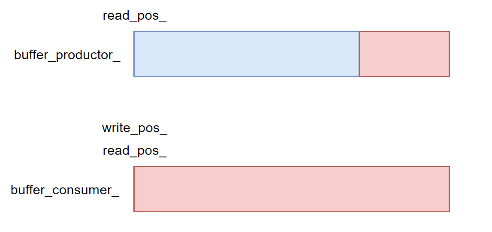


33. 2026.4.11

    由于 `evhttp` 会在我们调用 `evhttp_request_get_input_buffer(req)` 获取缓冲区中的请求体前，把完整的请求体放在缓冲区 `evbuffer` 当中。如果8G的数据，那么这个过程肯定会把内存耗尽。

    因此我们尝试将网络库从 `libevent` 换成 `muduo`。因为我们给 `muduo` 提供的回调函数 `onMessage()` 会在读事件到来时触发，此时 `Buffer` 中会存放从 `socket` 缓冲区中读取到数据，此时只是请求报文的一部分，随着每次触发都会追加到 `Buffer`。又由于请求报文的接收顺序是 请求行 -> 请求头 -> 空行 -> 请求体。因此完整的请求头内容肯定先于请求体读取到。此时就可以通过请求头中的 `Content-Type` 字段来判断请求体的长度。

    ```cpp
    std::string contentLength = request_.getHeader("Content-Length");
    if(!contentLength.empty())
    {
        request_.setContentLength(std::stoi(contentLength));
        if(request_.contentLength() > 0)  // 补充，如果request_.contentLength() > threshold
        {
            state_ = kExpectBody;  // 大于0说明需要继续读取body
        }
        else
        {
            state_ = kGotAll;
            hasMore = false;
        }   
    }
    ```

34. 2026.4.12

- 问题18

    将网络库换成muduo后，能正常打开页面，但是不能上传文件。显示

    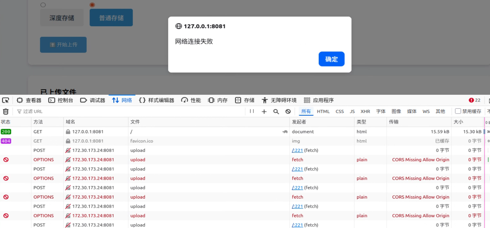

    先把中间件去掉。。。然后依然网络连接失败，这次是`OPTIONS`的问题，因为没有和这个请求方法匹配的路由函数。
    
    因为在请求头中有自定义的头，比如 `filename` 和 `storagetype` 等，就会发送OPTIONS预检，像第二个项目就没有发送过OPTIONS，因为它的请求头只有 `Accept`, `Connection` 等字段。这里发现，调用 `conn->send(&buf)` 时，buf的状态行只有 204 然后就是\r\n，少了版本号和状态信息。此外返回的允许的方法中，`Options` 少了一个 `s`。以及我们需要在允许的头中添加相应的字段。

    ```cpp
    // response.setStatusCode(HttpResponse::k204NoContent);
    response.setStatusLine(request.getVersion(), HttpResponse::k204NoContent, "Origin Allowed");
    ```

    ```cpp
    config.allowedHeaders = {"Content-Type, Authorization, FileName, StorageType"};
    ```

    现在客户端浏览器能够发送请求了，但是在服务端显示日志显示如下，客户端接收到 `400` (但是没有响应头?) :

    [ERROR]2026/04/12 13:36:40 : Exception in onMessage: [json.exception.parse_error.101] parse error at line 1, column 1: syntax error while parsing value - invalid literal; last read: '/'

    第二个项目里HttpServer中做了一些判断，在请求体中使用到了json，来确定是否是ai消息防止阻塞

35. 2026.4.13

    完成了模拟大文件拒绝接受的场景(磁盘和内存都写不下这个文件)，这里模拟成大于512mb就拒绝写入的情况。在muduo中，onMessage()每次调用都会把读取到数据追加到buffer中，如果上次的数据没有被读取走就会累加。由于报文的到达顺序肯定是请求行->请求头->空行->请求体，在解析的时候就可以判断buffer中是否有\r\n，有的话就表示有一个完整的部分，然后读走，进行解析。请求头先于请求体解析，那么就可以在接收请求体的开始阶段，判断请求头的content-length字段，获取文件大小，如果太大就直接关闭连接，这样就能在内存耗尽前拒绝写入文件。

    尚有一点小问题，客户端能上传小文件，服务端能保存，也能上传大文件被服务端拒绝，但是客户端接受不到响应。

    ***如果文件太大(比内存大)但是磁盘写的下***

    最顶层是 `onMessage(Buffer* buffer)` , 数据在`buffer`当中。每次调用时都尝试解析其中的报文，如果有完整的一部分就解析，解析到所有部分(包括请求体)都解析完成且无误，才会调用 `onRequest()`，处理中间件(请求后) -> 对应的路由函数 -> 处理中间件(响应前)。在路由函数中，会根据请求头中的文件名，文件存储位置等信息创建文件，并把完整的请求体中的文件内容写入。

    思路: 

    在解析时发现已经解析完请求头了，准备解析请求体前(`state_ = kExpectBody`)，在解析请求体时，只有当Buffer(可扩容)有完整的请求体信息时才会进行读取。
    ```cpp
     // 检查缓冲区中是否有足够的数据
    if(buf->readableBytes() < request_.contentLength()){
        hasMore = false;  // 数据不完整，等待更多数据
        return true;
    }
    // 只读取Content-Length指定的长度
    std::string body(buf->peek(), buf->peek() + request_.contentLength());
    request_.setBody(body);

    // 准备移动读指针
    buf->retrieve(request_.contentLength());

    state_ = kGotAll;
    hasMore = false;
    ```

    因此我们可以解析完请求头后，通过content-length判断是否需要分块写入，如果需要，就获取缓冲区中的请求体片段，然后一点点的通过追加的形式写入文件当中。由于`onRequest()`处理的是整个请求报文，因此可以直接把请求体的片段视为整个请求体传给`onRequest()`让他处理。

    ```cpp
    if(context->gotHeader() && context->request().contentLength() > 256 * 1024 * 1024){
        // 每次都直接读取buffer中的一点数据，而不是等待完整的请求体后再解析
        std::string part = std::string(buf->peek(), buf->readableBytes());
        buf->retrieve(buf->readableBytes());
        context->request().setBody(part);
        onRequest(conn, context->request());
    }
    ```

    ~~整体的逻辑上没有什么问题，但是由于在UTF-8编码中中文字符占三个字节，如果末尾的字符是中文且没有完全取到(比如本次从socket缓冲区中获取到的只有前两个字符)，那么在写入文件中后，会显示为乱码，即便下一次读取时把剩下的部分追加到文件内容中，也无法正常显示。如图所示，红色部分是同一行的内容，在很多个nul之后才是下一次读取的内容，因为“三”这个汉字的读取不完整~~

    缺了一部分后面追加是能够正常处理的，问题在于你分块读取但是在写入的时候长度使用的`Content-Length`，修改后大部分问题都解决了。

    

    

    尝试上传一个4.43 GB的文件，上传过程如下，即便内存只有4G，可用内存可能更少，也能够进行传输。

    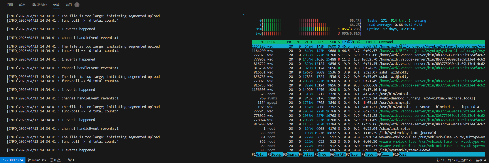


37. 2026.4.14

    下载功能。因为AIHttpServer中，路径后面是不带任何参数的，而下载认为中，会把文件名携带在路径后面，如果使用静态路由匹配，就不能够匹配上。

    ```txt
    url: 1 /download/unet.txt
    ```

    因此我们需要使用动态路由匹配，其实可以把要下载的文件名放在请求头的FileName字段当中，这样就不需要动态路由匹配了。这里就当验证一下动态路由匹配是否有效。
 
    原先的下载操作是把完整的请求体内容写入到发送缓冲区当中，然后调用 `conn->send(&buf)` 将其写入 `socket` 缓冲区当中。为了能让客户端能从4G内存的服务器中下载大于4G的文件，我们需要分块下载。

    全部读取的方法如下，如果是evhttp，可以指定`offset`和`length`(第三和第四个参数)来决定从哪里开始读，读多少。倘若使用HttpServer? 先通过 `conn->send(&buf)` 将状态行，响应头和空行写入 `socket` 缓冲区当中，然后在多次调用  `conn->send(&buf)` 将响应体中的数据一点点写入 `socket` 缓冲区中。

    ```cpp
    int fd = open(download_path.c_str(), O_RDONLY); 
    evbuffer_add_file(outbuf, fd, 0, fu.FileSize());
    ```

    conn在 `onRequest()` 中，调用 `handleRequest()`，其中根据路由执行对应的路由处理函数。理论上在路由处理函数里面通过循环读取片段并写入到 `socket` 缓冲区即可，但是路由函数访问不到 `conn` 。客户端发送下载请求时，把文件的大小也携带在请求头当中，这样在 `onRequest()` 中就可以直接判断文件的大小是否需要进行分块传输。

    但是，分块下载时发现了一个情况，就是大量的 `conn->send()` 的调用先发生，然后才是连续不断地muduo日志提示事件发生。原因在于大量的 `conn->send()` 在短时间内发生，但是 `socket` 缓冲区很快就满了，无法写入，这时候数据就会大量的堆积的在内存中，依然可能导致内存耗尽。


38. 2026.4.15

    在HttpServer的基础上，添加了网页端的删除功能。

    明确一点，在调用 `conn->send(&buf)` 时，会尝试将 `buf` 中的数据写到对应的 `socket` 缓冲区当中，如果无法完全写入，会把剩下的数据都转移到 `TcpConnection` 里面的一个 `outputBuffer_`当中，`outputBuffer_` 中的数据不断堆积。因此每次调用完 `conn->send(&buf)` 时，这个buf就清空。因此内存的不断消耗是发送在 `outputBuufer_` 当中的而不是 `buf`。

    第二种尝试，发现了`socket`缓冲区可写时，调用的`handleWrite()`中，当`outputBuffer`中的数据读完后就会关闭对`EPOLLOUT`监听，并且如果设置了`writeCompleteCallback_`就会执行。这个`writeCompleteCallback_`通过`TcpServer`提供，也就是我们可以在`HttpServer`中定义一个，并且他的参数带`TcpConnectionPtr`，因此有操作空间。

    
39. 2026.4.18

    使用 `Claude Sonnet 4.6` 优化一下日志系统的性能：

    主要贡献：Message.hpp 的两处改动，这是绝对的大头，贡献了绝大部分提升。

    thread_local 时间戳缓存（最大贡献）

    原来每次 format() 都调：
    std::localtime(&now)  →  strftime(...)
    localtime 内部要读取系统时区数据、做时区换算，strftime 再做格式化。在你的测试里，1秒内循环几十万次，但时间戳每秒只变一次——也就是说 99.999% 的 localtime + strftime
    调用都是在重复计算同一个结果，全部白费。

    改成 thread_local 缓存后，这两个调用每秒最多执行一次，其余全部命中缓存直接跳过。这一条单独就能贡献 2x 以上的提升。

    ostringstream 换成 snprintf + 栈上 buffer（第二大贡献）

    优化前
    ```cpp
    std::ostringstream oss;          // 构造：堆分配内部缓冲区
    oss << "[" << time_buf << "] [" << level_str << "] " << unformatted_message;
    return oss.str();                // 再拷贝一次到新 string
    ```
    每次 format() 都要构造一个 ostringstream，这意味着一次堆分配。在高频循环里，堆分配本身有 mutex（glibc malloc 内部锁），几十万次/秒的分配会在这里产生明显竞争。

    优化后：
    ```cpp
    char buf[256];                   // 栈上，零分配
    snprintf(buf, sizeof(buf), ...); // 直接写栈
    result.reserve(n + msg.size());  // 一次分配，精确大小
    result.append(buf, n);
    result.append(unformatted_message);
    ```
  
    堆分配从每次 format() 两次（ostringstream + oss.str()）降到一次（最终 result），且大小精确，不会触发 realloc。

    每秒的日志输出量直接从 `56MB/s` 提升到了 `185.94 MB/s`

40. 2026.4.23

    实现了大文件下载功能，并验证了上传和下载的文件没有错误(不会丢失数据，压缩包能够正常的打开)

41. 2026.4.24

    因为`TcpConnection` 的 `outputBuffer` 中数据是通过事件回调的方式进行发送的，也就是`EPOLLOUT`事件(socket缓冲区中可写)触发时，调用handleWrite()。因此原先在onRequest()中循环发送是没用的，因为handleWrite()的调用最早在下一次的epoll_wait()，而循环在本次的epoll_wait()中完成。

    当handleWrite()将`outputBuffer`中的数据写入缓冲区时，如果`outputBuffer`空了，就会调用writeCompleteCallback(), 就可以利用这个回调函数。

    数据分块传输，调用onRequest()的send, 发送一个chunk，由于chunk大小大于socket缓冲区大小，因此一次write无法把数据都写入socket缓冲区中，剩下的数据进入outputBuffer，启动对EPOLLOUT的监听。当socket缓冲区可写时，就会触发对应的回调函数，把outputBuffer中的数据写入socket缓冲区，如果还有剩，就能带下次socket缓冲区可写，如果没有剩，就调用writeCompleteCallback，把下一个chunk写入，重复这个流程直到数据全部发送过去。
    
42. 2026.4.25

    使用libevent封装类似的HttpServer，不直接使用evhttp，来处理大文件上传下载的问题。

    bufferevent_write()和操作和TcpConnection::send()类似，内部调用evbuffer_add(), 将数据写入到bufferevent中的输出缓冲区bev->output当中(类似TcpConnection的outputBuffer)，当socket缓冲区有空间时就会调用回调函数来将其中的数据写入。

    ```cpp
    bufferevent_setcb(ctx->bev, &HttpServer::readCallback, &HttpServer::writeCallback, &HttpServer::eventCallback, ctx);

    void HttpServer::writeCallback(bufferevent*, void* arg){
        auto* ctx = static_cast<ConnectionContext*>(arg);

        // 大文件下载时，写完成回调就是“发送下一块”的节流点，避免一次性把整个文件塞进输出缓冲区。
        if(ctx->download && ctx->download->file_size > 0){
            ctx->server->sendNextDownloadChunk(ctx);
            ...
        }
    }
    ```
    这里的 `sendNextDownloadChunk()` 就是按块发送的逻辑，他会在判断完是大文件后直接调用一次，将响应体外的部分作为第一块发送过去，之后的响应体都通过事件回调的方法来调用这个函数，将数据块发送过去，直到所有的数据都发送过去了。
    
    修复了原先部分HTTP响应头的内容被浏览器当成文件内容保存，导致前面多了几十个字节，尾部少了几十个字节，虽然总的大小是对的，但是文件内容有误的问题。

