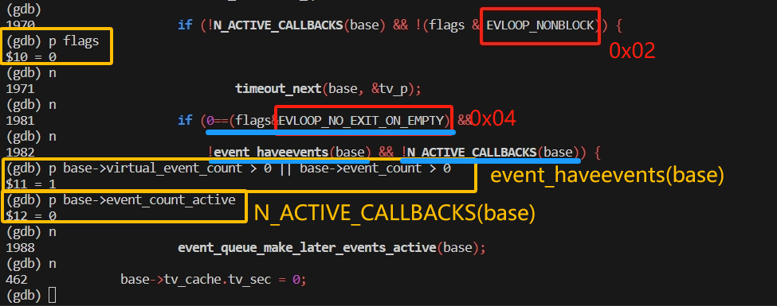
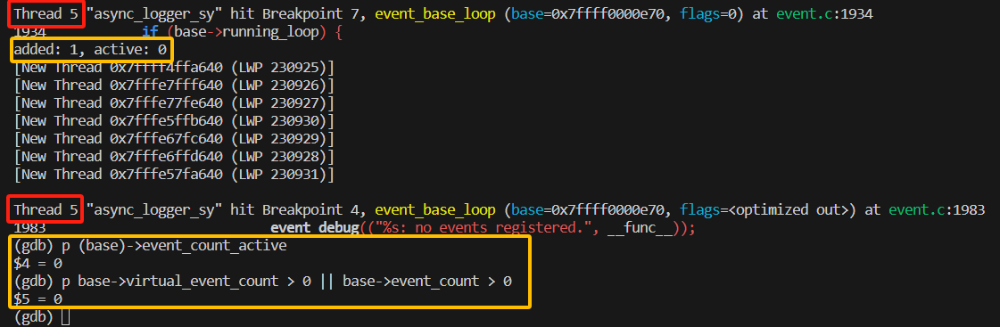

# AsynLogSystem-CloudStorage
基于libevent的带异步日志功能的云存储系统

## 更新日志
1. 2025.9.13
    
    实现了异步日志系统的主要功能:
    

    include(with libevent)提供了基于libevent的部分功能测试，可以在终端`nc 127.0.0.1 8000`向服务器发送消息作为日志信息发送到控制台和日志中。

<br>

2. 2025.9.17

    - 发现没有libevent测试的异步日志管理系统并没有将日志信息写入缓冲区，而是直接发送了
        ```cpp
        mylog::LoggerManager::GetInstance().GetLogger("asynclogger")->Info("pdchelloworld");
        ```
        其中`.GetLogger()`是从`LoggerMap`中返回对应的`async_logger(class AbstractAsyncLoggerPtr)`, 
        
        `AbstractAsyncLoggerPtr`包含一个成员变量`logger_(class Logger)`， 并把他返回， 

        `logger_`中就有`INFO`等方法，可以把消息发送到控制台，文件或者滚动文件中，因此这个过程并没有经过buffer

        通过调整各个类的调用逻辑解决。

    <br>

    - 没有消息发来时，生产者消费者都在不断地判断条件，通过gdb调试发现，处理完所有消息后，控制生产者
        线程的两个标志`label_consumer_ready_`和`label_data_ready_`都是`true`，这就意味着生产者进入wait语句判断一次后就会出来，发现没有数据
        就开启下一次循环，重复同样的操作，因此表现出来生产者不断地在判断wait中的
        谓词。

        当生产者被“意外唤醒”时，此时`label_consumer_ready_`和`label_data_ready_`都是`true`，但再经判断发现自己的缓冲区内没有东西，就把`label_data_ready_`置为`false`，重新开启循环时就会等待。同时，由于初始化是误把两个标签初始化为`true`导致启动时就无限循环。

    <br>

    - 完善了日志信息的筛选部分，即等于最低等级的日志消息不会被`flush`

    


    

    - 一个发生在buffer交换的非致命问题：

        一开始生产者在等待数据，消费者在等待生产者给数据（交换buffer）（label_consumer_ready_ = true），之后生产者的buffer有了数据（label_data_ready_ = true），它被唤醒，交换buffer并通知消费者（label_data_ready_），而后释放互斥锁，此时生产者和消费将抢夺同一个锁：**如果生产者抢到了这把锁**，在生产者进入`wait`之前，又有数据到了（label_data_ready_ = true），这时候再`wait`就不会进入等待，而是交换buffer，但是，消费者中的buffer还没有被处理掉......
        

        因此让生产者交换完缓冲区后，把`label_consumer_ready_`置为`false`，表示消费者的buffer中已经有数据了。这样生产者抢到锁后，即使有数据发来，也会把锁释放掉让消费者先处理buffer中的数据。

        

    <br>


    - 一个发生在AsyncWorker析构中的死锁问题：

        一开始，生产者在等待数据，消费者在等待生产者给数据（交换buffer）
        之后生产者的buffer有了数据，它被唤醒，因为没有线程占着锁，它启动，交换buffer什么的，
        然后通知消费者起来，消费者发现条件都满足了，进入阻塞状态，生产者结束当前循环后会释放锁，
        于是生产者和消费者同时抢锁：
        如果生产者抢到了锁，他会进入wait，然后发现buffer没有数据进而等待，消费者从而拿到锁，于是这种情况下，**消费者在处理数据时生产者在wait处等待**。
        如果消费者抢到了锁，那么它直接处理数据，于是在这种情况下，**消费者在处理数据时生产者在互斥锁的外面阻塞**，
        如果此时此刻AsyncWorker开始析构，在消费者处理完数据后抢到了锁，那么生产者和消费者都在互斥锁外面阻塞，析构函数中的通知就没有用。
        不过生产者进入wait,发现Exitlabel_已经为true，依然能正常退出，通知析构函数，当然此时析构函数只检测到了生产者退出的标志是true，因此继续等待。
        消费者进入wait，因为消费者唯二被唤醒的情况是生产者通知或者AsyncWorker析构时通知，因为生产者线程已经结束了，所以消费者在wait中永远出不来，进而AsyncWorker的析构也卡住了。
        
        

        最初的消费者的唤醒条件比较单一：
        ```cpp
        cond_consumer_.wait(lock);
        ```
        由于上一个问题我们在生产者交换完buffer就把`label_consumer_ready_`置为`false`，因此我们可以以`label_consumer_ready_`作为标志，同时初始化的时候置为`true`，因为在异步日志器构建完成之前不会有数据输入，因此不存在生产者初始化进入`wait`之前因为有消息而直接跳过。
        ```cpp
        cond_consumer_.wait(lock, [&]()->bool { return !label_consumer_ready_ || ExitLabel_;});
        ```
        

<br>

3. 2025.9.22

    实现了`backlog`服务器和客户端的部分，以及`ThreadPool`与异步日志系统的连接：线程函数`threadfunc`调用时，会先创建一个`Client`指针，`Client`会执行一系列连接服务器相关的操作等。当异步日志系统发现日志时[Error]和[Fatal]时，就会通过线程池的`submitLog()`进行提交。
    线程函数中会检测是否日志队列中有日志，如果有，抢到锁后就将其发送到服务器。

    - 一个连接服务器后事件循环无法正常启动的问题

        通过gdb调试发现，有时候有些进程无法正常启动事件循环，刚启动后就发现`event_base_dispatch(base);`下面的断点被触发了。
        

        通过gdb打印`event_base_dispatch(base);`的返回值发现，异常退出事件循环的，它们返回值为1，而正常退出的几个返回值都是0，通过查阅`libevent`的源码，找到退出循环的语句，从判断语句的其中两个条件来看，`!event_haveevents(base) && !N_ACTIVE_CALLBACKS(base)`应该分别表示：是否有事件，以及激活状态的事件的数量。
        ```cpp
        /* If we have no events, we just exit */
		if (0==(flags&EVLOOP_NO_EXIT_ON_EMPTY) &&
		    !event_haveevents(base) && !N_ACTIVE_CALLBACKS(base)) {
			event_debug(("%s: no events registered.", __func__));
			retval = 1;
			goto done;
		}
        ```
        ```cpp
        static int event_haveevents(struct event_base *base)
        {
            return (base->virtual_event_count > 0 || base->event_count > 0);
        }
        ```
        ```cpp
        #define N_ACTIVE_CALLBACKS(base) ((base)->event_count_active)        
        ```
       
        通过gdb进入`event_base_dispatch(base)`函数内部，事件循环正常启动的情况下，应该是如下情况：蓝色划线的分别代表事件循环直接退出的三个需要成立条件：其中`flags`默认为0，`EVLOOP_NO_EXIT_ON_EMPTY`为0x04，&后的结果为0，因此第一个条件满足；第二个条件获取注册的事件情况，返回1表示有注册的事件，正常情况下返回1，故第二个条件为0，到此已经可以判断条件不会成立；第三个条件式激活状态的事件情况，结果是0，故第三个条件为满足。
        
        
        我们用gdb将断点打在事件循环直接退出的条件满足后执行的语句上，结果发现，此时的事件循环中没有任何事件！因此事件循环退出的三个条件都满足了，于是`event_base_dispatch(base)`直接就出来了。
        
        
        进一步调试，我们打印刚进入`event_base_dispatch(base)`时事件循环有无事件，发现是有的`event_haveevents(base) = 1`(`event_callback`和`read_callback`两个事件，只打印`base->event_count`是2)，但等到事件循环退出的条件判断时，却显示没有任何事件。
        

        另外我们发现，在进入事件循环即执行`event_base_dispatch(base)`之前使线程休眠0.1s，便可解决上述问题。
        ```cpp
        std::this_thread::sleep_for(std::chrono::milliseconds(100));
        ```

    异步日志系统向服务器发送消息的功能基本完善，存在瑕疵但是对整体的功能没有影响。


4. 2025.9.23
    - 异步日志器判断线程池是否创建成功来决定是否向服务器提交日志，但是线程池创建成功不代表器它的线程连接服务器成功，因此
    线程池向外包装一个函数，用于判断成功连接的数量，如果一个都没有，那就不提交。

    - 实现了把服务器接受到的日志消息写入到日志文件中，之前仅仅是输出在控制台中

    - 新的问题（可能和22号的问题有联系），当启动的线程较多比如8个时，发生以下问题的概率就更高：
        
        图中我们可以看到，参数`base`和`returnEventLoopExit()`已不可访问。说明`Client`对象此时已经析构了，
        它的这两个成员变量无法再访问。

        在`Client`的启动函数`start()`中，我们将事件循环放到了另一个线程并将其设置为分离线程。在`Client::stop()`中关闭事件循环，等待事件循环关闭后再接着把`bev`和`base`清理掉。
        
        `Client()`发生在线程池的线程函数退出后，那么就可能发生以下的情况：

        `client_->stop()`执行，
        ```cpp
        void threadFunc(tp_uint threadid)
        {
            std::unique_ptr<Client> client_ =
                std::make_unique<Client>(serverAddr_, serverPort_, threadid);
            // 启动客户端并连接服务器, 其中包含了event_base_dispatch(base);
            if(client_->start())
            .
            .
            .

            client_->stop();  // 清理base, bv，关闭事件循环
            Exit_.notify_all();  // 通知析构函数那里，我这个线程已经清理完成了
        }
        ```

        当我们在`~ThreadPool()`最后休眠5s，该问题便解决，因此我们可以认为：线程池析构后还有一些`Client`没有析构完成，导致出错。另外，当`Client`连接服务器成功后，`curThreadSize_`就会加一，但是有时候，这个值可能
        会小于`INIT_THREADSIZE`，或许可以说明某些`Client`连接失败，并且连接失败`Client`，服务器控制台显示的客户端下线发生在5s休眠之后，而正常连接都发生在5s休眠之前，并且它们不会执行到`client_->stop();`和`Exit_.notify_all();`，而5s之后是线程池析构了，因此还可以认为，有些`Client`在`while`循环中无法退出。

5. 2025.9.25

    - 在启动事件循环之前让线程休眠100ms，就解决了上面两个大问题...
        ```cpp
        std::this_thread::sleep_for(std::chrono::milliseconds(100));
        int ret = event_base_dispatch(base);
        ```
        后续会接着分析该问题。

6. 2025.9.26

    - 实现了云存储服务的配置文件的加载以及服务器的建立，并且与异步日志系统对接。
    - 使用CMake对项目构建系统的架构设计。
        