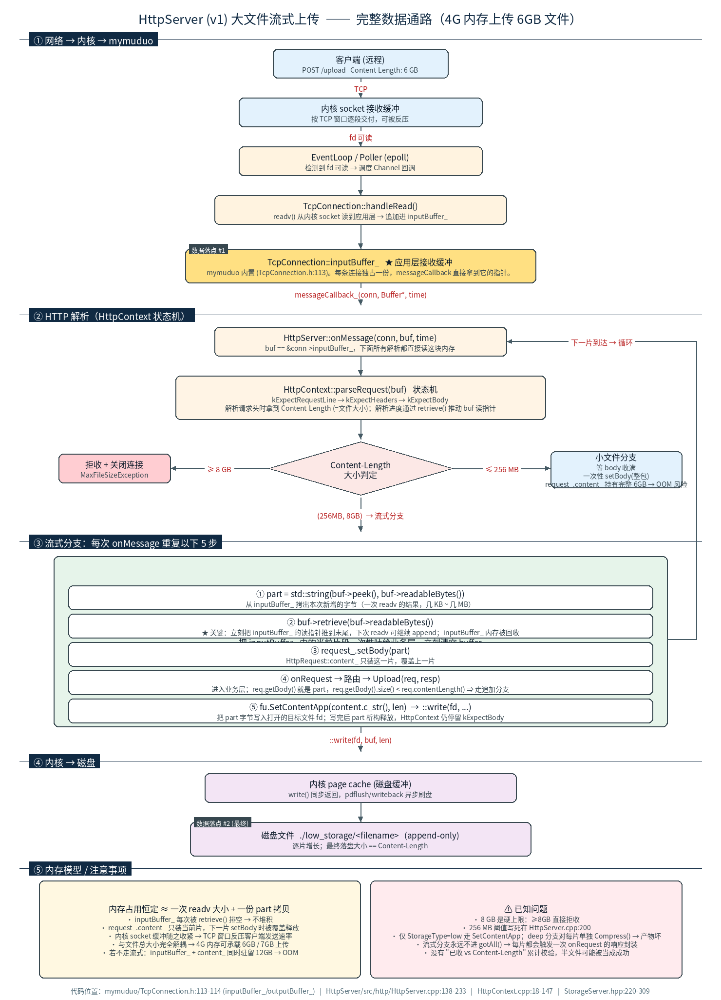
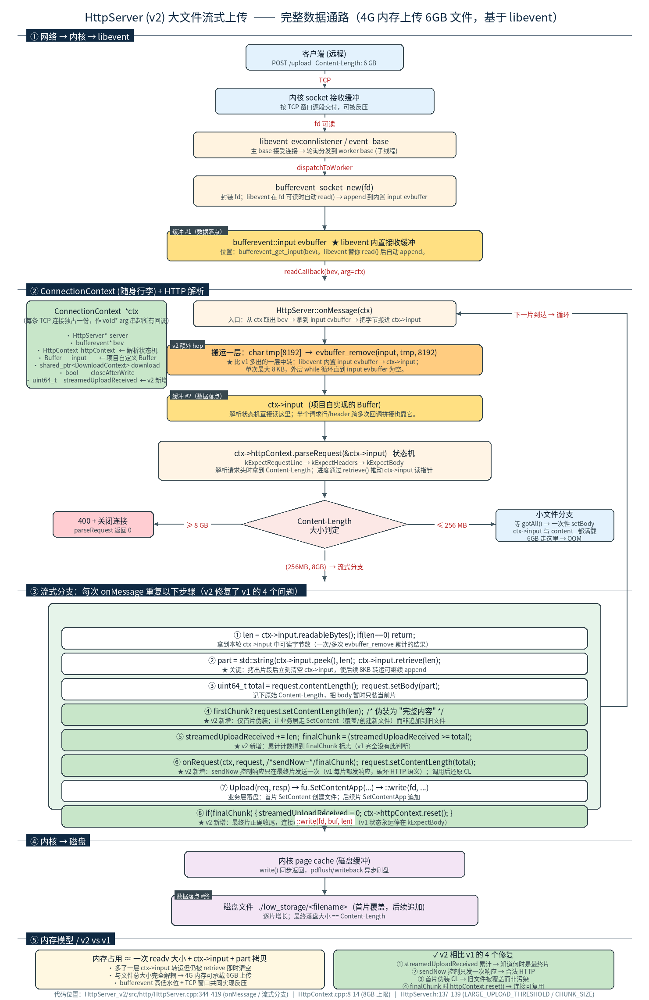
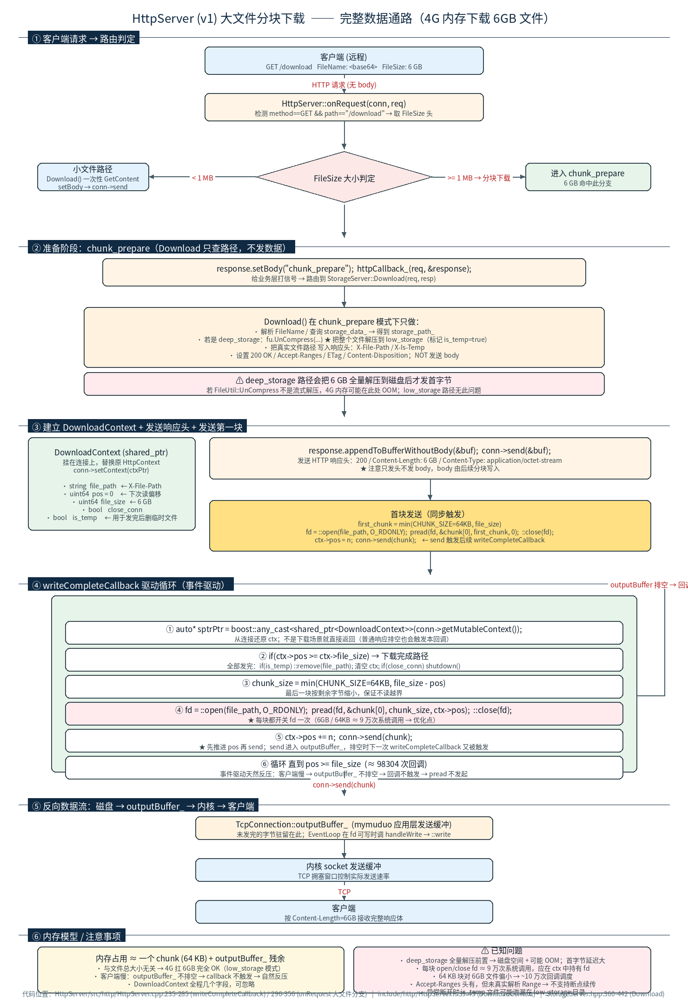
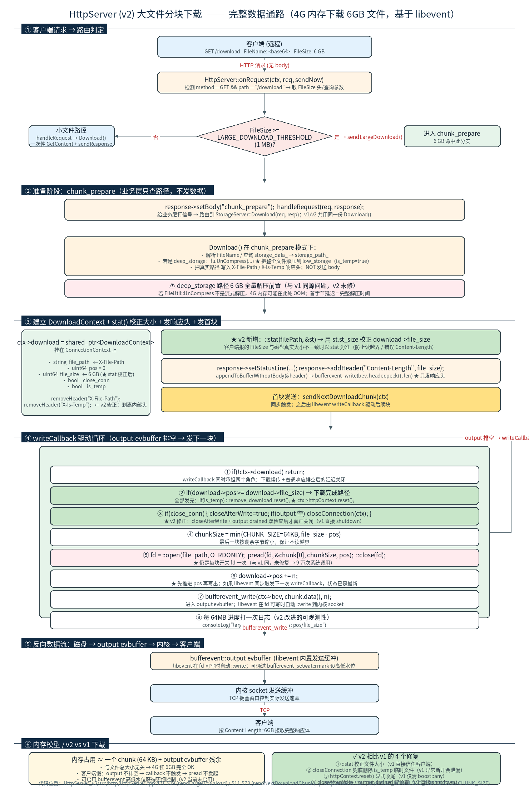

# HttpServer_v1 的大文件上传 (基于 muduo)

## 场景

服务器内存只有 **4 GB**，但要上传一个 **6 GB** 的文件。

## 流程图（含完整数据流向）



## 数据流向总览：从 socket 到磁盘

整个上传过程数据要经过 **5 段、3 块缓冲、2 次落点**：

```
客户端
  │  TCP
  ▼
内核 socket 接收缓冲                              ← 缓冲 ①（内核态）
  │  fd 可读 → epoll 唤醒
  ▼
EventLoop / Poller
  │
  ▼
TcpConnection::handleRead()  →  readv()
  │
  ▼
TcpConnection::inputBuffer_                       ← 缓冲 ②（应用层、★ 数据落点 #1）
  │  messageCallback_(conn, Buffer*, time)
  ▼
HttpServer::onMessage(conn, buf, time)
  │  ※ buf 就是 &conn->inputBuffer_，下面所有解析直接读这块内存
  ▼
HttpContext::parseRequest(buf)   状态机
  │  解析请求头 → 拿到 Content-Length
  ▼
判定：≥8GB 拒收 / ≤256MB 小文件 / (256MB,8GB) 流式
  │ (流式分支)
  ▼
五步处理 (循环)：
  ① part = std::string(buf->peek(), buf->readableBytes())   ← 从 inputBuffer_ 拷出当前片
  ② buf->retrieve(buf->readableBytes())                     ← ★ 立刻清空 inputBuffer_
  ③ request_.setBody(part)                                  ← 装到 HttpRequest::content_（缓冲 ③）
  ④ onRequest → 路由 → Upload(req, resp)                    ← 进入业务层
  ⑤ fu.SetContentApp(content.c_str(), len)  →  ::write(fd, ...)
  │
  ▼
内核 page cache                                   ← 缓冲（内核态，writeback 异步刷盘）
  │
  ▼
磁盘文件 ./low_storage/<filename>                 ← ★ 数据落点 #2（最终）
```

### 三块缓冲的关系

| 缓冲 | 位置 | 容量行为 | 谁清空 |
|------|------|----------|--------|
| 内核 socket recv buffer | 内核态 | 由 TCP 窗口控制，readv 后释放 | `readv()` 系统调用 |
| `TcpConnection::inputBuffer_` | mymuduo 内置（[TcpConnection.h:113](../HttpServer/include/http/HttpServer.h)）| 流式分支里每次回调都被 `retrieve` 清光 | `buf->retrieve(len)` |
| `HttpRequest::content_` | HttpRequest 成员 | 只装当前一片，下一片 `setBody()` 时整个被覆盖 | `setBody(newPart)` 自动覆盖 |

**关键不变量**：这三块缓冲在流式分支下任何时刻都只各自驻留"一片"的数据，与文件总大小无关。这就是 4 G 内存能扛 6 GB 上传的根本原因。

## 阈值

| 阈值 | 位置 | 行为 |
|------|------|------|
| `> 256 MB` | [HttpServer.cpp:200](../HttpServer/src/http/HttpServer.cpp#L200) | 进入流式分支 |
| `>= 8 GB`（`maxFileSize_`） | [HttpContext.cpp:11-14](../HttpServer/src/http/HttpContext.cpp#L11-L14) | 直接拒收，关闭连接 |

6 GB 命中 (256 MB, 8 GB) 区间 → 流式上传。

## 流式分支的 5 步

```cpp
// HttpServer.cpp:200-209
if(context->gotHeader() && context->request().contentLength() > 256 * 1024 * 1024){
    size_t len = buf->readableBytes();
    if(len == 0) return;
    std::string part(buf->peek(), buf->readableBytes()); // ① 从 inputBuffer_ 拷出
    buf->retrieve(buf->readableBytes());                 // ② 清空 inputBuffer_
    context->request().setBody(part);                    // ③ 装入 request_.content_
    onRequest(conn, context->request());                 // ④ 路由 → Upload()
}                                                        // ⑤ Upload 内部 SetContentApp → write
```

### 为什么状态机能持续命中流式分支

判定条件是 `context->gotHeader()`，对应 `state_ == kExpectBody`。流式分支永远走不到 `gotAll()`（body 没读满），因此 `context->reset()` 不会被调用，`state_` 一直停在 `kExpectBody`。下一次 `onMessage` 进来又会命中 `gotHeader()`，于是循环直到客户端发完。

### 业务层落盘

`Upload()` 在 [StorageServer.hpp:262-278](../src/server/StorageServer.hpp#L262-L278) 里通过 `req.getBody().size() < req.contentLength()` 判定是否分片：
- 流式分支下永远成立 → 走 `fu.SetContentApp(...)` 追加写；
- 内部封装 `::write(fd, buf, len)` → 数据进入内核 page cache → 异步刷盘。

## 内存模型

- 常驻内存 ≈ **一次 readv 的字节数 + 一份 part 拷贝**，与文件总大小无关；
- `inputBuffer_` 被即时排空 → 内核 socket 接收缓冲收紧 → **TCP 反压**客户端自然减速；
- 磁盘文件以追加方式增长，与内存解耦。

如果**不**走流式（即按小文件路径处理），6 GB 数据会同时驻留在 `inputBuffer_` 与 `request_.content_` 中，至少需要 12 GB 内存才扛得住，4 G 内存必然 OOM。这就是流式分支存在的意义。

## 注意事项

- **8 GB 是硬上限**：`Content-Length >= 8 GB` 会抛 `MaxFileSizeException` 直接关闭连接。
- **256 MB 阈值写死**在 [HttpServer.cpp:200](../HttpServer/src/http/HttpServer.cpp#L200)，未走流式时整包驻留内存。
- **仅 `StorageType=low` 路径支持流式**：[StorageServer.hpp:262-278](../src/server/StorageServer.hpp#L262-L278) 用 `SetContentApp` 追加写。`deep` 分支对每片单独 `Compress(...)`，多个独立压缩流首尾相接的产物**不可解压**。
- **缺少完整性校验**：流式路径没有"已收字节 vs Content-Length"的累计比对，客户端中途断开会留下半个文件。
- **响应被多次封装**：每片都会触发一次 `onRequest` → 设置状态行/响应体，严格意义上不是合法的 HTTP 行为，仅适合"客户端发完不读响应"的私有约定。

## 相关代码位置

- `mymuduo/TcpConnection.h:113-114` — `inputBuffer_` / `outputBuffer_` 应用层缓冲
- [HttpServer/src/http/HttpServer.cpp:138-233](../HttpServer/src/http/HttpServer.cpp#L138-L233) — `onMessage` 流式分支判定与分发
- [HttpServer/src/http/HttpContext.cpp:18-147](../HttpServer/src/http/HttpContext.cpp#L18-L147) — `parseRequest` 状态机
- [src/server/StorageServer.hpp:220-309](../src/server/StorageServer.hpp#L220-L309) — `Upload()` 业务层追加写盘

---

# HttpServer_v2 的大文件上传 (基于 libevent)

## 场景

同样的服务器，**4 GB** 内存，要上传 **6 GB** 文件。v2 把底层网络框架从 mymuduo 换成 libevent (`bufferevent`)，整体思路与 v1 一致，但在四个细节上做了实质性改进。

## 流程图（含完整数据流向）



## 数据流向总览：从 socket 到磁盘

v2 比 v1 多出**一层 8 KB 中转**（libevent 内置 evbuffer → 项目自实现 Buffer），其它结构相同：

```
客户端
  │  TCP
  ▼
内核 socket 接收缓冲                              ← 缓冲 ①（内核态）
  │  fd 可读
  ▼
libevent evconnlistener → event_base
  │  dispatchToWorker → worker base
  ▼
bufferevent_socket_new(fd)
  │  libevent 自动 read() 后 append 到内置 input evbuffer
  ▼
bufferevent::input evbuffer                       ← 缓冲 ②（libevent 内置、★ 数据落点 #1）
  │  readCallback(bev, arg=ctx)
  ▼
HttpServer::onMessage(ctx)
  │  ※ 用 char tmp[8192] 反复 evbuffer_remove → 把字节搬到 ctx->input
  ▼
ctx->input  (项目自实现 Buffer)                   ← 缓冲 ③（应用层、★ 数据落点 #2）
  │  ctx->httpContext.parseRequest(&ctx->input)
  ▼
HttpContext 状态机
  │  解析请求头 → 拿到 Content-Length
  ▼
判定：≥8GB 拒收 / ≤256MB 小文件 / (256MB,8GB) 流式
  │ (流式分支，含 v2 新增逻辑)
  ▼
八步处理 (循环)：
  ① len = ctx->input.readableBytes()
  ② part = std::string(...);  ctx->input.retrieve(len)         ← ★ 立刻清空
  ③ total = request.contentLength();  request.setBody(part)
  ④ if(firstChunk) request.setContentLength(len)               ← ★ v2 新增：让首片走覆盖
  ⑤ streamedUploadReceived += len;  finalChunk = (received >= total)  ← ★ v2 新增：累计计数
  ⑥ onRequest(ctx, request, /*sendNow=*/finalChunk)            ← ★ v2 新增：只发一次响应
  ⑦ Upload → SetContent / SetContentApp → ::write(fd, ...)
  ⑧ if(finalChunk) httpContext.reset();  streamedUploadReceived = 0  ← ★ v2 新增：正确收尾
  │
  ▼
内核 page cache                                   ← 缓冲（内核态，writeback 异步刷盘）
  │
  ▼
磁盘文件 ./low_storage/<filename>                 ← ★ 数据落点 #终
```

### ConnectionContext：v2 的"随身行李"

libevent 是 C 库，回调签名固定为 `void readCallback(bufferevent*, void* arg)`，没有 `this` 也没有连接私有数据。所有跨回调要保留的状态必须通过 `void* arg` 传进去。v2 在 [HttpServer.cpp:72-81](../HttpServer_v2/src/http/HttpServer.cpp#L72-L81) 定义了 `ConnectionContext`：

| 字段 | 用途 | v1 等价物 |
|------|------|-----------|
| `bufferevent* bev` | 这条连接的 bufferevent | `TcpConnectionPtr conn` |
| `HttpContext httpContext` | HTTP 解析状态机 | `conn->setContext(HttpContext{})` |
| `Buffer input` | 项目自定义 Buffer，状态机的输入 | `conn->inputBuffer_`（mymuduo 内置）|
| `shared_ptr<DownloadContext> download` | 大文件下载状态 | `conn->setContext(downloadCtx)` |
| `bool closeAfterWrite` | 短连接：output 排空后再关 | `conn->shutdown()` 时机判断 |
| `uint64_t streamedUploadReceived` | **v2 新增**：流式上传已收字节累计 | （v1 无此机制）|

### 四块缓冲的关系

| 缓冲 | 位置 | 容量行为 | 谁清空 |
|------|------|----------|--------|
| 内核 socket recv buffer | 内核态 | TCP 窗口控制，read 后释放 | libevent 内部 `read()` |
| `bufferevent::input evbuffer` | libevent 内置 | onMessage 里被 `evbuffer_remove` 8KB 一次搬空 | `evbuffer_remove` |
| `ctx->input`（项目 Buffer） | ConnectionContext 成员 | 流式分支里每次回调都被 `retrieve` 清光 | `ctx->input.retrieve(len)` |
| `HttpRequest::content_` | HttpRequest 成员 | 只装当前片，下一片 `setBody()` 覆盖 | `setBody(newPart)` 自动覆盖 |

**关键不变量**：流式分支下任何时刻这四块缓冲都只各自驻留"一片"的数据，与文件总大小无关。

## 阈值

| 阈值 | 位置 | 行为 |
|------|------|------|
| `LARGE_UPLOAD_THRESHOLD = 256 MB` | [HttpServer.h:137](../HttpServer_v2/include/http/HttpServer.h#L137) | 进入流式分支 |
| `maxFileSize_ = 8 GB` | [HttpContext.cpp:10-12](../HttpServer_v2/src/http/HttpContext.cpp#L10-L12) | `Content-Length >= 8 GB` 直接 400 + 关闭连接 |
| `CHUNK_SIZE = 64 KB` | [HttpServer.h:139](../HttpServer_v2/include/http/HttpServer.h#L139) | 大文件**下载**每块大小（与上传无关）|

阈值与 v1 完全一致，6 GB 落在 (256 MB, 8 GB) → 流式上传。

## 流式分支的核心代码

```cpp
// HttpServer_v2/src/http/HttpServer.cpp:373-404
if(ctx->httpContext.gotHeader() && request.contentLength() > LARGE_UPLOAD_THRESHOLD)
{
    size_t len = ctx->input.readableBytes();
    if(len == 0) return;

    uint64_t totalLength = request.contentLength();
    std::string part(ctx->input.peek(), ctx->input.peek() + len);
    ctx->input.retrieve(len);                          // ② 清空 ctx->input
    request.setBody(part);                             // ③ 装入 content_

    bool firstChunk = (ctx->streamedUploadReceived == 0);
    ctx->streamedUploadReceived += len;
    if(firstChunk) request.setContentLength(len);      // ④ ★ 首片伪装为完整内容

    bool finalChunk = ctx->streamedUploadReceived >= totalLength;  // ⑤ ★ 累计计数
    onRequest(ctx, request, finalChunk);               // ⑥ ★ sendNow=finalChunk
    request.setContentLength(totalLength);             // 还原

    if(finalChunk) {                                   // ⑧ ★ 正确收尾
        ctx->streamedUploadReceived = 0;
        ctx->httpContext.reset();
    }
}
```

### v2 相比 v1 的 4 个改进

| # | 改进点 | v1 的问题 | v2 的修复 |
|---|--------|-----------|-----------|
| ① | 累计计数 | 没有 "已收 vs Content-Length" 任何对比 | `streamedUploadReceived` 字段累计每片，与 `totalLength` 比较得 `finalChunk` |
| ② | 只发一次响应 | 每片都触发完整响应封装，破坏 HTTP 语义 | `onRequest(ctx, req, sendNow)` 多了 `sendNow` 参数，仅 `finalChunk` 时调 `sendResponse` |
| ③ | 首片覆盖语义 | 所有片都走 `SetContentApp`，重名文件被污染 | 首片临时把 CL 改成 len → 触发 `SetContent`（创建/覆盖），后续片才追加 |
| ④ | 状态机收尾 | 永远走不到 `gotAll()` → `reset()` 不调用，连接难以复用 | `finalChunk` 时显式 `httpContext.reset()`，连接可继续承载下个请求 |

### 业务层落盘

`Upload()` 在 [StorageServer.hpp:262-278](../src/server/StorageServer.hpp#L262-L278) 里通过 `req.getBody().size() < req.contentLength()` 判定是否分片，与 v1 共用同一份代码：
- **首片**：`body.size() == contentLength`（v2 伪装的结果）→ 走 `SetContent`，**覆盖/创建**新文件；
- **后续片**：`body.size() < contentLength` → 走 `SetContentApp`，**追加**写入。

## 内存模型

- 常驻内存 ≈ **一次 read 的字节数 + ctx->input 中转 + 一份 part 拷贝**，与文件总大小无关；
- `bufferevent::input evbuffer` 每次被 `evbuffer_remove` 排空；
- `ctx->input` 被 `retrieve` 排空 → 内核 socket 缓冲收紧 → **TCP 反压**客户端自然减速；
- 磁盘文件以"首片覆盖、后续追加"方式增长，与内存解耦；
- bufferevent 还可设置高低水位（watermark），进一步控制内存压力。

如果**不**走流式（即按小文件路径处理），6 GB 数据会同时驻留在 input evbuffer + ctx->input + content_ 中，至少需要 18 GB 内存，4 G 内存必然 OOM。

## 注意事项

- **8 GB 硬上限**仍然存在：`Content-Length >= 8 GB` 直接 400 关连接（与 v1 完全一致）。
- **256 MB 阈值写死**在 [HttpServer.h:137](../HttpServer_v2/include/http/HttpServer.h#L137)。
- **仅 `StorageType=low` 路径支持流式**：`deep` 分支仍是逐片 `Compress(...)`，产物不可解压（与 v1 同源问题，未在 v2 修复）。
- **8 KB 中转**：[HttpServer.cpp:349](../HttpServer_v2/src/http/HttpServer.cpp#L349) 的 `char tmp[8192]` 是固定值，吞吐密集时 evbuffer 中可能积累远多于 8 KB，需要外层 while 多次搬运（已正确实现）。
- **SSL 未实现**：[HttpServer.cpp:97-101](../HttpServer_v2/src/http/HttpServer.cpp#L97-L101) 看到 `useSSL=true` 会打日志降级为明文 HTTP。
- **多线程模型**：v2 是主 base + worker bases (子线程) 的多 reactor 模型，连接被 dispatch 到 worker，跨连接的全局状态需自行加锁（如 `StorageServer` 的 `storage_data_`）。

## 相关代码位置

- [HttpServer_v2/include/http/HttpServer.h:72-139](../HttpServer_v2/include/http/HttpServer.h#L72-L139) — `ConnectionContext` 结构、阈值常量
- [HttpServer_v2/src/http/HttpServer.cpp:276-419](../HttpServer_v2/src/http/HttpServer.cpp#L276-L419) — `createConnection` / `onMessage` / 流式分支
- [HttpServer_v2/src/http/HttpServer.cpp:421-509](../HttpServer_v2/src/http/HttpServer.cpp#L421-L509) — `onRequest(sendNow)` / `sendLargeDownload`
- [HttpServer_v2/src/http/HttpContext.cpp:8-14](../HttpServer_v2/src/http/HttpContext.cpp#L8-L14) — 8 GB 上限定义
- [src/server/StorageServer.hpp:220-309](../src/server/StorageServer.hpp#L220-L309) — `Upload()` 业务层（v1/v2 共用）

## v1 vs v2 对照速查

| 维度 | v1 (mymuduo) | v2 (libevent) |
|------|--------------|---------------|
| 网络框架 | mymuduo（Reactor + TcpConnection） | libevent（event_base + bufferevent） |
| 应用层接收缓冲 | `TcpConnection::inputBuffer_`（框架内置） | `ctx->input`（自定义 Buffer，需 8KB 中转） |
| 业务上下文挂载 | `conn->setContext(boost::any{...})` | 自造 `ConnectionContext` + `void* arg` |
| 缓冲层数 | 3 块（内核 / inputBuffer\_ / content\_） | **4 块**（内核 / input evbuffer / ctx->input / content\_） |
| 256 MB / 8 GB 阈值 | ✓ | ✓（一致） |
| 流式分支 | ✓ | ✓ |
| 累计已收字节 | ✗ | ✓ `streamedUploadReceived` |
| 只发一次响应 | ✗ 每片都发 | ✓ `sendNow=finalChunk` |
| 首片覆盖语义 | ✗ 全部追加（重名污染） | ✓ 首片伪装 CL 走覆盖 |
| 状态机正确 reset | ✗ 永远停 kExpectBody | ✓ finalChunk 时 reset |
| SSL | 已实现 | 未实现（降级为明文） |
| 多线程模型 | 主从 Reactor (mymuduo 自带) | 主 base + worker bases (自行实现) |

---

# HttpServer_v1 的大文件下载 (基于 muduo)

## 场景

客户端要从这台 **4 GB** 内存的服务器上下载一个 **6 GB** 文件。

## 流程图（含完整数据流向）



## 数据流向总览：从磁盘到客户端（与上传方向相反）

整个下载过程数据要经过 **4 段、3 块缓冲、1 个事件驱动循环**：

```
磁盘文件
  │  pread(fd, buf, 64KB, pos)
  ▼
chunk: std::string (~64KB)                     ← 短暂驻留（缓冲 ①）
  │  conn->send(chunk)
  ▼
TcpConnection::outputBuffer_                   ← mymuduo 应用层发送缓冲（缓冲 ②）
  │  EventLoop 监听 fd 可写 → handleWrite → ::write
  ▼
内核 socket 发送缓冲                           ← 缓冲 ③（内核态）
  │  TCP 拥塞窗口控制实际发送
  ▼
客户端
  │  outputBuffer_ 排空时回调
  ▼
HttpServer::writeCompleteCallback(conn)        ← ★ 驱动力：事件触发下一块
  │  ctx->pos += n;  pread 下一段
  └──→ 回到顶部，循环 直到 pos >= file_size
```

**关键点**：与上传不同，下载不是被"输入数据到达"驱动，而是被 mymuduo 的 **`writeCompleteCallback`**（output buffer 排空回调）驱动。整个过程是事件驱动的拉模式（pull-based）。

## 阈值与常量

| 常量 | 位置 | 含义 |
|------|------|------|
| `1 MB` | [HttpServer.cpp:299](../HttpServer/src/http/HttpServer.cpp#L299) | `FileSize >= 1 MB` 走分块下载（写死字面量）|
| `CHUNK_SIZE = 64 KB` | [HttpServer.h:114](../HttpServer/include/http/HttpServer.h#L114) | 每次发送的块大小 |
| `chunkDownloadSizeThreshold` | 构造函数 | **死代码**，构造里乘成 1 GB 但从未被读取 |

6 GB 文件 → 远超 1 MB → 走分块下载。

## 三个关键阶段

### 阶段 A：准备（chunk_prepare）

[HttpServer.cpp:303-318](../HttpServer/src/http/HttpServer.cpp#L303-L318)：

```cpp
response.setBody("chunk_prepare");          // 给业务层打信号
httpCallback_(req, &response);              // 路由到 Download()
std::string file_path = response.getHeader("X-File-Path");
bool is_temp = (response.getHeader("X-Is-Temp") == "1");
```

业务层 `Download()` 在 [StorageServer.hpp:408-417](../src/server/StorageServer.hpp#L408-L417) 看到 `body == "chunk_prepare"` 时**只做准备工作，不发数据**：

- 解析 `FileName` 头 / `?filename=` 查询参数；
- 查 `storage_data_` 拿到真实 `storage_path_`；
- **如果是 deep_storage**：调用 `fu.UnCompress(...)` 把整个文件解压到 `low_storage`，标记 `is_temp = true`；
- 把真实路径塞进 `X-File-Path` / `X-Is-Temp` 响应头返回。

### 阶段 B：建立 DownloadContext + 发送响应头 + 发首块

[HttpServer.cpp:320-355](../HttpServer/src/http/HttpServer.cpp#L320-L355)：

```cpp
auto ctxPtr = std::make_shared<DownloadContext>();
ctxPtr->file_path  = file_path;
ctxPtr->pos        = 0;
ctxPtr->file_size  = file_size;
ctxPtr->close_conn = close;
ctxPtr->is_temp    = is_temp;
conn->setContext(ctxPtr);                   // ★ 用 DownloadContext 替换原 HttpContext

// 只发响应头
response.setStatusLine(...);                // 200 OK
response.addHeader("Content-Length", std::to_string(file_size));
Buffer buf;
response.appendToBufferWithoutBody(&buf);
conn->send(&buf);

// 发首块
uint64_t first_chunk = std::min(CHUNK_SIZE, file_size);
int fd = ::open(file_path.c_str(), O_RDONLY);
ssize_t n = ::pread(fd, &chunk[0], first_chunk, 0);
::close(fd);
ctxPtr->pos = n;
conn->send(chunk);                          // 触发后续 writeCompleteCallback
```

`conn->setContext(ctxPtr)` 把连接的"随身行李"从 `HttpContext` 换成 `DownloadContext` —— 这就是为什么 `onMessage` 在 [HttpServer.cpp:215-220](../HttpServer/src/http/HttpServer.cpp#L215-L220) 的 `gotAll()` 路径里要先做一次 `boost::any_cast<shared_ptr<DownloadContext>>` 检查，命中就跳过 `HttpContext::reset()`。

### 阶段 C：writeCompleteCallback 驱动循环

[HttpServer.cpp:235-285](../HttpServer/src/http/HttpServer.cpp#L235-L285)：

```cpp
void HttpServer::writeCompleteCallback(const TcpConnectionPtr& conn) {
    auto* sptrPtr = boost::any_cast<shared_ptr<DownloadContext>>(conn->getMutableContext());
    if(!sptrPtr || !*sptrPtr) return;       // 不是下载场景就直接返回
    auto ctx = *sptrPtr;

    if(ctx->pos >= ctx->file_size) {        // ★ 全部发完
        if(ctx->is_temp) ::remove(ctx->file_path.c_str());   // 清理临时文件
        conn->setContext(boost::any{});
        if(ctx->close_conn) conn->shutdown();
        return;
    }

    uint64_t chunk_size = std::min(CHUNK_SIZE, ctx->file_size - ctx->pos);
    int fd = ::open(ctx->file_path.c_str(), O_RDONLY);    // ★ 每块都开关一次
    ssize_t n = ::pread(fd, &chunk[0], chunk_size, ctx->pos);
    ::close(fd);

    ctx->pos += n;
    conn->send(chunk);                      // 进入 outputBuffer_，排空又触发本回调
}
```

**循环次数**：6 GB / 64 KB ≈ **98304 次回调**，每次一个 chunk。

## 内存模型

| 缓冲 | 位置 | 容量 |
|------|------|------|
| `chunk` (`std::string`) | 函数局部变量 | 64 KB |
| `TcpConnection::outputBuffer_` | mymuduo 内置 | 通常 0 ~ 64 KB（writeComplete 即排空）|
| 内核 socket 发送缓冲 | 内核态 | TCP 拥塞窗口控制 |
| `DownloadContext` | shared_ptr 字段 | 几十字节，可忽略 |

**常驻 ≈ 64 KB ~ 1 MB**，与文件总大小完全无关。

**事件驱动天然反压**：客户端慢 → `outputBuffer_` 不排空 → `writeCompleteCallback` 不触发 → `pread` 不发起 → 内存不增长。

如果不分块（即 `Download()` 走小文件路径 `GetContent` + `setBody`），6 GB 数据会一次性进入 `content_` 和 `outputBuffer_`，至少 12 GB 内存才扛得住，4 G 内存必然 OOM。

## 注意事项

- **deep_storage 的解压前置**：[StorageServer.hpp:384-397](../src/server/StorageServer.hpp#L384-L397) 在 `chunk_prepare` 阶段就把整个 6 GB 文件解压到 `low_storage`。这一步：
  - 需要 6 GB+ 磁盘余量；
  - 如果 `FileUtil::UnCompress` 不是流式解压，**4 G 内存可能在此处 OOM**；
  - 首字节延迟 = 完整解压时间（用户体验差）；
  - low_storage 的文件无此问题。
- **每块都 open + pread + close**：6 GB / 64 KB ≈ 9 万次系统调用。fd 应该在 `DownloadContext` 里持有一次，关闭时统一释放。
- **64 KB 块对 6 GB 文件偏小**：~10 万次回调调度往返，CPU 与上下文切换开销显著。建议 256 KB ~ 1 MB。
- **不支持断点续传**：响应头里写了 `Accept-Ranges: bytes`（[StorageServer.hpp:410](../src/server/StorageServer.hpp#L410)），但**实际未解析 `Range` 请求头**。客户端中途断开重连只能从头下载。
- **`chunkDownloadSizeThreshold` 是死代码**：构造函数赋了 1 GB 但从未被读取，判断阈值是 [HttpServer.cpp:299](../HttpServer/src/http/HttpServer.cpp#L299) 的字面量 `1024 * 1024`。
- **临时文件清理脆弱**：`is_temp` 文件只在 `writeCompleteCallback` 走完正常完成分支时才 `::remove`。连接异常断开（拔网线、客户端 reset）时临时文件会**泄漏在 low_storage 目录**，应该在连接关闭回调里也兜一手。

## 与上传的对称性对照

| 维度 | 上传 (v1) | 下载 (v1) |
|------|-----------|-----------|
| 触发分支 | `gotHeader() && CL > 256MB` | `path == "/download" && FileSize >= 1MB` |
| 驱动事件 | `onMessage` (input 可读) | `writeCompleteCallback` (output 排空) |
| 单次搬运量 | 一次 readv 拿到的字节 | 固定 `CHUNK_SIZE = 64 KB` |
| 应用层缓冲 | `inputBuffer_` (即时 retrieve 清空) | `outputBuffer_` (即时排空触发回调) |
| 反压机制 | TCP 接收窗口收紧 | `::write EAGAIN` + `outputBuffer_` 累积 |
| 状态容器 | `HttpContext`（停在 `kExpectBody`）| `DownloadContext`（替换原 HttpContext）|
| 完成判定 | 客户端断开（`gotAll` 实际不会触发）| `pos >= file_size` |
| 内存占用 | ≈ 一次 readv | ≈ 一个 chunk (64 KB) |

下载这条路径**事件驱动得更干净**（`writeCompleteCallback` 是天然的"发送完成"信号），上传那条路径只能靠累计 socket 输入凑活，所以 v1 上传缺少明确的"已收够 / 没收够"判定（这点 v2 用 `streamedUploadReceived` 修正）。

## 相关代码位置

- [HttpServer/include/http/HttpServer.h:39-45](../HttpServer/include/http/HttpServer.h#L39-L45) — `DownloadContext` 结构定义
- [HttpServer/include/http/HttpServer.h:114](../HttpServer/include/http/HttpServer.h#L114) — `CHUNK_SIZE = 64 KB`
- [HttpServer/src/http/HttpServer.cpp:235-285](../HttpServer/src/http/HttpServer.cpp#L235-L285) — `writeCompleteCallback` 驱动循环
- [HttpServer/src/http/HttpServer.cpp:296-356](../HttpServer/src/http/HttpServer.cpp#L296-L356) — `onRequest` 大文件分支（chunk_prepare + 首块）
- [src/server/StorageServer.hpp:360-442](../src/server/StorageServer.hpp#L360-L442) — `Download()` 业务层（含 deep_storage 解压）

---

# HttpServer_v2 的大文件下载 (基于 libevent)

## 场景

客户端要从同一台 **4 GB** 内存的服务器下载 **6 GB** 文件，v2 把底层网络框架从 mymuduo 换成 libevent (`bufferevent`)。事件驱动模型与 v1 完全一致，但在工程鲁棒性上修了 4 个 v1 的隐患。

## 流程图（含完整数据流向）



## 数据流向总览：从磁盘到客户端

与 v1 同方向，只是底层框架换了：

```
磁盘文件
  │  pread(fd, buf, 64KB, pos)
  ▼
chunk: std::string (~64KB)
  │  bufferevent_write(bev, chunk.data(), n)
  ▼
bufferevent::output evbuffer                   ← libevent 内置发送缓冲（缓冲 ②）
  │  libevent 在 fd 可写时自动 ::write
  ▼
内核 socket 发送缓冲                           ← 缓冲 ③（内核态）
  │  TCP 拥塞窗口控制实际发送
  ▼
客户端
  │  output evbuffer 低于水位时回调
  ▼
HttpServer::writeCallback(bev, ctx)            ← ★ 驱动力
  │  if(ctx->download) sendNextDownloadChunk(ctx)
  └──→ 循环 直到 pos >= file_size
```

**唯一变化**：v1 的 `outputBuffer_` 换成 `bufferevent::output evbuffer`；v1 的 `writeCompleteCallback` 换成 libevent 的 `writeCallback`。两者的事件语义一致：output 排空 → 回调触发 → 发下一块。

## 阈值与常量

| 常量 | 位置 | 含义 |
|------|------|------|
| `LARGE_DOWNLOAD_THRESHOLD = 1 MB` | [HttpServer.h:138](../HttpServer_v2/include/http/HttpServer.h#L138) | `FileSize >= 1 MB` 走分块下载（v1 是字面量，v2 提为常量）|
| `CHUNK_SIZE = 64 KB` | [HttpServer.h:139](../HttpServer_v2/include/http/HttpServer.h#L139) | 每次发送的块大小 |

阈值与 v1 完全一致。6 GB 命中分块下载。

## 三个关键阶段

### 阶段 A：准备（chunk_prepare）

[HttpServer.cpp:454-468](../HttpServer_v2/src/http/HttpServer.cpp#L454-L468)：

```cpp
// onRequest 入口判定
if(req.method() == HttpRequest::kGet && req.path() == "/download") {
    uint64_t fileSize = ...;
    if(fileSize >= LARGE_DOWNLOAD_THRESHOLD) {
        if(sendLargeDownload(ctx, req, &response, close)) return;
    }
}

// sendLargeDownload 内部
response->setBody("chunk_prepare");
handleRequest(req, response);                  // 路由到 Download()
std::string filePath = response->getHeader("X-File-Path");
```

业务层 `Download()` 与 v1 共用同一份 `StorageServer::Download()`，行为完全一致：解析路径 / deep_storage 解压 / 写 `X-File-Path` 头。

### 阶段 B：建立 DownloadContext + stat 校正 + 发响应头 + 发首块

[HttpServer.cpp:471-508](../HttpServer_v2/src/http/HttpServer.cpp#L471-L508)：

```cpp
auto download = std::make_shared<DownloadContext>();
download->file_path = filePath;
download->file_size = std::stoull(req.getHeader("FileSize"));   // 客户端报的

// ★ v2 新增：用 stat() 校正真实文件大小
struct stat st{};
if(::stat(filePath.c_str(), &st) == 0 && st.st_size >= 0) {
    uint64_t actualSize = static_cast<uint64_t>(st.st_size);
    if(download->file_size != actualSize) {
        consoleLog("size corrected: requested=" + ... + ", actual=" + ...);
    }
    download->file_size = actualSize;                           // 以 stat 为准
}

download->close_conn = close;
download->is_temp = response->getHeader("X-Is-Temp") == "1";
ctx->download = download;                                       // 挂在 ctx 上

// ★ v2 修正：把内部头从外发响应中剥掉，避免 X-File-Path 暴露给客户端
response->removeHeader("X-File-Path");
response->removeHeader("X-Is-Temp");

response->setStatusLine(...);                  // 200 OK
response->addHeader("Content-Length", std::to_string(download->file_size));

// 只发响应头
Buffer header;
response->appendToBufferWithoutBody(&header);
bufferevent_write(ctx->bev, header.peek(), header.readableBytes());

// 发首块（同步）
sendNextDownloadChunk(ctx);
```

### 阶段 C：sendNextDownloadChunk + writeCallback 循环

[HttpServer.cpp:511-573](../HttpServer_v2/src/http/HttpServer.cpp#L511-L573)：

```cpp
void HttpServer::sendNextDownloadChunk(ConnectionContext* ctx) {
    if(!ctx->download) return;
    auto download = ctx->download;

    if(download->pos >= download->file_size) {     // ★ 全部发完
        if(download->is_temp) ::remove(download->file_path.c_str());
        bool close = download->close_conn;
        ctx->download.reset();
        ctx->httpContext.reset();                  // ★ v2 修正：显式 reset
        if(close) {
            ctx->closeAfterWrite = true;
            evbuffer* output = bufferevent_get_output(ctx->bev);
            if(evbuffer_get_length(output) == 0) closeConnection(ctx);  // ★ 双检查
        }
        return;
    }

    uint64_t chunkSize = std::min(CHUNK_SIZE, download->file_size - download->pos);
    int fd = ::open(download->file_path.c_str(), O_RDONLY);  // ★ 仍是每块开关
    ssize_t n = ::pread(fd, &chunk[0], chunk.size(), download->pos);
    ::close(fd);

    download->pos += n;                            // ★ 先推进 pos 再写出
    bufferevent_write(ctx->bev, chunk.data(), n);  // 进入 output evbuffer
}
```

[HttpServer.cpp:311-330](../HttpServer_v2/src/http/HttpServer.cpp#L311-L330) `writeCallback`：

```cpp
void HttpServer::writeCallback(bufferevent*, void* arg) {
    auto* ctx = static_cast<ConnectionContext*>(arg);
    if(ctx->download && ctx->download->file_size > 0) {
        ctx->server->sendNextDownloadChunk(ctx);   // 同 v1 模式：output 排空 → 下一块
        return;
    }
    // 普通响应：closeAfterWrite + output drained → 才关闭
    evbuffer* output = bufferevent_get_output(ctx->bev);
    if(ctx->closeAfterWrite && evbuffer_get_length(output) == 0) {
        ctx->server->closeConnection(ctx);
    }
}
```

## 内存模型

| 缓冲 | 位置 | 容量 |
|------|------|------|
| `chunk` (`std::string`) | 函数局部变量 | 64 KB |
| `bufferevent::output evbuffer` | libevent 内置 | 通常 0 ~ 64 KB（writeCallback 触发时机决定）|
| 内核 socket 发送缓冲 | 内核态 | TCP 拥塞窗口控制 |
| `DownloadContext` | shared_ptr 字段 | 几十字节，可忽略 |

**常驻 ≈ 64 KB ~ 1 MB**，与文件总大小完全无关。

bufferevent 默认低水位为 0，等 output 完全排空才触发 writeCallback —— 客户端慢 → 不排空 → 不触发 → `pread` 不发起 → 内存不增长（自然反压）。

如想更精细控制内存，可通过 `bufferevent_setwatermark(bev, EV_WRITE, low, high)` 设高水位让 high 一旦超过就停止往 output 写。**v2 当前没启用这个机制**，依赖默认行为。

## v2 相比 v1 下载的 4 个改进

| # | 改进点 | v1 的问题 | v2 的修复 |
|---|--------|-----------|-----------|
| ① | **文件大小校正** | 直接信任客户端传的 `FileSize` 头，与真实大小不符就会发出错误的 `Content-Length` 或读越界 | [HttpServer.cpp:476-486](../HttpServer_v2/src/http/HttpServer.cpp#L476-L486) 用 `::stat()` 取真实大小并校正，不一致时打日志 |
| ② | **临时文件兜底清理** | `is_temp` 文件只在正常完成路径 `::remove`，连接异常断开会泄漏 | [HttpServer.cpp:614-618](../HttpServer_v2/src/http/HttpServer.cpp#L614-L618) `closeConnection` 里也兜一手清理 |
| ③ | **状态机正确 reset** | 仅 `conn->setContext(boost::any{})` 清空，HttpContext 没有重置 | 显式 `ctx->httpContext.reset()` —— 连接可继续承载下个请求 |
| ④ | **关闭时机更稳** | `conn->shutdown()` 直接调，可能在 outputBuffer_ 未排空前关闭 | `closeAfterWrite = true` + `evbuffer_get_length(output) == 0` 双检查后才 close，确保响应不被截断 |

另外还有一个小修正：[HttpServer.cpp:495-496](../HttpServer_v2/src/http/HttpServer.cpp#L495-L496) 显式 `removeHeader("X-File-Path")` / `removeHeader("X-Is-Temp")`，避免内部头泄漏给客户端。

## v2 仍然遗留的问题（与 v1 同源，未修复）

1. **deep_storage 全量解压前置**：[StorageServer.hpp:384-397](../src/server/StorageServer.hpp#L384-L397) 在 `chunk_prepare` 阶段就把整个 6 GB 文件解压到 `low_storage`。磁盘空间需要 6 GB+ 余量；如果 `FileUtil::UnCompress` 不是流式解压可能 OOM；首字节延迟 = 完整解压时间。
2. **每块 open + pread + close**：6 GB / 64 KB ≈ 9 万次系统调用（与 v1 完全相同的代码路径）。
3. **64 KB 块对 6 GB 文件偏小**：~10 万次 writeCallback 调度往返，CPU 与上下文切换开销显著。
4. **不支持 Range 断点续传**：响应头写了 `Accept-Ranges: bytes` 但实际未解析 `Range` 请求头。
5. **未启用 bufferevent 高低水位**：可以更细粒度控制内存压力，目前依赖默认行为。

## v1 vs v2 下载速查表

| 维度 | v1 (mymuduo) | v2 (libevent) |
|------|--------------|---------------|
| 网络框架 | TcpConnection + writeCompleteCallback | bufferevent + writeCallback |
| 应用层发送缓冲 | `TcpConnection::outputBuffer_` | `bufferevent::output evbuffer` |
| 1 MB 阈值 | 字面量 | `LARGE_DOWNLOAD_THRESHOLD` 常量 |
| 64 KB CHUNK_SIZE | 同 | 同 |
| 发首块 | `conn->send(chunk)` | `bufferevent_write(bev, ...)` |
| 状态容器 | `conn->setContext(shared_ptr<DownloadContext>)` | `ctx->download = downloadCtx` |
| 文件大小校正 | ✗ 信任客户端 | ✓ `::stat()` 校正 |
| 状态机正确 reset | ✗ | ✓ `ctx->httpContext.reset()` |
| 临时文件兜底清理 | ✗ 异常断开泄漏 | ✓ `closeConnection` 里也清理 |
| 关闭时机 | `conn->shutdown()` 直接 | `closeAfterWrite + output drained` 双检查 |
| 内部头剥离 | ✗ X-File-Path 可能外发 | ✓ `removeHeader("X-File-Path")` |
| 每块 open/close | ✗ 9 万次 | ✗ 同（未修复）|
| 64 KB 太小 | ✗ | ✗ 同 |
| Range 续传 | ✗ | ✗ 同 |
| deep 全量解压 | ✗ | ✗ 同 |
| bufferevent 水位反压 | N/A | 未启用，依赖默认 |

## 相关代码位置

- [HttpServer_v2/include/http/HttpServer.h:138-139](../HttpServer_v2/include/http/HttpServer.h#L138-L139) — `LARGE_DOWNLOAD_THRESHOLD` / `CHUNK_SIZE`
- [HttpServer_v2/src/http/HttpServer.cpp:311-330](../HttpServer_v2/src/http/HttpServer.cpp#L311-L330) — `writeCallback`（驱动入口）
- [HttpServer_v2/src/http/HttpServer.cpp:421-509](../HttpServer_v2/src/http/HttpServer.cpp#L421-L509) — `onRequest` / `sendLargeDownload`（chunk_prepare + stat 校正 + 首块）
- [HttpServer_v2/src/http/HttpServer.cpp:511-573](../HttpServer_v2/src/http/HttpServer.cpp#L511-L573) — `sendNextDownloadChunk`（循环单步）
- [HttpServer_v2/src/http/HttpServer.cpp:611-623](../HttpServer_v2/src/http/HttpServer.cpp#L611-L623) — `closeConnection`（is_temp 兜底清理）
- [src/server/StorageServer.hpp:360-442](../src/server/StorageServer.hpp#L360-L442) — `Download()` 业务层（v1/v2 共用）
