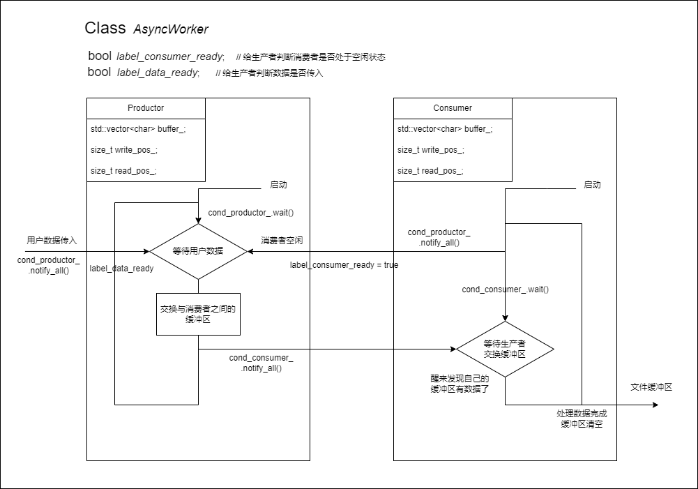
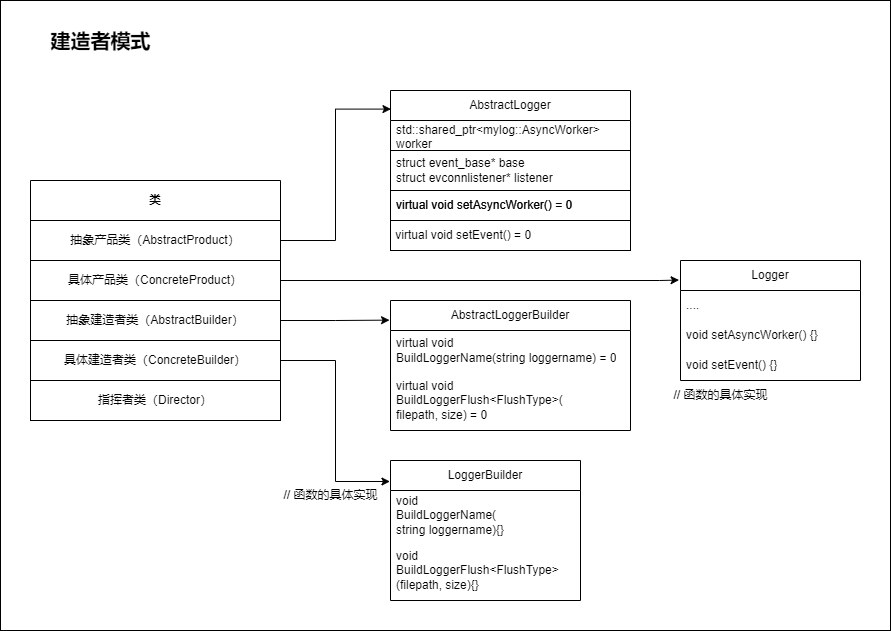

# AsyncWorker
## 生产者和消费者模式：
- 逻辑图：

    

- 如何交换生产者和消费者的缓冲区？

    ————使用指针

    ```cpp
    std::shared_ptr<AsyncBuffer> buffer_productor_;
    std::shared_ptr<AsyncBuffer> buffer_consumer_;
    ```
    
- 安全模式和非安全模式

    **安全模式**：缓冲区有一定的大小，当写满时，生产者将不再允许用户数据写入，直到其他日志内容被消费掉

    **非安全模式**：缓冲区的大小可变，允许缓冲区增长，但可能导致缓冲区过大而内存不足，一般只用于测试

    

## 日志管理系统第一版：
- 逻辑图：

    

    在ASyncLogger中，使用`libevent`来模拟异步日志系统接受到日志信息：客户端向服务器发送信息，视为日志，服务器接受到日志后发送到生产者的缓冲区，生产者因为消费者空闲以及缓冲区有数据就醒来交换生产者与消费者对于的指针，唤醒消费者，消费者变处理数据，将数据发送到文件以及控制台上。
    
    但通常情况下，都是云存储中用户下载，上传，操作出错等系统会产生对应的日志，而非用户自己生产日志发送给异步日志系统。用户执行完某个操作，云存储系统响应后以json字符串的形式发送给异步日志系统。


## 建造者模型：
### 什么是建造者模式
建造者模式是一种对象创建型模式之一，用来隐藏复合对象的创建过程，他把复合对象的创建过程加以抽象，通过子类继承和重载的方式，动态地创建具有复合属性的对象。官方说法就是将一个复杂对象的构造与它的表示分离，使同样的构建过程可以创建不同的表示。

### 为什么使用建造者模式
主要解决在软件系统中，有时候面临着一个复杂对象的创建工作，其通常由各个部分的子对象用一定的算法构成；由于需求的变化，这个复杂对象的各个部分经常面临着剧烈的变化，但是将他们组合在一起的算法却相对稳定。

### 建造者模式实现步骤
1. 提供抽象建造者类: 为创建产品各个部分，统一抽象接口
2. 提供具体建造者类: 具体实现抽象创建者各个部分的接口
3. 提供多个具体产品类: 具体的创建产品的各个部分
4. 提供一个指挥类: 负责安排和调度复杂对象的各个建造过程


## AsyncLogger
- 包含一个异步日志器类和创建日志器的建造者

    

- 由于`Glb->Build()`中包含了`event_base_dispatch(base_)`, 因此：
    ```cpp
    // 将日志器添加到日志管理者中，管理者是全局单例类 
    mylog::LoggerManager::GetInstance().AddLogger(Glb->Build());
    ```
    这里的`.addLogger()`在调用前已经被阻塞了，执行不到。
