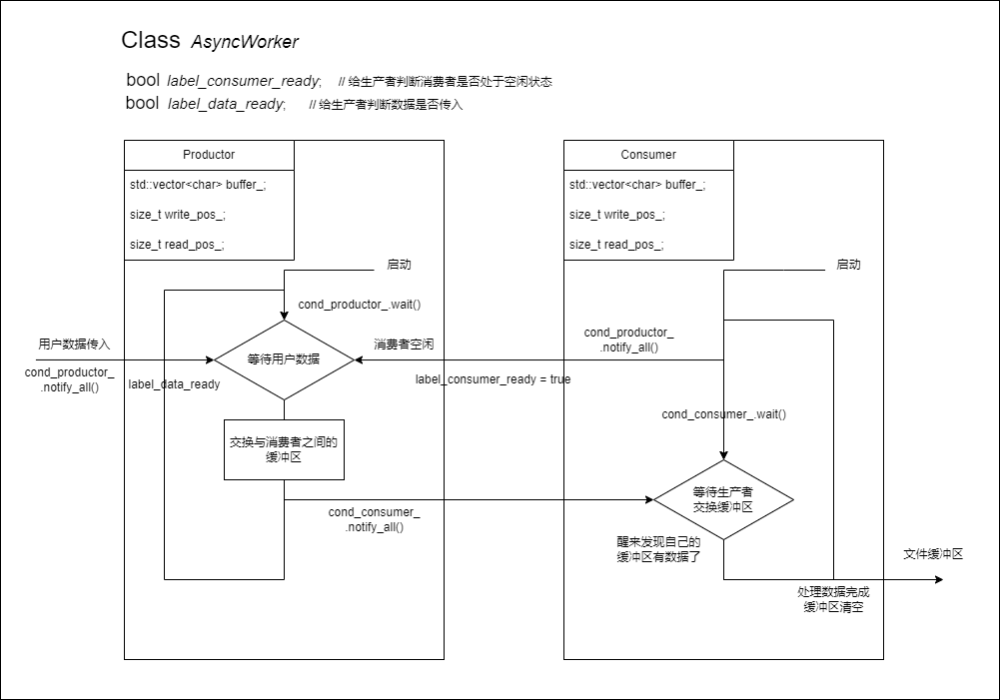
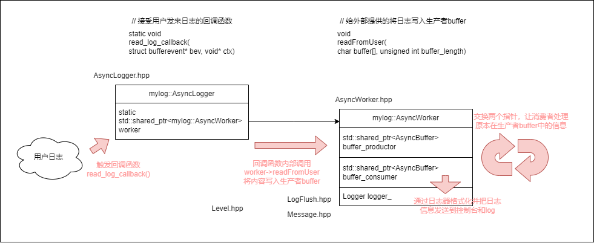

# AsyncWorker
## 生产者和消费者模式：
- 逻辑图：

    

- 如何交换生产者和消费者的缓冲区？

    ————使用指针

    ```cpp
    std::shared_ptr<AsyncBuffer> buffer_productor_;
    std::shared_ptr<AsyncBuffer> buffer_consumer_;
    ```
    
- 安全模式和非安全模式

    **安全模式**：缓冲区有一定的大小，当写满时，生产者将不再允许用户数据写入，直到其他日志内容被消费掉

    **非安全模式**：缓冲区的大小可变，允许缓冲区增长，但可能导致缓冲区过大而内存不足，一般只用于测试

    

## 日志管理系统第一版：
- 逻辑图：

    

    在ASyncLogger中，使用`libevent`来模拟异步日志系统接受到日志信息：客户端向服务器发送信息，视为日志，服务器接受到日志后发送到生产者的缓冲区，生产者因为消费者空闲以及缓冲区有数据就醒来交换生产者与消费者对于的指针，唤醒消费者，消费者变处理数据，将数据发送到文件以及控制台上。
    
    但通常情况下，都是云存储中用户下载，上传，操作出错等系统会产生对应的日志，而非用户自己生产日志发送给异步日志系统。用户执行完某个操作，云存储系统响应后以json字符串的形式发送给异步日志系统。


## 建造者模型：
### 什么是建造者模式
建造者模式是一种对象创建型模式之一，用来隐藏复合对象的创建过程，他把复合对象的创建过程加以抽象，通过子类继承和重载的方式，动态地创建具有复合属性的对象。官方说法就是将一个复杂对象的构造与它的表示分离，使同样的构建过程可以创建不同的表示。

### 为什么使用建造者模式
主要解决在软件系统中，有时候面临着一个复杂对象的创建工作，其通常由各个部分的子对象用一定的算法构成；由于需求的变化，这个复杂对象的各个部分经常面临着剧烈的变化，但是将他们组合在一起的算法却相对稳定。

### 建造者模式实现步骤
1. 提供抽象建造者类: 为创建产品各个部分，统一抽象接口
2. 提供具体建造者类: 具体实现抽象创建者各个部分的接口
3. 提供多个具体产品类: 具体的创建产品的各个部分
4. 提供一个指挥类: 负责安排和调度复杂对象的各个建造过程


## AsyncLogger
- 包含一个异步日志器类和创建日志器的建造者

    


## ThreadPool
- Thread 线程类：

    构造函数：接受来自线程池统一提供的线程函数
    ```cpp
    Thread(threadfunc func)
    {
        // 接受线程函数
        // 设置线程标识号：static 并自动增长。
    }
    ```

    启动函数：启动线程
    ```cpp
    void start()
    {
        // 创建并启动线程
        // 设置为分离线程
    }
    ```

- ThreadPool 线程池类：

    重要的参数列表：
        
    1. 初始线程数量(初始化的时候)`initThreadSize_`，上限线程数量`threadSizeThreshHold_`，当前线程数量`curThreadSize_`，空闲线程数量`idleThreadSize_`(疑似不需要)，线程列表(unordered_map, key为线程号)`threads_`
    2. 任务数量`taskSize_`，上限任务数量`taskQueMaxThreshHold_`，任务队列(queue)`taskQue_`
    3. 互斥和同步操作：
        
        a. 保证任务队列taskQue_线程安全的互斥锁`taskQueMtx_`
        
        b. 通知线程来取任务的`notEmpty_`, 表示线程有提交的任务

        c. 控制submitTask可以提交任务的`notFull_` 

    
    重要函数列表：
    1. 启动线程，按照设置的线程数量初始化线程，放入`threads_`，然后遍历注意启动（调用线程的`start()`函数）

    2. 线程函数，提供给Thread类的统一接口，内容为一个无限循环，wait等待任务队列不为空，苏醒并拿到锁后从队列中取出任务并执行

    3. 提交任务函数，用户调用这个函数来向线程池提交任务，有1s的超时判断，如果这一秒内任务队列都是满的就判定提交失败，否则写入任务队列中


- 线程池在该项目中的作用：

    当异步日志系统处理到`ERROR`级别或者`FATAL`级别的日志消息，就需要把日志消息发送到服务器上，1. 这时每个日志器都要与远程建立连接，发送日志，然后关闭，这样频繁的建立和关闭连接非常消耗资源；2. 如果每个日志器都先建立一个连接，虽然避免了上述资源浪费的情况，但如果日志器的数量非常多，就要建立很多的连接，这也是不合理的。因此，线程池可以优先创建好连接，日志器需要的时候就把线程交于进行网络IO。

    1. 线程函数`threadFunc()`

        线程池，本身就是先创建好若干的线程，每个线程连接上服务器，进入事件循环。
        线程函数先创建连接，然后启动事件循环`event_base_dispatch(base)`, 相当于`for(;;){}`
        

    2. 提交任务`submitTask()`

        把需要上传的日志消息通过该函数交给线程池，线程池把它通过`bufferevent_write`发送给服务器，服务器的事件响应回调函数会被触发，当然也可以什么都不做。

    `~ThreadPool()`的调用要晚于`~LoggerManager()`的调用，因此`LoggerManager`中存储的异步日志器也不再提交日志，即调用`submitLog()`，线程池析构的时候，需要把每个线程创建的`client`处理掉，包括关闭事件循环，清理`bv`和`base`

    - 如何让线程函数退出循环？

        调用`~ThreadPool()`时，将线程池运行的标签通知所有线程函数醒来


        - 假设线程池关闭 (`ThreadPoolRunning_  = false`) 的时候还有好几条日志没有处理：
        **阻塞在锁定义那里的**，抢到锁后进入`wait()`，发现`logSize_ > 0`，就处理日志信息，然后又开始新的循环。如果没有了，那么在循环判断条件上`ThreadPoolRunning_ || logSize_`两个都不成立，就会退出循环。如果还有，虽然线程池关闭了，但是`logSize_`还大于0，于是继续循环。

        **等待在wait()处**，被通知后先判断`logSize`发现还有日志，就处理日志
        ```cpp
        notEmpty_.wait(lock, [&]()->bool{ return logSize_ > 0 || ThreadPoolRunning_ == false; });
        ```

        先判断`logSize_ > 0`，满足就处理日志，不退出，然后开启下一个循环
        ```cpp
        if(logSize_ > 0)
        {
            log = logQue_.front();  // std::function<void()>;
            logQue_.pop();
            logSize_--;
        }
        else  // 唤醒条件要么有日志，要么线程池关闭了，但是先判断有日志
        { 
            break;
        }
        ```
        再次循环，判断循环条件，线程池关闭了且没有日志了，就全部退出循环.

    

